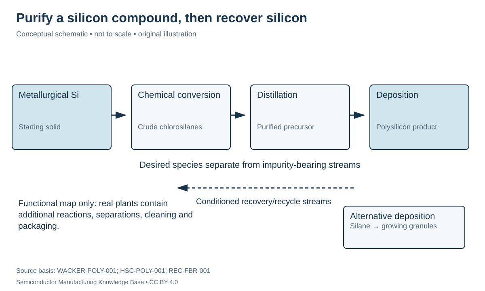

# Electronic-grade polysilicon: purification through chemistry

Status: **Reviewed — author self-review; specialist review pending**. Owner: repository author. Article type: foundation explainer. Scope: general engineering; no proprietary process recipe. Source review: 2026-09-16.

## Prerequisites

Read [metallurgical silicon](metallurgical_silicon.md). For the electrical meaning of impurities, see [doping and transport](../05_semiconductor_physics/doping_and_transport.md).

## Why this matters — 30-second explanation

The silicon needed for electronic devices must support deliberately controlled electrical behavior. An effective purification strategy is to turn metallurgical silicon into volatile silicon compounds, separate those compounds from contaminants, and deposit silicon again. **[Polysilicon](../40_glossary/phase1_glossary.md#polysilicon)** describes a many-crystal form of solid silicon; **electronic grade** describes its suitability against a demanding specification. The two terms are not synonyms. [WACKER-POLY-001](../42_references/bibliography.md#wacker-poly-001) [HSC-POLY-001](../42_references/bibliography.md#hsc-poly-001)

## Intuition: make a difficult separation easier

A mixture that is difficult to clean in one physical form may be easier to separate after chemistry changes its constituents' properties. Distillation repeatedly contacts vapor and liquid so compounds with different volatilities can separate. Here the useful intermediate is a chlorosilane, not a pot of distilled molten silicon. Purification and subsequent deposition are separate engineering functions.

*Figure F1-02 — Chemical purification and recovery of silicon. Original functional schematic, not a complete plant piping diagram. Source basis: WACKER-POLY-001 and HSC-POLY-001; alternative reactor context: REC-FBR-001. CC BY 4.0. Recycle is shown as a separate stream, not a backward prerequisite.*

## Representative chlorosilane route

**Trichlorosilane**, HSiCl₃ (also written SiHCl₃ or TCS), contains one silicon, one hydrogen and three chlorine atoms. WACKER describes converting metallurgical silicon using hydrogen chloride, purifying TCS by distillation and depositing silicon on seed rods in the Siemens process. Rod removal, breaking and semiconductor-oriented cleaning follow. [WACKER-POLY-001](../42_references/bibliography.md#wacker-poly-001)

Two balanced net expressions help track the desired chemistry:

$$
\mathrm{Si+3HCl\rightarrow HSiCl_3+H_2}
$$

$$
\mathrm{HSiCl_3+H_2\rightarrow Si+3HCl}.
$$

Each expression conserves atoms; neither describes all reactions, separation stages or recycle streams in a real plant. A useful process map therefore identifies crude mixture, purified precursor and deposited product separately. Reversing an equation on paper is not evidence that a reactor can be operated backward with the same equipment or settings.

**Chemical vapor deposition (CVD)** means solid material forms from reactive gaseous feed at a surface. In a Siemens-type rod reactor, the target is high-purity bulk polysilicon feedstock. Later fab CVD applies the same broad process concept to thin films on wafers, but reactor geometry, product form and qualification are different. [HSC-POLY-001](../42_references/bibliography.md#hsc-poly-001)

## Materials, equipment and variables

| Function | Equipment/material role | Control question |
|---|---|---|
| Convert silicon | Reaction vessel and chlorosilane-handling system | Does the output mixture meet the separation train's input requirements? |
| Purify precursor | Distillation system | Which impurity-bearing species remain with the silicon-bearing product? |
| Deposit silicon | Controlled CVD reactor and seed surfaces | Are growth conditions and contact surfaces compatible with product purity? |
| Preserve purity | Sizing, cleaning and clean packaging | Is contamination introduced after deposition? |

This is a functional decomposition of the disclosed route. It supplies questions for subsequent equipment chapters without inventing column counts, operating pressures or a vendor's recipe. **CONFIRMED — CLM-000003:** WACKER describes a Siemens/TCS route for its polysilicon. **CONFIRMED — CLM-000004:** Hemlock describes TCS-based CVD followed by sizing, cleaning and controlled packaging. [WACKER-POLY-001](../42_references/bibliography.md#wacker-poly-001) [HSC-POLY-001](../42_references/bibliography.md#hsc-poly-001)

## Failure modes and the meaning of purity

Unwanted electrically active dopants can alter carrier concentration. Other impurities and defects can create recombination pathways, so counting total impurity mass alone does not measure every relevant electrical effect. The [physics path](../05_semiconductor_physics/doping_and_transport.md) explains the first mechanism; carrier recombination describes electrons and holes returning from an excited carrier population. [MIT-CARRIERS-001](../42_references/bibliography.md#mit-carriers-001) [HU-TRANSPORT-001](../42_references/bibliography.md#hu-transport-001)

Failure can occur through incomplete separation or contamination during downstream handling. A pure deposited rod is not useful if subsequent contact and packaging destroy the required cleanliness. Qualification must specify relevant species, measurement limits, product form and customer use. A marketing string of “nines” is not a complete acceptance specification.

## Worked example: tiny fractions, many atoms

Use a teaching value of $N_{\mathrm{Si}}=5.0\times10^{22}$ silicon atoms/cm³, consistent with the introductory silicon lattice model. One atomic part per billion is the number fraction $f=10^{-9}$. [MIT-CARRIERS-001](../42_references/bibliography.md#mit-carriers-001)

$$
N_{\mathrm{imp}}=fN_{\mathrm{Si}}=5.0\times10^{13}\ \mathrm{cm}^{-3}.
$$

$N_{\mathrm{imp}}$ is impurity atoms per cubic centimeter, not automatically mobile carriers per cubic centimeter. The equality to a carrier density would require assumptions about species, activation and compensation. Atomic fraction also differs from mass fraction when atomic masses differ. This example explains why “very little” contamination may still matter without pretending to state a supplier's impurity limit.

## Alternatives and areas of uncertainty

A **fluidized bed** suspends particles in a gas flow; deposited silicon increases the size of seed granules rather than thickening long rods. **CONFIRMED — CLM-000005, historical:** REC Silicon's 2023 annual report describes a silane-fed FBR process in its photovoltaic production context. This is a documented reactor alternative, not evidence of current plant operation or automatic electronic-grade qualification. [REC-FBR-001](../42_references/bibliography.md#rec-fbr-001)

The appropriate choice depends on precursor chemistry, contamination control, product form and qualification. This chapter does not claim that a particular FBR product is interchangeable with any semiconductor customer's accepted polysilicon.

## Handoff and checks for understanding

Accepted polysilicon becomes feed for [single-crystal growth](../03_crystal_growth/crystal_growth.md). Its high chemical purity does not yet provide one continuous crystal orientation. Explain why the next operation is still necessary, and why distillation, deposition and clean handling each have a separate acceptance role.

## Position in the manufacturing map

[MAT-0003](../manufacturing_map/process_nodes.md#mat-0003), [MAT-0004](../manufacturing_map/process_nodes.md#mat-0004), [MAT-0005](../manufacturing_map/process_nodes.md#mat-0005), [MAT-0006](../manufacturing_map/process_nodes.md#mat-0006), [PROC-0003](../manufacturing_map/process_nodes.md#proc-0003), [PROC-0004](../manufacturing_map/process_nodes.md#proc-0004), [PROC-0005](../manufacturing_map/process_nodes.md#proc-0005). These are process/material categories, not a tracked customer lot. Concept pages link to the operations they explain rather than inventing a physical manufacturing step.

## Rubin connection and evidence boundary

No mine, feedstock supplier, wafer specification, process recipe or transistor implementation is assigned to Rubin here. The [case-study plan](../38_case_studies/nvidia_rubin/README.md) and [Rubin map](../manufacturing_map/rubin_manufacturing_path.md) preserve that boundary. Company examples in these chapters are documented roles, not a Rubin bill of materials.

## Separate economics and further learning

Process cost drivers are recorded in the [Phase 1 evidence notes](../36_economics/phase1_cost_drivers.md); full [industry analysis](../37_investment_analysis/README.md) remains a later phase. Use the [glossary](../40_glossary/phase1_glossary.md) for definitions and the [learning sequence](../LEARNING_PATHS.md) for navigation.

## Sources and review

- [WACKER-POLY-001](../42_references/bibliography.md#wacker-poly-001)
- [HSC-POLY-001](../42_references/bibliography.md#hsc-poly-001)
- [REC-FBR-001](../42_references/bibliography.md#rec-fbr-001)
- [MIT-CARRIERS-001](../42_references/bibliography.md#mit-carriers-001)
- [HU-TRANSPORT-001](../42_references/bibliography.md#hu-transport-001)

Source locators and limitations are in the canonical bibliography. Review scope: original synthesis, scoped mathematical examples and conceptual figures. Independent specialist review has not been performed. Final module review is recorded in [AUDIT_PHASE1.md](../AUDIT_PHASE1.md).
