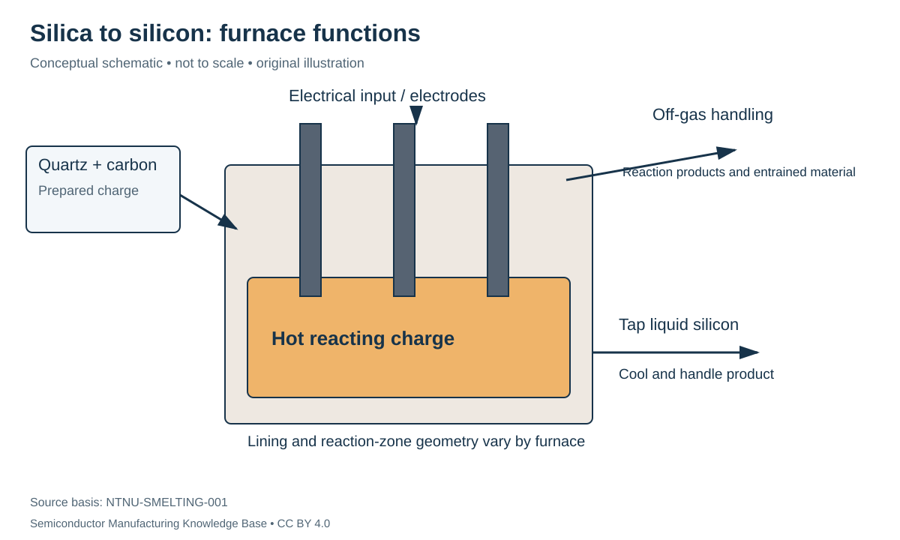

# Metallurgical silicon: removing oxygen from silica

Status: **Reviewed — author self-review; specialist review pending**. Owner: repository author. Article type: foundation explainer. Scope: general engineering; no proprietary process recipe. Source review: 2026-09-16.

## Prerequisites

Read [quartz and feedstocks](../01_raw_materials/quartz_and_feedstocks.md). Know how to balance a chemical equation.

## Why this matters — 30-second explanation

Sorting quartz does not turn SiO₂ into Si. **Carbothermic reduction** uses carbon to remove oxygen from the silicon-bearing feed at high temperature. The output is silicon metal that still requires substantial purification before crystal growth for electronic devices. USGS distinguishes silicon metal from silicon ferroalloys; adding iron changes the product category. [USGS-SILICON-001](../42_references/bibliography.md#usgs-silicon-001)

## Intuition: this is chemical separation, not just melting

Heating an ice cube changes its phase but preserves H₂O. Silicon smelting must change chemical bonds and move oxygen into other species. The furnace therefore has to provide energy, contact between reactants and transport paths for gas and liquid. The material is not made electronic-grade simply because it has solidified into a shiny lump.

A convenient **net bookkeeping reaction** is:

$$
\mathrm{SiO_2+2C\rightarrow Si+2CO}.
$$

The coefficients count moles: one mole of silica and two moles of carbon correspond ideally to one mole of silicon and two moles of carbon monoxide. They are not furnace feed ratios or a complete emissions inventory. Silicon-monoxide gas, SiO, and silicon carbide, SiC, participate in the actual reaction network. NTNU's furnace investigations describe SiC formation and deposits inside operating furnaces. [NTNU-SMELTING-001](../42_references/bibliography.md#ntnu-smelting-001)

## What the furnace physically does

A submerged-arc furnace receives a solid charge and delivers electrical energy through electrodes into a hot, reacting bed. Different regions have different temperatures and chemical conditions. Gases pass through the charge while liquid product collects for tapping. The electrodes, refractory/lining and off-gas system are parts of the production system, not incidental accessories. [NTNU-SMELTING-001](../42_references/bibliography.md#ntnu-smelting-001)

*Figure F1-01 — Silicon-furnace functions. Original conceptual cross section; not to scale and not a construction drawing. Source basis: NTNU-SMELTING-001. CC BY 4.0. The arrows show streams, not exact internal reaction-zone boundaries.*

Feed preparation, smelting, tapping/cooling and product handling form the high-level handoff. The next [purification stage](electronic_grade_polysilicon.md) takes silicon into separable chemical compounds. Avoid using a ferrosilicon plant description as proof of a pure-silicon supplier's exact flow.

## Important variables and failure mechanisms

| Variable or material feature | Why it matters | What evidence would resolve a problem? |
|---|---|---|
| Quartz behavior on heating | The charged structure can change through cracking and phase transformation | Thermal testing of the actual quartz source |
| Carbon type and reactivity | Carbon participates through intermediate reactions, including SiC formation | Feed characterization and process observations |
| Electrical/thermal distribution | Energy must reach useful reaction regions | Operating measurements and model validation |
| Deposits and gas pathways | Internal structure affects how reactants and gases meet | Inspection and furnace-study evidence |

These are process-control questions, not numerical operating recommendations. Primary quartz and furnace studies motivate them. An observed deposit is evidence of local history; it does not prove the same condition exists throughout every furnace. [NTNU-QUARTZ-001](../42_references/bibliography.md#ntnu-quartz-001) [NTNU-SMELTING-001](../42_references/bibliography.md#ntnu-smelting-001)

Impurities present in the feed or introduced by contact materials are a reason for the later chemical purification step. Chemical grade is an input specification, whereas furnace recovery concerns how much desired silicon reaches usable product. The distinction echoes the upstream grade/recovery example.

## Worked example: theoretical material demand

**Hypothetical ideal stoichiometric calculation.** Use approximate molar masses of 60.1 g/mol for SiO₂, 28.1 g/mol for Si and 12.0 g/mol for carbon. Then, for 1.00 kg of silicon:

$$
m_{\mathrm{SiO_2}}=1.00\ \mathrm{kg}\frac{60.1}{28.1}=2.14\ \mathrm{kg},
\qquad m_C=1.00\ \mathrm{kg}\frac{2(12.0)}{28.1}=0.854\ \mathrm{kg}.
$$

The ratios are dimensionless because numerator and denominator use the same molar-mass units. This is a lower-bound reaction balance for pure reagents and full silicon recovery, not a prediction of industrial charge consumption. Moisture, ash, impurity-bearing fractions, process losses and side streams require a real plant balance.

For a separate **hypothetical energy accounting** example, define $e=E/m$, where $E$ is metered energy in kWh and $m$ is accepted silicon in kg. If a chosen boundary consumes 1,000 kWh for 80 kg of accepted product, $e=12.5$ kWh/kg. If only 70 kg is accepted at the same input, $e=14.3$ kWh/kg. Neither number is a sourced industry benchmark; the exercise shows why the acceptance boundary matters.

## Alternatives and limits

Silicon ferroalloy manufacture serves different product requirements. Alternative reduction chemistries are not assumed to be qualified substitutes for the route taught here. This foundation follows a documented carbon-based industrial route and leaves process innovation comparisons to researched extensions.

## Handoff and checks for understanding

Input: qualified silica and carbon-bearing charge. Output: metallurgical silicon for further purification. Equipment: furnace, power/electrode system, charge handling and off-gas/product handling.

Explain why the net reaction is useful for mass balance but insufficient to design a furnace. Identify what additional measurements are needed to compare two plants' kWh/kg values fairly.

## Position in the manufacturing map

[MAT-0002](../manufacturing_map/process_nodes.md#mat-0002), [MAT-0003](../manufacturing_map/process_nodes.md#mat-0003), [PROC-0002](../manufacturing_map/process_nodes.md#proc-0002). These are process/material categories, not a tracked customer lot. Concept pages link to the operations they explain rather than inventing a physical manufacturing step.

## Rubin connection and evidence boundary

No mine, feedstock supplier, wafer specification, process recipe or transistor implementation is assigned to Rubin here. The [case-study plan](../38_case_studies/nvidia_rubin/README.md) and [Rubin map](../manufacturing_map/rubin_manufacturing_path.md) preserve that boundary. Company examples in these chapters are documented roles, not a Rubin bill of materials.

## Separate economics and further learning

Process cost drivers are recorded in the [Phase 1 evidence notes](../36_economics/phase1_cost_drivers.md); full [industry analysis](../37_investment_analysis/README.md) remains a later phase. Use the [glossary](../40_glossary/phase1_glossary.md) for definitions and the [learning sequence](../LEARNING_PATHS.md) for navigation.

## Sources and review

- [USGS-SILICON-001](../42_references/bibliography.md#usgs-silicon-001)
- [NTNU-SMELTING-001](../42_references/bibliography.md#ntnu-smelting-001)
- [NTNU-QUARTZ-001](../42_references/bibliography.md#ntnu-quartz-001)

Source locators and limitations are in the canonical bibliography. Review scope: original synthesis, scoped mathematical examples and conceptual figures. Independent specialist review has not been performed. Final module review is recorded in [AUDIT_PHASE1.md](../AUDIT_PHASE1.md).
