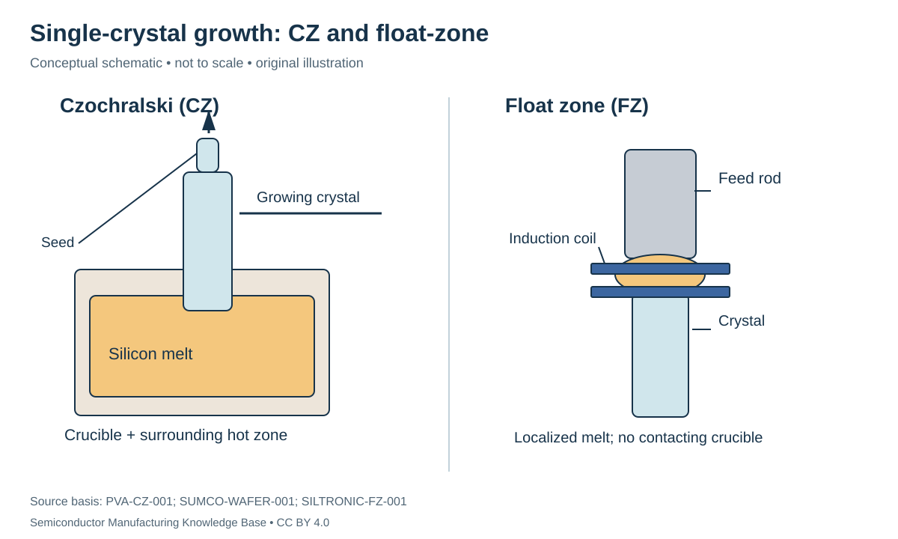

# Single-crystal growth: giving silicon a continuous lattice

Status: **Reviewed — author self-review; specialist review pending**. Owner: repository author. Article type: foundation explainer. Scope: general engineering; no proprietary process recipe. Source review: 2026-09-16.

## Prerequisites

Read [electronic-grade polysilicon](../02_silicon_refining/electronic_grade_polysilicon.md). The [bonding and bands primer](../05_semiconductor_physics/bonding_bands_and_carriers.md) explains a lattice; [doping](../05_semiconductor_physics/doping_and_transport.md) explains resistivity.

## Why this matters — 30-second explanation

Purity describes which atoms are present. **Crystallinity** describes how they are arranged. A single crystal has a continuous lattice orientation across the body; polysilicon contains many grains with different orientations. Crystal growth converts a chemically suitable feed into a controlled solid structure that can become wafers. Silicon's diamond-cubic lattice has four nearest neighbors around each atom. [HU-PHYSICS-001](../42_references/bibliography.md#hu-physics-001)

## Intuition: the seed supplies the pattern

Think of extending a tiled floor from a carefully aligned starting patch. New tiles can continue the same pattern instead of starting unrelated patterns in different corners. In growth, a **seed crystal** supplies the lattice orientation at the solidification boundary. The analogy explains continuity, but atoms attach through thermodynamics and transport, not an external tile-placement machine.

A **boule** is the grown crystal body, also called an ingot here. Crystallographic orientation names the direction or plane relative to its repeating atomic lattice. A wafer's `(100)` plane and a `[100]` direction are related crystallographic descriptions, not a diameter or process-node designation. [HU-PHYSICS-001](../42_references/bibliography.md#hu-physics-001)

*Figure F1-03 — CZ and float-zone growth. Original conceptual schematic; not to scale. Source basis: PVA-CZ-001, SUMCO-WAFER-001 and SILTRONIC-FZ-001. CC BY 4.0. The drawn boundaries show the method, not an actual supplier's geometry.*

## Czochralski growth

In **Czochralski (CZ)** growth, polysilicon is melted in a crucible, a seed contacts the melt, and controlled withdrawal lets silicon solidify onto the seed. The process manages heating, rotation and withdrawal to obtain a useful crystal diameter and quality. The useful output includes a controlled cylindrical body; beginning/end regions and unsuitable material can be excluded during wafer preparation. [SUMCO-WAFER-001](../42_references/bibliography.md#sumco-wafer-001)

The **hot zone** is the assembly that establishes the temperature field around the melt and growing crystal. It must supply heat where melting is required and allow solidification heat to leave where the crystal grows. The machine also controls chamber atmosphere and mechanical motion. **CONFIRMED — CLM-000006:** PVA TePla documents CZ pullers and describes their heater, crucible, seed motion and rotation/thermal controls. [PVA-CZ-001](../42_references/bibliography.md#pva-cz-001)

## Dopants, segregation and oxygen

Doping is deliberate addition of atoms that alter carrier populations. A chosen dopant concentration in a melt need not appear unchanged in the solid. **Segregation** means a species partitions differently between solid and liquid during growth. At equilibrium, define:

$$
k_0=\frac{C_s}{C_l}.
$$

$C_s$ and $C_l$ are the species concentrations at the solid and liquid sides of the interface in matching units, such as atoms/cm³; $k_0$ is dimensionless. Finite growth rate and transport can require an effective coefficient. This local relation is not a complete axial-profile model. [KIEL-GROWTH-001](../42_references/bibliography.md#kiel-growth-001)

**Hypothetical interface example:** if $C_l=2.0\times10^{16}$ cm⁻³ and an assumed coefficient is 0.5, then $C_s=1.0\times10^{16}$ cm⁻³ at that interface state. It does not follow that the whole ingot has that concentration. As solid grows, the remaining melt and its mixing history change.

The quartz crucible is also a possible oxygen source to the melt. Flow and thermal conditions influence incorporation; oxygen concentration cannot simply be treated as a fixed feed impurity being partitioned from a closed reservoir. [KIEL-SEGREGATION-001](../42_references/bibliography.md#kiel-segregation-001)

## Float-zone alternative

**Float-zone (FZ)** growth moves a localized molten region through a feed rod while a seeded crystal forms at the solidifying boundary. It avoids contact between the melt and a quartz crucible. This changes contamination and oxygen behavior, as well as growth constraints. **CONFIRMED — CLM-000007:** Siltronic documents FZ products and explains their lower oxygen content and high-resistivity/lifetime use cases. That does not establish FZ as the best input for every logic process. [SILTRONIC-FZ-001](../42_references/bibliography.md#siltronic-fz-001)

CZ and FZ should be alternative routes in the map, not sequential operations. Magnetic CZ is a variation that introduces magnetic-field control of the melt; it still belongs to the CZ family. SUMCO explicitly lists CZ, magnetic CZ and FZ in its process overview. [SUMCO-WAFER-001](../42_references/bibliography.md#sumco-wafer-001)

## Variables, defects and acceptance

| Concern | Physical meaning | Control/measurement connection |
|---|---|---|
| Diameter and usable length | Geometry of the solid body | Feedback on growth and thermal conditions |
| Dopant uniformity | Electrical properties vary along/across the ingot | Spatial resistivity characterization; control of partitioning and melt history |
| Oxygen incorporation | Contact/material and transport effect | Oxygen characterization and growth control |
| Crystal defects | Departure from the intended atomic structure | Characterize defects separately from bulk chemical purity |

Examples of structural defects include a missing lattice atom (**vacancy**), an extra atom between regular lattice sites (**interstitial**) and a disrupted line of lattice registry (**dislocation**). These are different from a grain boundary separating differently oriented crystals. Definitions describe defect types; they do not assert a particular defect density in a commercial ingot. [HU-PHYSICS-001](../42_references/bibliography.md#hu-physics-001) [KIEL-GROWTH-001](../42_references/bibliography.md#kiel-growth-001)

Growth is a balancing problem: faster output is not useful if the body falls outside geometry, electrical or structural requirements. The effect of melt flow and growth fluctuations is why a constant macroscopic pulling command does not by itself guarantee a uniform composition. [KIEL-SEGREGATION-001](../42_references/bibliography.md#kiel-segregation-001)

## Handoff and checks for understanding

Input: qualified polysilicon, seed and process consumables. Output: a single-crystal body with its orientation and characterization history. The next [wafer-manufacturing stage](../04_wafer_manufacturing/wafer_finishing_and_acceptance.md) converts this body into useful geometry and surfaces.

Explain why high purity, single-crystal structure and uniform resistivity are three different requirements. In the partitioning example, identify which additional assumptions would be needed before predicting the concentration at the tail of the ingot.

## Position in the manufacturing map

[MAT-0006](../manufacturing_map/process_nodes.md#mat-0006), [MAT-0007](../manufacturing_map/process_nodes.md#mat-0007), [PROC-0006](../manufacturing_map/process_nodes.md#proc-0006). These are process/material categories, not a tracked customer lot. Concept pages link to the operations they explain rather than inventing a physical manufacturing step.

## Rubin connection and evidence boundary

No mine, feedstock supplier, wafer specification, process recipe or transistor implementation is assigned to Rubin here. The [case-study plan](../38_case_studies/nvidia_rubin/README.md) and [Rubin map](../manufacturing_map/rubin_manufacturing_path.md) preserve that boundary. Company examples in these chapters are documented roles, not a Rubin bill of materials.

## Separate economics and further learning

Process cost drivers are recorded in the [Phase 1 evidence notes](../36_economics/phase1_cost_drivers.md); full [industry analysis](../37_investment_analysis/README.md) remains a later phase. Use the [glossary](../40_glossary/phase1_glossary.md) for definitions and the [learning sequence](../LEARNING_PATHS.md) for navigation.

## Sources and review

- [HU-PHYSICS-001](../42_references/bibliography.md#hu-physics-001)
- [SUMCO-WAFER-001](../42_references/bibliography.md#sumco-wafer-001)
- [PVA-CZ-001](../42_references/bibliography.md#pva-cz-001)
- [SILTRONIC-FZ-001](../42_references/bibliography.md#siltronic-fz-001)
- [KIEL-GROWTH-001](../42_references/bibliography.md#kiel-growth-001)
- [KIEL-SEGREGATION-001](../42_references/bibliography.md#kiel-segregation-001)

Source locators and limitations are in the canonical bibliography. Review scope: original synthesis, scoped mathematical examples and conceptual figures. Independent specialist review has not been performed. Final module review is recorded in [AUDIT_PHASE1.md](../AUDIT_PHASE1.md).
