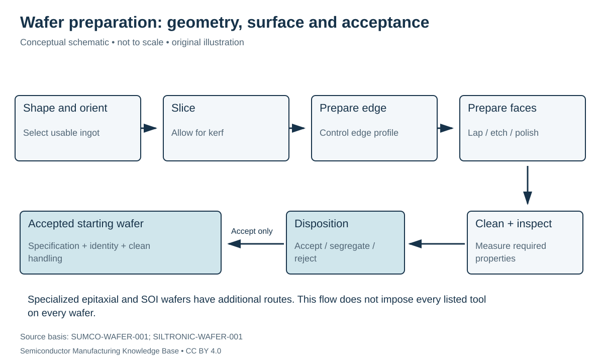

# From ingot to accepted wafer: geometry, surface and qualification

Status: **Reviewed — author self-review; specialist review pending**. Owner: repository author. Article type: foundation explainer. Scope: general engineering; no proprietary process recipe. Source review: 2026-09-16.

## Prerequisites

Read [crystal growth](../03_crystal_growth/crystal_growth.md). Review length, area and thickness units; distinguish millimeters, micrometers and nanometers.

## Why this matters — 30-second explanation

A grown ingot is too thick and geometrically unsuitable to enter a wafer-fabrication line. Slicing makes wafers, but leaves surfaces that need finishing and cleaning. A usable starting wafer must meet electrical, structural, geometric and surface requirements; being round and shiny is insufficient. SUMCO separates crystal pulling, wafer forming and optional specialized processing. [SUMCO-WAFER-001](../42_references/bibliography.md#sumco-wafer-001)

## Intuition: remove damage without losing the specification

Imagine cutting precision windows from a larger block. A saw gives an approximate shape, not the final optical surface. The next operations must remove cutting damage and establish a controlled geometry. Silicon adds further constraints because the surface becomes the starting point for electronic structures.

*Figure F1-04 — Ingot-to-wafer handoff. Original conceptual process diagram, not a universal tool route. Source basis: SUMCO-WAFER-001 and SILTRONIC-WAFER-001. CC BY 4.0. Rejection is against the selected use specification; it does not imply every rejected wafer is physically worthless.*

## What each operation contributes

| Operation family | Intended change | Why another operation follows |
|---|---|---|
| Crop/shape and orient | Select usable ingot region and establish diameter/orientation references | Bulk crystal is still not a wafer |
| Slice | Produce thin discs; cutting consumes a finite kerf | Sawed surfaces need further preparation |
| Edge preparation | Establish a controlled edge profile | Edge treatment alone does not set face geometry |
| Lap or other mechanical preparation | Improve thickness/parallelism | Mechanical processing can leave damaged surface material |
| Etch | Remove damaged silicon chemically | Etching alone is not the final polishing operation |
| Polish | Produce a controlled smooth face | Polishing residues and contamination must be removed |
| Clean and inspect | Clean surfaces and measure acceptance characteristics | Disposition and clean packaging preserve the result |

The sequence shown is a teaching route grouped from wafer-maker disclosures. Exact tool order and process choices vary; not every wafer uses identical lapping, polishing or epitaxy steps. **CONFIRMED — CLM-000008:** SUMCO describes slicing, lapping, etching, polishing, cleaning and inspection in its wafer-forming overview. **CONFIRMED — CLM-000010:** Siltronic's process diagram additionally makes edge rounding and identification visible. [SUMCO-WAFER-001](../42_references/bibliography.md#sumco-wafer-001) [SILTRONIC-WAFER-001](../42_references/bibliography.md#siltronic-wafer-001)

**[Kerf](../40_glossary/phase1_glossary.md#kerf)** is material consumed by the cut. It must be included in material-use accounting; the count of slices cannot be calculated from final wafer thickness alone.

## Geometry: four different questions

**Thickness** is the local separation of the two faces. **Total thickness variation (TTV)** compares maximum and minimum measured thickness over a defined area. **Bow** describes a specified median-surface displacement relative to a reference plane. **Warp** describes the range of that median-surface departure over the measurement area. A uniformly thick curved wafer can have low TTV and significant warp. **Surface roughness** measures shorter-scale surface texture and is not another name for warp. Measurement constraints, reference surfaces and excluded edge regions matter. [SEMI-TERMS-001](../42_references/bibliography.md#semi-terms-001) [SEMI-WAFER-001](../42_references/bibliography.md#semi-wafer-001)

**Edge exclusion** defines an outer area not included in a specified usable or measurement region. It must be attached to the metric: a “flatness” number with no measurement area or support condition is incomplete.

## Acceptance means measurement, not appearance

The public SEMI M1 scope identifies wafer dimensions and geometry and links to test methods for properties including resistivity, oxygen and surface characteristics. This repository reviewed that public scope, **not the paid normative tables**, and does not claim a universal numeric prime-wafer limit. [SEMI-WAFER-001](../42_references/bibliography.md#semi-wafer-001)

Laser-scattering inspection illuminates the surface and detects scattered light associated with particles or other scattering defects. This is a useful measurement channel, but it is not a direct measurement of every impurity atom or every buried defect. UCSB's facility documentation describes this mechanism for its Surfscan tool. [UCSB-INSPECT-001](../42_references/bibliography.md#ucsb-inspect-001)

| Failure or mismatch | Relevant evidence | Why one measurement is insufficient |
|---|---|---|
| Particle/surface defect | Surface inspection with declared sensitivity | A clean particle map does not establish bulk purity |
| Incorrect electrical material | Resistivity/dopant characterization | Geometry cannot establish carrier behavior |
| Geometry outside limits | Thickness/flatness/shape measurement | Shiny appearance cannot establish a measurement tolerance |
| Damaged or contaminated handling state | Inspection and controlled transfer history | Acceptance before later contamination does not qualify the delivered state |

The last row is the engineering consequence of making qualification a boundary-specific statement. The relevant characteristics and methods must be named rather than compressed into “good wafer.”

## Worked examples: kerf and usable area

**Hypothetical slicing estimate:** a usable cylindrical length $L=1{,}000$ mm is cut at pitch $p=t_s+k$, where as-sawn slice thickness $t_s=0.90$ mm and kerf $k=0.10$ mm. Ignoring end-cut corrections:

$$
N\approx\left\lfloor\frac{L}{t_s+k}\right\rfloor=1{,}000.
$$

(N) is a count; all lengths use mm. This deliberately simplified example does not predict a manufacturer's output. Final polishing removal and rejected slices reduce usable material further.

For a hypothetical wafer of diameter $D=300$ mm with radial exclusion $e=3$ mm, circular usable area is

$$
A=\pi(D/2-e)^2=\pi(147\ \mathrm{mm})^2\approx67{,}887\ \mathrm{mm}^2.
$$

That is 96.04% of the full circular area. It is not a dies-per-wafer calculation: die packing, streets, notch geometry and actual layout still matter.

## Alternatives and the phase boundary

A **polished wafer** is one starting-material category. An **epitaxial wafer** adds a grown crystalline layer; **silicon-on-insulator (SOI)** includes an insulating layer within its structure. Their role is to give subsequent device fabrication different starting structures. They are branches, not compulsory treatments of all wafers. [SUMCO-WAFER-001](../42_references/bibliography.md#sumco-wafer-001)

A **prime** device-production wafer should also be distinguished from test/monitor wafers used to evaluate processes and tools. Some monitor wafers are reclaimed through cleaning and polishing. This is a distinct use and qualification boundary, not proof of interchangeability with any prime wafer. [SEMI-RECLAIM-001](../42_references/bibliography.md#semi-reclaim-001)

## Handoff and checks for understanding

Phase 1A ends with a wafer accepted for a stated use, plus the accompanying identity and specification. Later [fab fundamentals](../08_fab_overview/README.md) explain repeated patterning and material modification. The [physics path](../05_semiconductor_physics/bonding_bands_and_carriers.md) explains what that material makes possible.

Describe a wafer that has low thickness variation but poor flatness in a selected measurement configuration. Explain why a particle inspection pass and a resistivity pass answer different questions. Identify two reasons why the slicing estimate can exceed the delivered wafer count.

## Position in the manufacturing map

[MAT-0007](../manufacturing_map/process_nodes.md#mat-0007), [MAT-0008](../manufacturing_map/process_nodes.md#mat-0008), [MAT-0009](../manufacturing_map/process_nodes.md#mat-0009), [MAT-0010](../manufacturing_map/process_nodes.md#mat-0010), [PROC-0007](../manufacturing_map/process_nodes.md#proc-0007), [PROC-0008](../manufacturing_map/process_nodes.md#proc-0008), [PROC-0009](../manufacturing_map/process_nodes.md#proc-0009). These are process/material categories, not a tracked customer lot. Concept pages link to the operations they explain rather than inventing a physical manufacturing step.

## Rubin connection and evidence boundary

No mine, feedstock supplier, wafer specification, process recipe or transistor implementation is assigned to Rubin here. The [case-study plan](../38_case_studies/nvidia_rubin/README.md) and [Rubin map](../manufacturing_map/rubin_manufacturing_path.md) preserve that boundary. Company examples in these chapters are documented roles, not a Rubin bill of materials.

## Separate economics and further learning

Process cost drivers are recorded in the [Phase 1 evidence notes](../36_economics/phase1_cost_drivers.md); full [industry analysis](../37_investment_analysis/README.md) remains a later phase. Use the [glossary](../40_glossary/phase1_glossary.md) for definitions and the [learning sequence](../LEARNING_PATHS.md) for navigation.

## Sources and review

- [SUMCO-WAFER-001](../42_references/bibliography.md#sumco-wafer-001)
- [SILTRONIC-WAFER-001](../42_references/bibliography.md#siltronic-wafer-001)
- [SEMI-WAFER-001](../42_references/bibliography.md#semi-wafer-001)
- [SEMI-TERMS-001](../42_references/bibliography.md#semi-terms-001)
- [UCSB-INSPECT-001](../42_references/bibliography.md#ucsb-inspect-001)
- [SEMI-RECLAIM-001](../42_references/bibliography.md#semi-reclaim-001)

Source locators and limitations are in the canonical bibliography. Review scope: original synthesis, scoped mathematical examples and conceptual figures. Independent specialist review has not been performed. Final module review is recorded in [AUDIT_PHASE1.md](../AUDIT_PHASE1.md).
