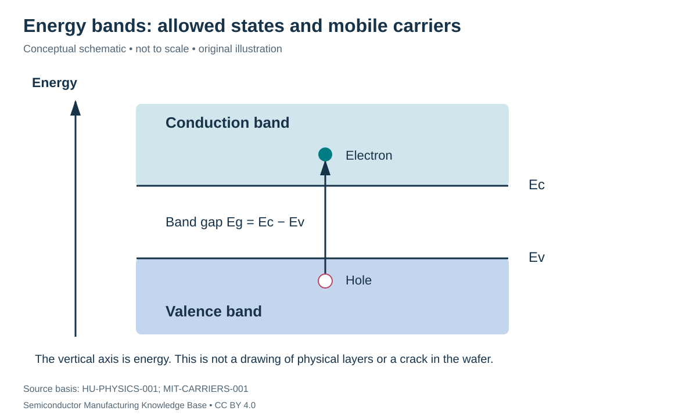

# Bonding, energy bands, electrons and holes

Status: **Reviewed — author self-review; specialist review pending**. Owner: repository author. Article type: foundation explainer. Scope: general engineering; no proprietary process recipe. Source review: 2026-09-16.

## Prerequisites

Introductory atomic structure and electric charge. The [material path](../01_raw_materials/quartz_and_feedstocks.md) can be read alongside this primer.

## Why this matters — 30-second explanation

Silicon becomes useful electronically because its carrier population can be controlled. An atom's valence electrons participate in bonding; in a crystal, the allowed electronic states form energy bands. Electrons in the conduction band and missing electrons—**holes**—in the valence band can carry current. A semiconductor is not simply a poor metal with fixed conductivity. [HU-PHYSICS-001](../42_references/bibliography.md#hu-physics-001)

## Intuition: a hole is a useful accounting object

Imagine a row of occupied seats with one vacancy. When a person moves into the vacancy, the empty seat appears to move the other way. A hole similarly tracks missing electron occupation; it is not a literal cavity in the silicon. The crystal lattice can remain structurally intact while carrying an electron-hole excitation.

The analogy cannot supply a quantitative band structure. Actual charge transport concerns allowed quantum states, occupation and scattering. Its value is explaining why positive-hole motion and negative-electron motion are both useful descriptions.

## The lattice and bonding

Each silicon atom has four valence electrons and four nearest-neighbor bonds in the diamond-cubic structure. The three-dimensional arrangement is tetrahedral; a flat square drawing of bonds is an explanatory projection, not the real geometry. Intrinsic silicon's thermal generation of mobile carriers creates electrons and holes in pairs. Recombination removes an electron-hole pair from that mobile population; equilibrium does not mean neither process occurs. [MIT-CARRIERS-001](../42_references/bibliography.md#mit-carriers-001)

## Read an energy-band diagram correctly

*Figure F1-05 — Energy bands and carrier excitation. Original conceptual diagram; vertical position is electron energy, not height inside a wafer. Source basis: HU-PHYSICS-001 and MIT-CARRIERS-001. CC BY 4.0. The horizontal extent carries no crystal-dimension scale.*

The **valence-band edge**, $E_v$, marks the top of the valence band. The **conduction-band edge**, $E_c$, marks the bottom of the conduction band. Their separation is the **band gap**:

$$
E_g=E_c-E_v.
$$

All three energies use the same units, commonly electronvolts (eV). An eV is an energy unit: the energy associated with one elementary charge crossing a one-volt potential difference. The band gap is a range without bulk allowed band states in the ideal crystal model, not a physical crack between two layers. Silicon's gap is about 1.1 eV near room temperature. [HU-PHYSICS-001](../42_references/bibliography.md#hu-physics-001)

The **Fermi level** characterizes electronic occupation at equilibrium. It is not another material layer or a trajectory that electrons follow. Its position helps connect doping to carrier concentration; the quantitative occupation function can wait until a deeper device course.

## Intrinsic and extrinsic material

**Intrinsic** describes the undoped ideal limit in which the equilibrium electron and hole concentrations are equal. **Extrinsic** describes behavior dominated by introduced dopants. Purity is therefore not a demand that the finished wafer have no intentional dopants; the objective is control over which species are present and what they do. [MIT-CARRIERS-001](../42_references/bibliography.md#mit-carriers-001)

Let $n$ and $p$ be electron and hole concentrations in cm⁻³ and $n_i$ the intrinsic equilibrium concentration at a specified temperature. In an intrinsic sample, $n=p=n_i$. Do not confuse any of these with the much larger density of silicon lattice atoms.

## Worked example: concentration is not total number

**Hypothetical counting exercise:** a piece has volume $V=0.02$ cm³ and assumed intrinsic carrier concentration $n_i=10^{10}$ cm⁻³ at the chosen temperature. Its equilibrium conduction-electron count is

$$
N_e=n_iV=2.0\times10^8,
$$

and the same count of holes is present in the intrinsic model. $N_e$ is a dimensionless count, whereas $n_i$ is a density. Neither is the total count of valence electrons in the piece. The arithmetic illustrates why a modest density still corresponds to many carriers in a macroscopic sample; it does not describe a transistor channel under bias.

## Manufacturing connection, limits and alternatives

[Crystal growth](../03_crystal_growth/crystal_growth.md) controls lattice structure; [purification](../02_silicon_refining/electronic_grade_polysilicon.md) controls unintended species; [doping](doping_and_transport.md) controls intentional carrier changes. These are separate levers. Recombination can also be affected by defect-related states, which is one reason electrical characterization contains information that a geometry measurement cannot provide. [HU-TRANSPORT-001](../42_references/bibliography.md#hu-transport-001)

Different semiconductors have different band structures and gaps. This repository's worked foundation uses silicon; it should not be read as a universal table of properties for all compound semiconductors. Real interfaces, defects and high doping also require extensions to the ideal bulk picture.

## Checks for understanding

Explain the difference between a hole and a vacancy defect. Identify the axes in the band diagram. Explain why “one impurity atom gives one carrier” needs additional assumptions, and why changing crystal size changes carrier count without necessarily changing carrier concentration.

## Position in the manufacturing map

[MAT-0007](../manufacturing_map/process_nodes.md#mat-0007), [MAT-0010](../manufacturing_map/process_nodes.md#mat-0010). These are process/material categories, not a tracked customer lot. Concept pages link to the operations they explain rather than inventing a physical manufacturing step.

## Rubin connection and evidence boundary

No mine, feedstock supplier, wafer specification, process recipe or transistor implementation is assigned to Rubin here. The [case-study plan](../38_case_studies/nvidia_rubin/README.md) and [Rubin map](../manufacturing_map/rubin_manufacturing_path.md) preserve that boundary. Company examples in these chapters are documented roles, not a Rubin bill of materials.

## Separate economics and further learning

Process cost drivers are recorded in the [Phase 1 evidence notes](../36_economics/phase1_cost_drivers.md); full [industry analysis](../37_investment_analysis/README.md) remains a later phase. Use the [glossary](../40_glossary/phase1_glossary.md) for definitions and the [learning sequence](../LEARNING_PATHS.md) for navigation.

## Sources and review

- [HU-PHYSICS-001](../42_references/bibliography.md#hu-physics-001)
- [MIT-CARRIERS-001](../42_references/bibliography.md#mit-carriers-001)
- [HU-TRANSPORT-001](../42_references/bibliography.md#hu-transport-001)

Source locators and limitations are in the canonical bibliography. Review scope: original synthesis, scoped mathematical examples and conceptual figures. Independent specialist review has not been performed. Final module review is recorded in [AUDIT_PHASE1.md](../AUDIT_PHASE1.md).
