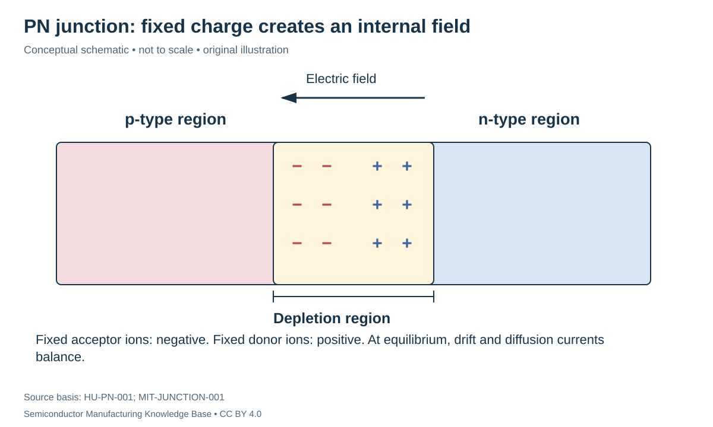

# PN junctions: diffusion creates an internal electric field

Status: **Reviewed — author self-review; specialist review pending**. Owner: repository author. Article type: foundation explainer. Scope: general engineering; no proprietary process recipe. Source review: 2026-09-16.

## Prerequisites

Read [doping and transport](doping_and_transport.md), including charge neutrality, diffusion and drift.

## Why this matters — 30-second explanation

A **PN junction** is the transition between p-type and n-type semiconductor regions. It develops an internal electric field because carriers redistribute while dopant ions remain fixed. Junction behavior matters to diodes, isolation and the source/drain-to-body interfaces in many transistors. A junction is not normally made by gluing two finished wafer halves together; the drawing describes adjacent doped regions. [HU-PN-001](../42_references/bibliography.md#hu-pn-001)

## Intuition: diffusion creates its own opposition

Electrons initially have a concentration-driven tendency to diffuse from the n side toward the p side; holes tend the other way. The redistribution leaves a region with relatively few mobile carriers and uncompensated dopant-ion charge. That charge creates an electric field opposing further net diffusion. At thermal equilibrium, drift and diffusion currents balance for each carrier type; the particles do not stop moving. [MIT-JUNCTION-001](../42_references/bibliography.md#mit-junction-001)

*Figure F1-06 — Equilibrium PN junction, p side on the left and n side on the right. Original schematic; not to scale. Source basis: HU-PN-001 and MIT-JUNCTION-001. CC BY 4.0. The field points from the positive donor-ion region toward the negative acceptor-ion region; depleted does not mean absolutely carrier-free.*

## Depletion and built-in potential

The **depletion approximation** treats the space-charge region as dominated by fixed ionized dopants and the outer regions as approximately neutral. It is useful because it connects a doping profile to electrostatic behavior without tracking each atom.

For an abrupt equilibrium junction with full ionization and nondegenerate statistics:

$$
V_{bi}=\frac{k_BT}{q}\ln\left(\frac{N_A N_D}{n_i^2}\right).
$$

$V_{bi}$ is built-in potential in V; $k_B$ is Boltzmann's constant in J/K; $T$ is absolute temperature in K; $q$ is elementary charge in C. $N_A,N_D,n_i$ must use consistent concentration units, making the logarithm's argument dimensionless. $k_BT/q$ is a voltage. This relation is a model for a junction under its stated assumptions, not a universal fixed “silicon diode voltage.” [HU-PN-001](../42_references/bibliography.md#hu-pn-001)

**Hypothetical example:** at 300 K, use $k_BT/q=0.02585$ V, $N_A=N_D=10^{16}$ cm⁻³ and $n_i=10^{10}$ cm⁻³. The logarithm's argument is $10^{12}$, giving $V_{bi}\approx0.714$ V. Changing doping or temperature changes the value. An ordinary external voltmeter does not expose this as a freely available battery voltage; equilibrium contact potentials and electrochemical balance must be included.

## Which side depletes farther?

Charge balance in the abrupt-junction approximation gives

$$
N_A x_p=N_D x_n,
$$

where $x_p$ and $x_n$ are depletion widths on the p and n sides, in cm. Each side has a dopant count per unit area in cm⁻²; multiplication by $q$ gives the magnitudes of opposing fixed charge per unit area. If the n side is ten times more heavily doped, its depleted width is one tenth as large under this approximation. Most of the depleted distance lies in the lighter-doped side. [HU-PN-001](../42_references/bibliography.md#hu-pn-001)

## Bias changes the barrier

Forward bias lowers the barrier and promotes carrier injection. Reverse bias raises the barrier and expands the depletion region in the simple junction model. Reverse current is not exactly zero, and sufficiently strong fields can cause breakdown mechanisms that require further analysis. A source/drain junction's electric field is consequently sensitive to how fabrication sets the doping profile. [HU-PN-001](../42_references/bibliography.md#hu-pn-001)

The **built-in potential**, the **applied terminal voltage**, and a forward-biased diode's operating voltage at a selected current are different quantities. Avoid substituting the 0.714 V teaching result for all three.

## Manufacturing connection and limits

The [doping process](../12_doping/README.md) and subsequent thermal treatment establish spatial profiles; [metrology](../16_metrology_and_inspection/README.md) and [electrical test](../20_wafer_test/README.md) examine different aspects of the result. An abrupt-junction sketch is a useful reference, but real profiles can be graded. Depletion-region analysis deliberately violates local mobile-carrier neutrality inside the junction while preserving the full electrostatic balance.

This article provides device intuition before fab detail. It does not prescribe a junction depth, breakdown rating or implant dose for any product. Manufacturing failure questions include whether a profile is too shallow/deep for its design, whether an unwanted leakage path exists and whether the process distribution satisfies the intended electrical limits. Those questions need an actual device design and test conditions before they become quantitative yield claims.

## Checks for understanding

Label the fixed charge on each side of the diagram and explain the direction of the field. Why can equilibrium contain both drift and diffusion? If only one side's doping increases, explain which width tends to become smaller relative to the other, without assuming the total width is fixed.

## Position in the manufacturing map

[MAT-0010](../manufacturing_map/process_nodes.md#mat-0010), [PROC-0030](../manufacturing_map/process_nodes.md#proc-0030). These are process/material categories, not a tracked customer lot. Concept pages link to the operations they explain rather than inventing a physical manufacturing step.

## Rubin connection and evidence boundary

No mine, feedstock supplier, wafer specification, process recipe or transistor implementation is assigned to Rubin here. The [case-study plan](../38_case_studies/nvidia_rubin/README.md) and [Rubin map](../manufacturing_map/rubin_manufacturing_path.md) preserve that boundary. Company examples in these chapters are documented roles, not a Rubin bill of materials.

## Separate economics and further learning

Process cost drivers are recorded in the [Phase 1 evidence notes](../36_economics/phase1_cost_drivers.md); full [industry analysis](../37_investment_analysis/README.md) remains a later phase. Use the [glossary](../40_glossary/phase1_glossary.md) for definitions and the [learning sequence](../LEARNING_PATHS.md) for navigation.

## Sources and review

- [HU-PN-001](../42_references/bibliography.md#hu-pn-001)
- [MIT-JUNCTION-001](../42_references/bibliography.md#mit-junction-001)

Source locators and limitations are in the canonical bibliography. Review scope: original synthesis, scoped mathematical examples and conceptual figures. Independent specialist review has not been performed. Final module review is recorded in [AUDIT_PHASE1.md](../AUDIT_PHASE1.md).
