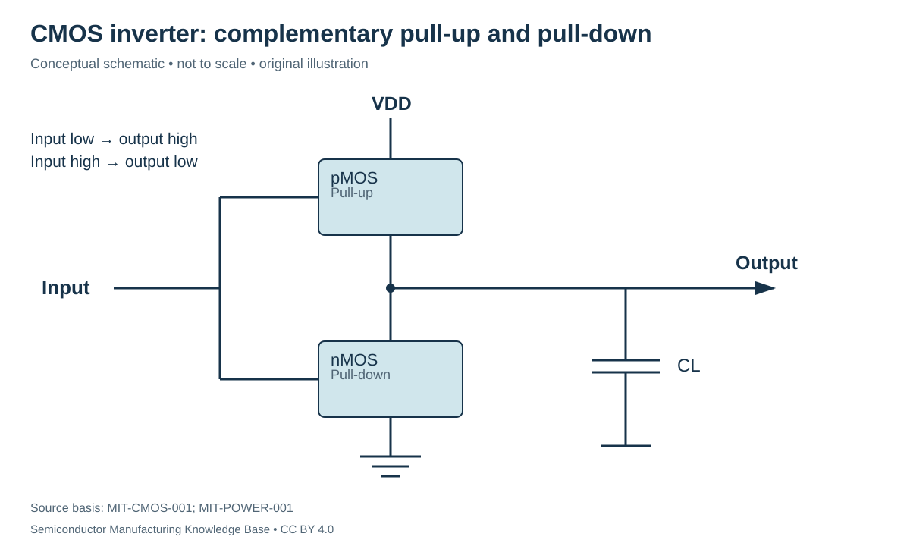
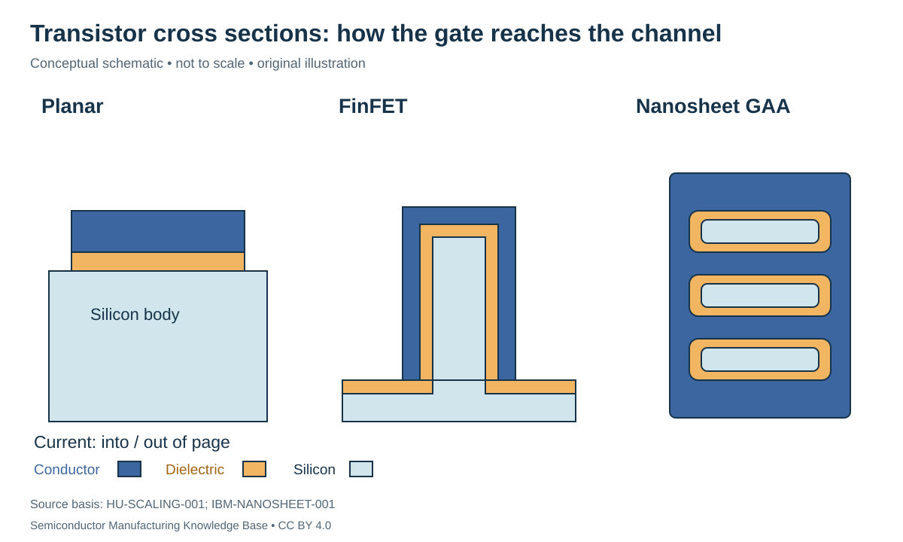

# CMOS logic and the move from planar gates to fins and nanosheets

Status: **Reviewed — author self-review; specialist review pending**. Owner: repository author. Article type: foundation explainer. Scope: general engineering; no proprietary process recipe. Source review: 2026-09-16.

## Prerequisites

Read [MOS capacitors and MOSFETs](mos_capacitor_and_mosfet.md). Know capacitance and stored electrical energy.

## Why this matters — 30-second explanation

A useful integrated circuit connects transistors into functions. **Complementary MOS (CMOS)** combines n-channel and p-channel devices; a simple inverter drives its output toward the opposite logic level from its input. Device geometry and capacitance affect how fast it switches and how much power it consumes. [MIT-CMOS-001](../42_references/bibliography.md#mit-cmos-001)

As gate lengths shrink, maintaining gate control of the channel becomes harder. FinFET and gate-all-around structures improve how the gate influences a thin semiconductor body. They do not remove all resistance, capacitance or heat constraints. [HU-SCALING-001](../42_references/bibliography.md#hu-scaling-001)

## From a transistor to an inverter

A CMOS inverter uses a pMOS pull-up toward supply $V_{DD}$ and an nMOS pull-down toward ground. Both gates receive the input, and their drain-side output node is shared. For an ideal input near ground, the pMOS path is on and the nMOS path is off; near $V_{DD}$, the reverse holds. During switching, the output capacitance must charge or discharge. [MIT-CMOS-001](../42_references/bibliography.md#mit-cmos-001)

*Figure F1-08 — Functional CMOS inverter. Original circuit-level schematic with transistor blocks; not a layout. Source basis: MIT-CMOS-001 and MIT-POWER-001. CC BY 4.0. Supply-to-ground leakage and brief switching overlap are omitted from the ideal picture, not asserted to be zero in a real circuit.*

This is the bridge from devices to digital functions. Networks implement logic; larger designs compose logic into registers, arithmetic and control. The [design-to-tapeout branch](../07_ic_design_and_tapeout/README.md) later explains how a circuit becomes a manufacturable physical layout.

## Charging, delay and switching power

A rough transition-time estimate is $t\approx C_L\Delta V/I$, where load capacitance $C_L$ is in F, voltage change $\Delta V$ in V, approximately available current $I$ in A and time $t$ in s. The unit check is F·V/A = C/A = s. This estimate ignores the changing transistor current during a transition. [MIT-POWER-001](../42_references/bibliography.md#mit-power-001)

**Hypothetical example:** $C_L=10$ fF, $\Delta V=0.8$ V and average $I=100$ µA give $t\approx80$ ps. Doubling the capacitance at the same average current doubles the estimate. This is an intuition for fan-out and wiring load, not a timing-signoff model.

For capacitive switching, a common accounting model is

$$
P_{dyn}=\alpha C_L V_{DD}^{2}f.
$$

$P_{dyn}$ is in W; $f$ is cycles/s; $\alpha$ is the mean number of output charging events per reference cycle; $C_L$ is in F and $V_{DD}$ in V. Defining $\alpha$ avoids a hidden factor-of-two convention. A complete charge/discharge event draws $C_LV_{DD}^2$ from the supply in the ideal model. Real total power also includes leakage and other losses. [MIT-POWER-001](../42_references/bibliography.md#mit-power-001) [HU-SCALING-001](../42_references/bibliography.md#hu-scaling-001)

With invented inputs $\alpha=0.1$, $C_L=10$ fF, $V_{DD}=0.8$ V and $f=1$ GHz, dynamic power is 0.64 µW for this modeled node. Summing transistor counts times this number would not reconstruct a real GPU: activity, loads and circuit roles differ.

## Why transistor geometry changed

In a planar MOSFET, a gate over a surface controls the channel. When dimensions become small enough, source/drain fields can influence the channel barrier more strongly. **Short-channel effects** describe this loss of the simple long-channel behavior; one concern is excessive off-state current. Raising threshold can reduce leakage but also reduces overdrive and drive current at a fixed supply. [HU-SCALING-001](../42_references/bibliography.md#hu-scaling-001)

*Figure F1-09 — Gate access to the channel. Original conceptual cross sections normal to source–drain current, which passes into/out of the page. Not to scale. Source basis: HU-SCALING-001 and IBM-NANOSHEET-001. CC BY 4.0. Conductor and dielectric are distinguished; these are architecture sketches rather than process recipes.*

| Architecture | Channel/gate relationship | Engineering tradeoff |
|---|---|---|
| Planar | Gate above the channel surface | Straightforward surface picture; short-channel control becomes difficult as dimensions shrink |
| FinFET | Gate controls multiple exposed sides of a narrow fin | Greater control and effective width per footprint; fin geometry adds manufacturing constraints |
| Gate-all-around (GAA) | Gate surrounds the channel cross section | Strong control of a thin body; access around the channel complicates integration |
| Stacked nanosheet GAA | Several sheet-shaped channels within a surrounding gate structure | Sheet width/stacking provide design choices; release, isolation and gate filling require control |

Nanosheets are an implementation of GAA, not a separate step after all GAA devices. A **chiplet** is a design partition/package concept, not another transistor cross section. **CONFIRMED — CLM-000009, historical:** IBM Research's 2019 technical account describes GAA nanosheet work and related integration challenges. This confirms a reported research architecture, not adoption in Rubin. [IBM-NANOSHEET-001](../42_references/bibliography.md#ibm-nanosheet-001)

## Manufacturing reality and next steps

**Parasitic capacitance** is coupling beyond the intended ideal element, such as unwanted gate/source-drain coupling. It still has to charge. Contacts and interconnect add resistance; dense devices create heat that must leave through the [thermal path](../27_thermal_management/README.md). A geometry change is useful only if the whole fabricated circuit meets performance, power, variability and reliability requirements.

The next manufacturing phases explain how isolation, patterning, deposition, etching, doping and contacts realize these structures. This foundation deliberately avoids assigning a process-node name a literal gate dimension or turning a historical research result into a future roadmap.

## Checks for understanding

Why does complementary switching reduce the ideal static supply-to-ground path without guaranteeing zero real power? Why can increased drive capability also increase the load seen by the preceding gate? Explain why improving gate control does not automatically remove packaging or cooling constraints.

## Position in the manufacturing map

[PROC-0030](../manufacturing_map/process_nodes.md#proc-0030), [ART-0042](../manufacturing_map/process_nodes.md#art-0042). These are process/material categories, not a tracked customer lot. Concept pages link to the operations they explain rather than inventing a physical manufacturing step.

## Rubin connection and evidence boundary

No mine, feedstock supplier, wafer specification, process recipe or transistor implementation is assigned to Rubin here. The [case-study plan](../38_case_studies/nvidia_rubin/README.md) and [Rubin map](../manufacturing_map/rubin_manufacturing_path.md) preserve that boundary. Company examples in these chapters are documented roles, not a Rubin bill of materials.

## Separate economics and further learning

Process cost drivers are recorded in the [Phase 1 evidence notes](../36_economics/phase1_cost_drivers.md); full [industry analysis](../37_investment_analysis/README.md) remains a later phase. Use the [glossary](../40_glossary/phase1_glossary.md) for definitions and the [learning sequence](../LEARNING_PATHS.md) for navigation.

## Sources and review

- [MIT-CMOS-001](../42_references/bibliography.md#mit-cmos-001)
- [MIT-POWER-001](../42_references/bibliography.md#mit-power-001)
- [HU-SCALING-001](../42_references/bibliography.md#hu-scaling-001)
- [IBM-NANOSHEET-001](../42_references/bibliography.md#ibm-nanosheet-001)

Source locators and limitations are in the canonical bibliography. Review scope: original synthesis, scoped mathematical examples and conceptual figures. Independent specialist review has not been performed. Final module review is recorded in [AUDIT_PHASE1.md](../AUDIT_PHASE1.md).
