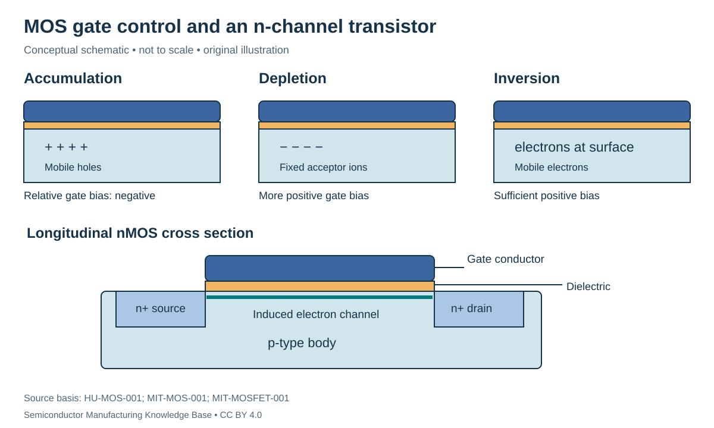

# From MOS capacitor to transistor: controlling a channel with a field

Status: **Reviewed — author self-review; specialist review pending**. Owner: repository author. Article type: foundation explainer. Scope: general engineering; no proprietary process recipe. Source review: 2026-09-16.

## Prerequisites

Read [carrier transport](../05_semiconductor_physics/doping_and_transport.md) and [PN junctions](../05_semiconductor_physics/pn_junctions.md).

## Why this matters — 30-second explanation

A **metal–oxide–semiconductor (MOS) capacitor** places an insulating dielectric between a conducting gate and a semiconductor. Gate voltage changes charge near the semiconductor surface. A **MOS field-effect transistor (MOSFET)** adds source and drain regions so that this surface charge can carry a controlled current. The word field-effect names how the gate controls the channel. [HU-MOS-001](../42_references/bibliography.md#hu-mos-001) [MIT-MOSFET-001](../42_references/bibliography.md#mit-mosfet-001)

## Intuition: control without an ideal DC gate-current path

A gate can influence charge across an insulator just as capacitor plates influence one another without a conducting wire through the dielectric. This does not mean switching the gate costs no energy. Charging capacitance requires transient current; real dielectrics can also leak. A MOS device uses the field to change a conduction path elsewhere in the structure.

*Figure F1-07 — Gate control and nMOS structure. Original conceptual cross section; not to scale. Source basis: HU-MOS-001, MIT-MOS-001 and MIT-MOSFET-001. CC BY 4.0. The p-type body, n+ source/drain, gate dielectric and induced channel are distinct. The drawing is not a Rubin process cross section.*

## Accumulation, depletion and inversion

Consider a p-type body and voltage measured relative to its electrical reference. Relative to **flatband** conditions, a sufficiently negative gate bias attracts majority holes toward the surface: **accumulation**. A more positive bias repels holes, exposing ionized acceptor charge: **depletion**. With sufficiently strong positive surface bias, electrons become the dominant mobile surface carriers: **inversion**. Material work functions and oxide/interface charge can shift the applied voltages at which these regimes occur. [MIT-MOS-001](../42_references/bibliography.md#mit-mos-001)

The **threshold voltage**, $V_T$, marks a chosen transition criterion for strong inversion in the model. It is not a statement that physical current jumps from exactly zero to nonzero at one infinitely sharp voltage. Threshold extraction is also measurement/model dependent.

## Gate capacitance and charge

For an ideal planar dielectric:

$$
C'_{ox}=\frac{\epsilon_{ox}}{t_{ox}},\qquad C_{ox}=C'_{ox}A.
$$

$C'_{ox}$ is capacitance per unit area in F/m²; dielectric permittivity $\epsilon_{ox}$ is in F/m; thickness $t_{ox}$ is in m; gate area $A$ is in m²; total capacitance $C_{ox}$ is in F. The semiconductor's response means the measured MOS capacitance is not always equal to this oxide-only capacitance. [HU-MOS-001](../42_references/bibliography.md#hu-mos-001)

**Hypothetical capacitor example:** take $\epsilon_{ox}=3.45\times10^{-11}$ F/m, $t_{ox}=4\times10^{-9}$ m and $A=10^{-12}$ m². Then $C'_{ox}=8.625\times10^{-3}$ F/m² and $C_{ox}=8.625$ fF. These are teaching inputs, not a modern GPU gate stack.

In a simple strong-inversion description, extra gate voltage beyond threshold increases the inversion charge magnitude approximately in proportion to effective gate capacitance. Real charge partition includes depletion and other effects, so the model must be named before assigning a numeric charge.

## Adding source and drain

An n-channel MOSFET has electron-supplying source and drain regions and a channel controlled by the gate. The body is a fourth terminal; source-to-body bias can affect threshold. Gate-to-source voltage $V_{GS}$ controls inversion, while drain-to-source voltage $V_{DS}$ drives current along the channel. Conventional drain current and electron motion have opposite directions. [MIT-MOSFET-001](../42_references/bibliography.md#mit-mosfet-001) [HU-MOSFET-001](../42_references/bibliography.md#hu-mosfet-001)

At small $V_{DS}$, the inverted channel behaves approximately like a gate-controlled resistance. At larger drain voltage, the simple long-channel model enters saturation as channel charge near the drain becomes depleted. Saturation does not mean that all charge stops or that every modern device has perfectly flat output current.

## A scoped current model

For an ideal long-channel device, constant mobility, strong inversion, negligible body/bulk-charge correction and no channel-length modulation:

$$
I_D=\beta\left[(V_{GS}-V_T)V_{DS}-\frac{V_{DS}^2}{2}\right],\quad
0\le V_{DS}\le V_{GS}-V_T,
$$

$$
I_{D,sat}=\frac{\beta}{2}(V_{GS}-V_T)^2,\quad
\beta=\mu_n C'_{ox}\frac{W}{L}.
$$

$I_D$ is in A; the voltages are in V; channel width $W$ and length $L$ use matching length units; $\mu_n$ is in m²/(V·s) when $C'_{ox}$ is in F/m². Therefore $\beta$ has units A/V². The saturation expression applies for $V_{DS}\ge V_{GS}-V_T$ within this model. These equations are a teaching approximation to the more general device behavior. [HU-MOSFET-001](../42_references/bibliography.md#hu-mosfet-001)

**Hypothetical example:** choose $\beta=1.0$ mA/V² and overdrive $V_{GS}-V_T=0.40$ V. At $V_{DS}=0.10$ V, $I_D=35$ µA. At and above the ideal saturation boundary of 0.40 V, the model gives 80 µA. No parameter here is extracted from a commercial process.

## Fabrication and failure implications

A MOSFET requires controlled semiconductor regions, gate dielectric, gate conductor and electrical contacts. Their detailed fabrication belongs to the [transistor integration](../17_transistor_fabrication/README.md) and [interconnect](../18_interconnects/README.md) branches. Changes in dielectric thickness, interface charge or body conditions can alter capacitance or threshold; the same nominal drawn transistor can therefore produce a distribution of electrical behavior. [HU-MOS-001](../42_references/bibliography.md#hu-mos-001) [HU-MOSFET-001](../42_references/bibliography.md#hu-mosfet-001)

Short-channel electrostatics, velocity saturation, mobility variation, leakage and parasitic resistance/capacitance limit the simple equations. The [next article](cmos_and_transistor_evolution.md) explains why device geometry evolved and how complementary transistors make logic.

## Checks for understanding

Why can an ideal insulated gate draw transient current? What would be wrong with using oxide capacitance as the measured MOS capacitance in every bias regime? Explain why the example's saturation voltage is not the threshold voltage, and why its current equation cannot predict Rubin performance.

## Position in the manufacturing map

[MAT-0010](../manufacturing_map/process_nodes.md#mat-0010), [PROC-0030](../manufacturing_map/process_nodes.md#proc-0030). These are process/material categories, not a tracked customer lot. Concept pages link to the operations they explain rather than inventing a physical manufacturing step.

## Rubin connection and evidence boundary

No mine, feedstock supplier, wafer specification, process recipe or transistor implementation is assigned to Rubin here. The [case-study plan](../38_case_studies/nvidia_rubin/README.md) and [Rubin map](../manufacturing_map/rubin_manufacturing_path.md) preserve that boundary. Company examples in these chapters are documented roles, not a Rubin bill of materials.

## Separate economics and further learning

Process cost drivers are recorded in the [Phase 1 evidence notes](../36_economics/phase1_cost_drivers.md); full [industry analysis](../37_investment_analysis/README.md) remains a later phase. Use the [glossary](../40_glossary/phase1_glossary.md) for definitions and the [learning sequence](../LEARNING_PATHS.md) for navigation.

## Sources and review

- [HU-MOS-001](../42_references/bibliography.md#hu-mos-001)
- [MIT-MOS-001](../42_references/bibliography.md#mit-mos-001)
- [MIT-MOSFET-001](../42_references/bibliography.md#mit-mosfet-001)
- [HU-MOSFET-001](../42_references/bibliography.md#hu-mosfet-001)

Source locators and limitations are in the canonical bibliography. Review scope: original synthesis, scoped mathematical examples and conceptual figures. Independent specialist review has not been performed. Final module review is recorded in [AUDIT_PHASE1.md](../AUDIT_PHASE1.md).
