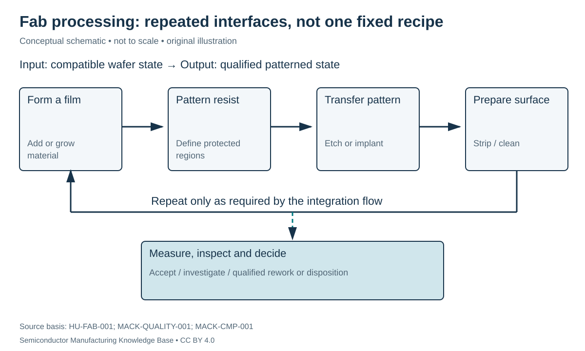

# Inside a fab: repeated operations and controlled interfaces

Status: **Reviewed — author technical/source review; independent specialist review pending.**
Last technical review: 2026-09-17 · Article class: process explainer.

## Prerequisites

Read [wafer preparation](../04_wafer_manufacturing/README.md) first. This chapter describes process functions, not a qualified manufacturing recipe.

## Why this matters

A fab turns a qualified starting wafer into patterned devices and wiring by repeatedly adding material, changing its properties, removing selected regions and checking the result. A good individual operation can still fail integration: its output may be unsuitable for the next operation. Planar wafer processing makes many devices together; the manufacturing sequence determines where materials and dopants remain. [HU-FAB-001](../42_references/bibliography.md#hu-fab-001), §3.1.

## From wafer to integrated structure

**Front end of line (FEOL)** forms active devices and isolation. **Middle of line (MOL)** connects device terminals to local wiring. **Back end of line (BEOL)** builds the interconnect stack. These labels describe integration regions; exact contact/local-interconnect boundaries vary. BEOL is wafer fabrication, distinct from subsequent packaging and assembly. Detailed device and wiring sequences belong to [Phase 3](../17_transistor_fabrication/README.md).

A representative learning loop is film formation → resist patterning → pattern transfer → resist removal → measurement. An implant can replace an etch as the operation selected by a resist opening. CMP may follow gap fill. Some films are blanket films without a lithography step. Cleaning occurs at qualified interfaces, not just at the start or end. This loop is a functional decomposition, not a universal recipe.

A **mask/reticle** carries spatial pattern information. A **recipe** specifies machine actions and settings for a particular operation. Neither is the complete process flow. A **lot** groups wafers for tracking and processing; a **carrier** physically transports or stores them. Single-wafer tools and batch tools therefore require different scheduling decisions. Lot genealogy must preserve which wafer experienced which chamber, recipe revision and measurement disposition.

## Equipment and contamination boundaries

The factory routes wafers among deposition chambers, lithography coat/develop tracks and scanners, etchers, implant/thermal tools, wet benches, polishers and measurement stations. Material compatibility matters as much as room air: a metal-contaminated wafer can carry contamination into a nominally clean furnace. Material history, dedicated labware and tool eligibility rules protect these interfaces. Stanford's classification is an example of facility-specific governance, not a universal classification system. [STANFORD-CLEAN-001](../42_references/bibliography.md#stanford-clean-001).

| Interface variable | Units / record | Why it matters | Check |
|---|---|---|---|
| Incoming film thickness | nm | Changes etch time and remaining margin | Thickness map |
| Surface topography | nm or µm with scale stated | Consumes lithography focus margin | Height map |
| Prior thermal exposure | Temperature–time history | Changes subsequent diffusion/film behavior | Recipe genealogy |
| Material history | Categorical record | Determines contamination eligibility | Route gate |
| Queue time | min or h | May change surface condition; adds cycle time | Dispatch history |

## Throughput is not cycle time

**Throughput** is output per time; **cycle time** is elapsed time from entry to exit. In a hypothetical line, two serial stations capable of 100 and 80 wafers/h cannot sustain more than 80 wafers/h without changing the bottleneck. Availability, rework and qualification can lower that bound. A wafer spending 2 minutes in a chamber and 58 minutes waiting has a one-hour elapsed interval even if the chamber itself processes 30 wafers/h. These are arithmetic examples, not fab operating estimates.

Batching introduces another tradeoff: waiting for a full batch may improve machine utilization while extending individual wafer cycle time. More in-process inventory does not by itself create more bottleneck capacity.

## Failure chains and integration review

A residual film can inhibit adhesion → resist lifts → the etched feature is damaged → post-develop and post-etch inspection distinguish where failure appeared. Excess topography can produce local defocus → incorrect pattern dimensions → electrical variation; planarization and focus measurements address different parts of this chain. A changed chamber condition can shift the output distribution even while one sampled wafer passes its dimensional specification. [MACK-QUALITY-001](../42_references/bibliography.md#mack-quality-001); [MACK-CMP-001](../42_references/bibliography.md#mack-cmp-001).

The integration question is therefore: what state is required at this boundary, what evidence establishes it, and what disposition follows a failed check? Accepted wafers feed this chapter; qualified patterned structures feed device integration. Measurement is a recurring decision point, not a final stamp of universal quality.

## Position in the manufacturing map

`FAM-0100` identifies this process scope in the [persistent entity register](../manufacturing_map/process_nodes.md). The [Phase 2 map guide](../manufacturing_map/phase2_unit_processes.md) separates process-family membership from the illustrative physical route. Upstream and downstream interfaces are defined in the chapter, not inferred from learning order. Continue to [photolithography](../09_photolithography/lithography.md).

## Connections and boundaries

Use the [Phase 2 glossary](../40_glossary/phase2_glossary.md), [method comparisons](../41_reference_tables/phase2_comparisons.md), and [process cost drivers](../36_economics/phase2_cost_drivers.md). Equipment categories are linked in the map; the broader [equipment ecosystem](../33_equipment_ecosystem/README.md) and [investment analysis](../37_investment_analysis/README.md) remain later work. Product-specific recipes and customer adoption are **UNKNOWN / PROPRIETARY** here. No verified [Rubin implementation](../38_case_studies/nvidia_rubin/README.md) is inferred from general applicability.

## Sources and review

- [HU-FAB-001](../42_references/bibliography.md#hu-fab-001): Device fabrication chapter; only cited mechanism sections.
- [STANFORD-CLEAN-001](../42_references/bibliography.md#stanford-clean-001): Material history, tool eligibility and labware discussion
- [MACK-QUALITY-001](../42_references/bibliography.md#mack-quality-001): Pattern-transfer and resist-property slides
- [MACK-CMP-001](../42_references/bibliography.md#mack-cmp-001): Pages 1–2: topography, pressure/speed and dishing/erosion

Source scope, equations, illustration rights and remaining limitations are recorded in the [Phase 2 audit](../AUDIT_PHASE2.md). Hypothetical numbers are teaching examples, not tool specifications or process targets.
