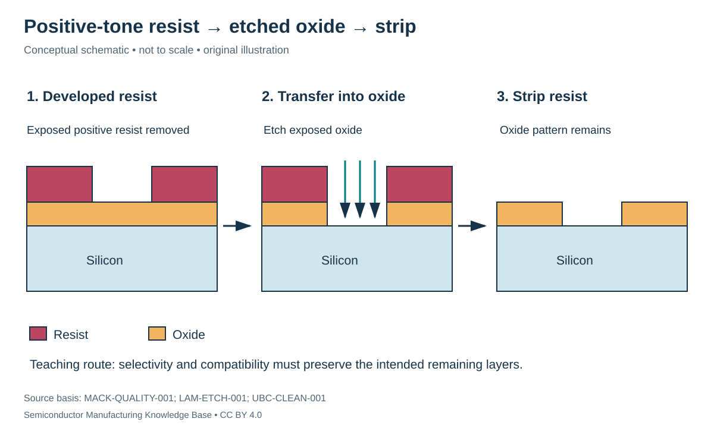

# Photolithography: from optical image to usable resist pattern

Status: **Reviewed — author technical/source review; independent specialist review pending.**
Last technical review: 2026-09-17 · Article class: process explainer.

## Prerequisites

Read [fab interfaces](../08_fab_overview/fab_flow.md) first. This chapter describes process functions, not a qualified manufacturing recipe.

## Why this matters

Lithography locates openings and protected regions for a later etch, implant or other pattern-transfer operation. It does not normally machine the final structure directly. A useful resist image must also survive its next operation and be removable afterward. Adhesion, etch resistance, collapse resistance and compatibility therefore matter alongside optical resolution. [MACK-QUALITY-001](../42_references/bibliography.md#mack-quality-001).

## Coat, expose, develop and inspect

Start with a compatible clean surface. Surface preparation and an adhesion treatment, when qualified for that material, support a uniform resist coating. Spin coating distributes liquid resist; a soft bake removes solvent and prepares the film. The exposure system aligns the wafer to existing marks, focuses on the surface and projects the mask pattern. Development converts a latent chemical image into a physical pattern. **Positive tone** means exposed regions become more soluble; **negative tone** means exposed regions remain preferentially. Tone and chemistry must be stated rather than inferred from a cartoon. [HU-FAB-001](../42_references/bibliography.md#hu-fab-001), §3.3.

In a conventional chemically amplified resist, exposure generates acid from a photoacid generator. A **post-exposure bake (PEB)** permits catalyzed chemistry that changes solubility. Bake history and acid transport affect edge position as well as sensitivity. This mechanism does not describe every EUV resist, including all metal-containing formulations. [MACK-CAR-001](../42_references/bibliography.md#mack-car-001).

The coat/develop **track** controls dispense, spin, bake and development functions. The **scanner** supplies illumination, projection optics, precision stages, alignment and focus control. These are distinct equipment functions even when tightly coupled in production. A developed opening must be measured before assuming it will produce the intended etched dimension.

## DUV and EUV: what physically changes

KrF and ArF excimer-laser lithography use nominal wavelengths of 248 nm and 193 nm respectively. EUV uses approximately 13.5 nm radiation; laser-produced tin plasma is the light-source mechanism described by ASML. These are radiation wavelengths, not marketed semiconductor node dimensions. [ASML-LIGHT-001](../42_references/bibliography.md#asml-light-001).

DUV systems use refractive projection optics. Immersion introduces liquid between the final lens and wafer to increase numerical aperture. EUV absorption prevents a comparable transmissive optical path: illumination and imaging use reflective optics in vacuum. [ASML-OPTICS-001](../42_references/bibliography.md#asml-optics-001). Multilayer mirrors use constructive interference from alternating layers; their performance depends on wavelength and incidence geometry, rather than ordinary bulk-metal reflectivity alone. A reflective EUV mask combines a multilayer reflector with a patterned absorber. [ZEISS-EUV-001](../42_references/bibliography.md#zeiss-euv-001), optics section.

A **pellicle** intercepts particles away from the mask's image plane. An EUV pellicle must transmit useful radiation while tolerating absorbed energy, creating transmission and thermal constraints. It does not make a mask immune to every defect. [ASML-PELLICLE-001](../42_references/bibliography.md#asml-pellicle-001).

## Resolution, focus and placement are different constraints

Numerical aperture is $NA=n\sin\theta$, with medium refractive index $n$ and collection half-angle $\theta$. A common resolution scaling is

$$CD=k_1\frac{\lambda}{NA}.$$

Here $CD$ and wavelength $\lambda$ use the same length unit; $k_1$ and $NA$ are dimensionless. $k_1$ summarizes pattern and process effects, not a universal material constant. Hypothetically, $k_1=0.35$, $\lambda=193$ nm and $NA=1.35$ give $CD\approx50.0$ nm. This does not establish a production process window. [ASML-RAYLEIGH-001](../42_references/bibliography.md#asml-rayleigh-001).

Paraxial depth-of-focus scaling is $DOF\propto\lambda/NA^2$ for fixed acceptance convention and other conditions. Raising NA by a factor of 1.5 reduces this approximate focus range to $1/1.5^2=0.444$ of its earlier value. This explains why flatter wafers and focus control matter; the simple expression is not a complete high-NA optical model. [MACK-DOF-001](../42_references/bibliography.md#mack-dof-001). High-NA EUV follows this resolution/focus tradeoff conceptually; no future product timetable is asserted.

**Critical dimension (CD)** is a designated feature width or size. **CD uniformity (CDU)** describes its variation over a specified population. **Overlay** measures relative placement between patterns, commonly between layers. Correct linewidth can coexist with incorrect placement. Optical diffraction measurements and electron imaging support different measurement tasks. [ASML-METRO-001](../42_references/bibliography.md#asml-metro-001).

| Variable | Units | Tradeoff or consequence |
|---|---|---|
| Exposure dose | mJ/cm² | Sensitivity and stochastic response versus exposure time |
| Focus error | nm | Changes aerial-image contrast and printed size |
| Resist thickness | nm | Transfer durability versus aspect ratio/collapse |
| Bake temperature/time | °C; s | Chemistry and diffusion must both remain controlled |
| CD / overlay | nm | Size and placement budgets must be assessed separately |

## Pattern correction and failure modes

**Optical proximity correction (OPC)** modifies mask geometry to compensate for neighborhood-dependent imaging. Phase and illumination engineering also improve usable image contrast. These techniques require a calibrated imaging/process model; a corrected mask shape need not resemble the desired wafer shape. [HU-FAB-001](../42_references/bibliography.md#hu-fab-001), §3.3. Multiple patterning divides a difficult pattern among exposures or uses additional pattern-transfer steps. It adds alignment or transfer sensitivities rather than simply dividing every dimension by a fixed factor.

At EUV scales, photon statistics and material chemistry can produce local missing contacts, bridges or broken lines. An acceptable average CD does not rule out rare failures. Increasing dose can help one source of variation but is not a universal cure for material and pattern-dependent defects. [IMEC-STOCH-001](../42_references/bibliography.md#imec-stoch-001). As an ideal statistical illustration only, independent Poisson photon counts have relative standard deviation $1/\sqrt{N}$; four times the count halves that contribution. Actual resist failures cannot be predicted from that expression alone.

Defocus → reduced image contrast → dimensional error is checked through focus/dose characterization and CD measurements. Poor adhesion → lifted resist → lost protection requires surface/process correction. Pattern collapse → merged or missing structures calls for profile and material review. Overlay error → misplaced contacts can cause opens or shorts despite acceptable resist linewidth. Each diagnosis must identify the measurement stage and sampled area; inspection after development and inspection after etch answer different questions.

## Position in the manufacturing map

`PROC-0101` identifies this process scope in the [persistent entity register](../manufacturing_map/process_nodes.md). The [Phase 2 map guide](../manufacturing_map/phase2_unit_processes.md) separates process-family membership from the illustrative physical route. Upstream and downstream interfaces are defined in the chapter, not inferred from learning order. Continue to [etching](../11_etching/etching.md).

## Connections and boundaries

Use the [Phase 2 glossary](../40_glossary/phase2_glossary.md), [method comparisons](../41_reference_tables/phase2_comparisons.md), and [process cost drivers](../36_economics/phase2_cost_drivers.md). Equipment categories are linked in the map; the broader [equipment ecosystem](../33_equipment_ecosystem/README.md) and [investment analysis](../37_investment_analysis/README.md) remain later work. Product-specific recipes and customer adoption are **UNKNOWN / PROPRIETARY** here. No verified [Rubin implementation](../38_case_studies/nvidia_rubin/README.md) is inferred from general applicability.

## Sources and review

- [HU-FAB-001](../42_references/bibliography.md#hu-fab-001): Device fabrication chapter; only cited mechanism sections.
- [MACK-QUALITY-001](../42_references/bibliography.md#mack-quality-001): Pattern-transfer and resist-property slides
- [MACK-CAR-001](../42_references/bibliography.md#mack-car-001): Photoacid and post-exposure-bake slides
- [ASML-LIGHT-001](../42_references/bibliography.md#asml-light-001): DUV and EUV light-source sections
- [ASML-OPTICS-001](../42_references/bibliography.md#asml-optics-001): DUV and EUV optics sections
- [ZEISS-EUV-001](../42_references/bibliography.md#zeiss-euv-001): EUV optics and Bragg-reflection discussion
- [ASML-PELLICLE-001](../42_references/bibliography.md#asml-pellicle-001): Pellicle purpose and EUV transmission discussion
- [ASML-RAYLEIGH-001](../42_references/bibliography.md#asml-rayleigh-001): Rayleigh equation and variable definitions
- [MACK-DOF-001](../42_references/bibliography.md#mack-dof-001): Page 2: depth of focus and paraxial approximation
- [ASML-METRO-001](../42_references/bibliography.md#asml-metro-001): Optical and electron-beam metrology sections
- [IMEC-STOCH-001](../42_references/bibliography.md#imec-stoch-001): Stochastic failures and inspection discussion

Source scope, equations, illustration rights and remaining limitations are recorded in the [Phase 2 audit](../AUDIT_PHASE2.md). Hypothetical numbers are teaching examples, not tool specifications or process targets.
