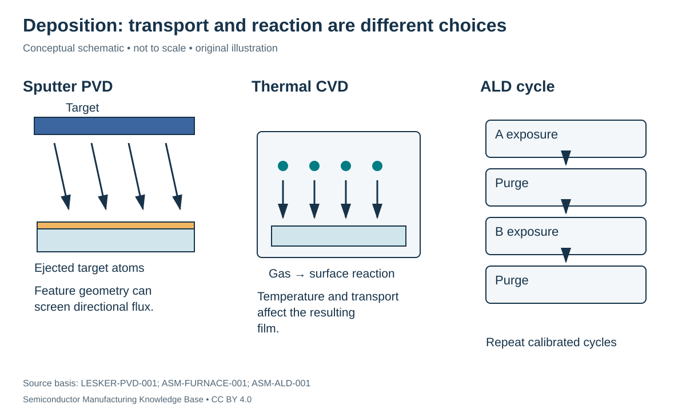

# Deposition: choosing how a film reaches the surface

Status: **Reviewed — author technical/source review; independent specialist review pending.**
Last technical review: 2026-09-17 · Article class: process explainer.

## Prerequisites

Read [fab interfaces](../08_fab_overview/fab_flow.md) first. This chapter describes process functions, not a qualified manufacturing recipe.

## Why this matters

Deposition supplies a film with required composition, thickness and geometry. A film can be thick enough on the wafer top yet discontinuous inside a feature. Three questions must stay separate: how material arrives, how it reacts or attaches, and whether the resulting film meets the next operation's requirements.

## Mechanisms, materials and equipment

| Method | Mechanism and tool function | Example material role | Strength and limitation |
|---|---|---|---|
| CVD | Gas delivery and reaction at a controlled surface | Dielectric or silicon films | Reaction/transport balance controls coverage; precursor by-products must leave |
| LPCVD | Thermal CVD under reduced pressure, often in a batch furnace | Silicon nitride or polysilicon | Batch capability; thermal exposure constrains compatible stacks |
| PECVD | Plasma supplies reactive species alongside substrate heating | Dielectric films | Lower substrate temperature possible; film properties and plasma exposure still matter |
| ALD | Separated precursor exposures and purge steps use saturating surface reactions | Thin dielectric or other qualified films | Thickness and complex-surface coverage control; cycle time and access to deep surfaces matter |
| Sputter PVD | Plasma ions eject atoms from a target; transported atoms form a film | Metal films | Direct target-material supply; directional flux can limit coverage |
| Epitaxy | Growth follows the crystalline template | Si/SiGe device regions | Crystal structure and composition control; surface preparation is critical |

LPCVD is a pressure/process category, while PECVD identifies plasma assistance; neither name alone fixes a film's quality. Furnace temperature distribution and gas delivery affect a batch. [ASM-FURNACE-001](../42_references/bibliography.md#asm-furnace-001). PECVD changes how energy drives precursor chemistry; it is not simply room-temperature thermal CVD. [ASM-PECVD-001](../42_references/bibliography.md#asm-pecvd-001).

In ALD, a first exposure reacts with available surface sites, excess species are removed, a complementary exposure completes the chemistry, and another purge prepares the next cycle. Thermal and plasma-assisted variants exist. Saturation is a process objective; growth per cycle need not equal one full atomic layer. Insufficient exposure or purge can defeat the intended behavior. [ASM-ALD-001](../42_references/bibliography.md#asm-ald-001).

Sputtering uses energetic ion bombardment of a target rather than volatilizing the entire desired film through a chemical precursor. A vacuum chamber, target, plasma supply and wafer holder perform distinct functions. [LESKER-PVD-001](../42_references/bibliography.md#lesker-pvd-001). Geometry then matters: a narrow opening can screen a directional flux from its lower sidewalls. This geometric argument explains why a flat-wafer thickness number cannot establish high-aspect-ratio coverage.

Epitaxy is defined by crystalline registry, not by a unique source-delivery method. Surface cleanliness and the underlying crystal affect nucleation. SiGe composition and in-situ doping can be additional design variables, with selectivity dependent on the actual material/chemistry combination. [ASM-EPI-001](../42_references/bibliography.md#asm-epi-001).

## What to measure

**Nucleation** is the start of film formation. A delay before continuous coverage matters especially for ultrathin films. **Conformality** describes coverage over a shape; **wafer uniformity** describes variation across positions on the wafer. A conformal coating can still have a wafer-scale thickness gradient. **Stress** is internal mechanical loading that can deform the wafer or damage interfaces.

| Variable | Units | Acceptance question |
|---|---|---|
| Thickness / growth per cycle | nm; nm/cycle | Is the target reached after nucleation? |
| Temperature / pressure | °C; Pa | Is the chemistry compatible with the stack? |
| Composition | Atomic fraction or concentration | Does the film have the required function? |
| Film stress | Pa or MPa | Will the stack remain mechanically compatible? |
| Step coverage | Ratio, location specified | Does the critical sidewall or bottom remain covered? |

## Worked coverage and cycle example

Hypothetically, a measured steady growth rate of 0.10 nm/cycle gives 8.0 nm after 80 active cycles. If the first 10 cycles contribute negligible growth, the same 80-cycle run produces approximately 7.0 nm under that simplified model. This is why a calibrated intercept can matter as much as slope. Neither value describes a commercial chemistry.

A sidewall thickness of 9 nm divided by a top thickness of 10 nm gives 0.90 sidewall/top coverage. Report where each was measured; this ratio says nothing about the trench bottom or wafer-edge thickness.

## Failures and alternatives

Delayed nucleation → discontinuous film → unintended conduction or poor barrier function can be investigated with thickness, composition and cross-section measurements. Excess stress → cracking/delamination → broken interfaces requires stress and adhesion assessment. Poor feature access → unfilled regions or seams → integration failure requires cross-section review rather than only blanket thickness. Particles → local raised defects → downstream patterning problems connect deposition to [cleaning](../14_cleaning/cleaning.md).

Thermal oxidation is a distinct alternative when the required film is oxide grown by consuming silicon. Depositing an oxide adds material from supplied precursors and need not consume the underlying silicon in the same mass-balance relationship. Use the canonical [oxidation chapter](../13_oxidation/oxidation.md) for that distinction. Downstream etch and CMP must be qualified against the actual film, not merely its method name.

## Position in the manufacturing map

`PROC-0102` identifies this process scope in the [persistent entity register](../manufacturing_map/process_nodes.md). The [Phase 2 map guide](../manufacturing_map/phase2_unit_processes.md) separates process-family membership from the illustrative physical route. Upstream and downstream interfaces are defined in the chapter, not inferred from learning order. Continue to [CMP](../15_cmp/cmp.md).

## Connections and boundaries

Use the [Phase 2 glossary](../40_glossary/phase2_glossary.md), [method comparisons](../41_reference_tables/phase2_comparisons.md), and [process cost drivers](../36_economics/phase2_cost_drivers.md). Equipment categories are linked in the map; the broader [equipment ecosystem](../33_equipment_ecosystem/README.md) and [investment analysis](../37_investment_analysis/README.md) remain later work. Product-specific recipes and customer adoption are **UNKNOWN / PROPRIETARY** here. No verified [Rubin implementation](../38_case_studies/nvidia_rubin/README.md) is inferred from general applicability.

## Sources and review

- [ASM-FURNACE-001](../42_references/bibliography.md#asm-furnace-001): Vertical furnace and LPCVD description
- [ASM-PECVD-001](../42_references/bibliography.md#asm-pecvd-001): Technology overview
- [ASM-ALD-001](../42_references/bibliography.md#asm-ald-001): ALD process and thermal/plasma discussion
- [LESKER-PVD-001](../42_references/bibliography.md#lesker-pvd-001): Sputtering mechanism explanation
- [ASM-EPI-001](../42_references/bibliography.md#asm-epi-001): Technology overview and material discussion

Source scope, equations, illustration rights and remaining limitations are recorded in the [Phase 2 audit](../AUDIT_PHASE2.md). Hypothetical numbers are teaching examples, not tool specifications or process targets.
