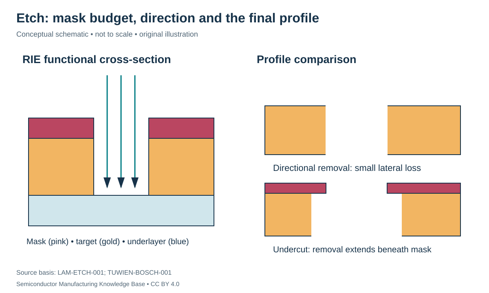

# Etching: selective removal with a controlled profile

Status: **Reviewed — author technical/source review; independent specialist review pending.**
Last technical review: 2026-09-17 · Article class: process explainer.

## Prerequisites

Read [lithography](../09_photolithography/lithography.md) first. This chapter describes process functions, not a qualified manufacturing recipe.

## Why this matters

An etch translates a mask opening into a three-dimensional material boundary. Removing the correct average thickness is insufficient if sidewalls, underlying layers or remaining mask are damaged. The input is a specified material stack and masking state; the output is a profile with controlled remaining materials and residues.

## Wet and dry mechanisms

A wet etch exposes material to a liquid chemistry. Reaction, transport and crystal orientation can all matter. Wet does not universally mean isotropic: some crystalline materials etch differently along different orientations. Conversely, a plasma does not automatically produce a vertical profile. **Isotropic** removal proceeds similarly in different directions; **anisotropic** removal is direction dependent.

Plasma etching combines reactive species with charged-particle effects. In **reactive ion etching (RIE)**, ion assistance helps direct or activate removal while chemical reactions form removable products. The chamber must supply gases, sustain the plasma, control the wafer environment and remove products. **Selectivity** compares removal rates of two named materials; it is not an intrinsic constant of the target alone. [LAM-ETCH-001](../42_references/bibliography.md#lam-etch-001).

**Deep reactive ion etching (DRIE)** targets deep features. In a Bosch-type sequence, passivation alternates with etching. Ion bombardment helps clear bottom passivation while protected sidewalls survive, producing directional progress. The alternating mechanism can leave scalloped sidewalls, and transport through deep features affects performance. This is a particular DRIE approach, not the definition of every deep etch. [TUWIEN-BOSCH-001](../42_references/bibliography.md#tuwien-bosch-001).

**Atomic layer etching (ALE)** separates controlled surface modification and removal steps to improve incremental removal control. Its useful process window depends on chemistry, surface and energy; the name alone does not promise one exact atomic layer per cycle or zero damage. It is an alternative control strategy within etching, not a guarantee that every material can be etched this way. [LAM-ALE-001](../42_references/bibliography.md#lam-ale-001), historical cyclic-process explanation.

## Profile, loading and endpoint

**Aspect ratio** is feature depth divided by a specified lateral dimension. A 10 µm-deep, 0.5 µm-wide trench has aspect ratio 20:1. As a feature deepens, incoming reactants and outgoing products have a more restricted path. **Loading** means that material demand and pattern density affect the process; identical nominal openings in different neighborhoods may not behave identically.

An **endpoint** signal indicates a relevant process transition. A subsequent qualified overetch can address nonuniform clearing, but consumes mask/underlayer margin. A time limit and an endpoint measurement answer different questions: elapsed time is not direct evidence that every local opening has cleared.

| Variable | Units | Tradeoff |
|---|---|---|
| Target etch rate | nm/min | Throughput versus profile and damage constraints |
| Selectivity, target/mask | Dimensionless | Determines required mask budget |
| Ion energy / bias | eV; instrument bias in V | Directionality versus damage; voltage is not always ion energy |
| Pressure | Pa | Transport and collision conditions |
| Depth / sidewall angle | nm or µm; degrees with reference stated | Device geometry and fill compatibility |

## Hypothetical mask budget

Suppose target rate is 100 nm/min and target/mask selectivity is 5. Ideal mask rate is then 20 nm/min. Removing 200 nm of target takes 2 minutes and consumes 40 nm of mask. Adding 20% time raises estimated mask consumption to 48 nm. Units cancel as $(\mathrm{nm/min})(\mathrm{min})=\mathrm{nm}$. This assumes constant rates, no loading and no transient effects; actual mask design needs margin and measured profile behavior.

## Defects, consequences and detection

Excess lateral removal → undercut → shifted feature size can be detected by cross-section/profile measurement. Incomplete bottom clearing → residue → poor contact requires bottom-sensitive inspection or electrical follow-up. Mask erosion → loss of protection → unwanted material removal calls for mask and selectivity review. Aggressive charged-particle exposure can damage sensitive dielectric structures; plasma charging can stress thin oxides, including through connected conductors. [HU-FAB-001](../42_references/bibliography.md#hu-fab-001), §3.4.

Inspection should distinguish missing material, residual material and damaged material. Each can produce an electrical failure through a different mechanism. Post-etch strip and cleaning receive the actual residual stack; the next deposition receives its geometry and surface condition. The preferred wet/RIE/DRIE/ALE route follows those interface requirements rather than a simple “newer is better” ranking.

## Position in the manufacturing map

`PROC-0103` identifies this process scope in the [persistent entity register](../manufacturing_map/process_nodes.md). The [Phase 2 map guide](../manufacturing_map/phase2_unit_processes.md) separates process-family membership from the illustrative physical route. Upstream and downstream interfaces are defined in the chapter, not inferred from learning order. Continue to [post-process cleaning](../14_cleaning/cleaning.md).

## Connections and boundaries

Use the [Phase 2 glossary](../40_glossary/phase2_glossary.md), [method comparisons](../41_reference_tables/phase2_comparisons.md), and [process cost drivers](../36_economics/phase2_cost_drivers.md). Equipment categories are linked in the map; the broader [equipment ecosystem](../33_equipment_ecosystem/README.md) and [investment analysis](../37_investment_analysis/README.md) remain later work. Product-specific recipes and customer adoption are **UNKNOWN / PROPRIETARY** here. No verified [Rubin implementation](../38_case_studies/nvidia_rubin/README.md) is inferred from general applicability.

## Sources and review

- [LAM-ALE-001](../42_references/bibliography.md#lam-ale-001): cyclic process and profile tradeoffs; product performance claims excluded.

- [LAM-ETCH-001](../42_references/bibliography.md#lam-etch-001): Etch process overview and process categories
- [TUWIEN-BOSCH-001](../42_references/bibliography.md#tuwien-bosch-001): Section 6.4, process sequence and profile discussion
- [HU-FAB-001](../42_references/bibliography.md#hu-fab-001): Device fabrication chapter; only cited mechanism sections.

Source scope, equations, illustration rights and remaining limitations are recorded in the [Phase 2 audit](../AUDIT_PHASE2.md). Hypothetical numbers are teaching examples, not tool specifications or process targets.
