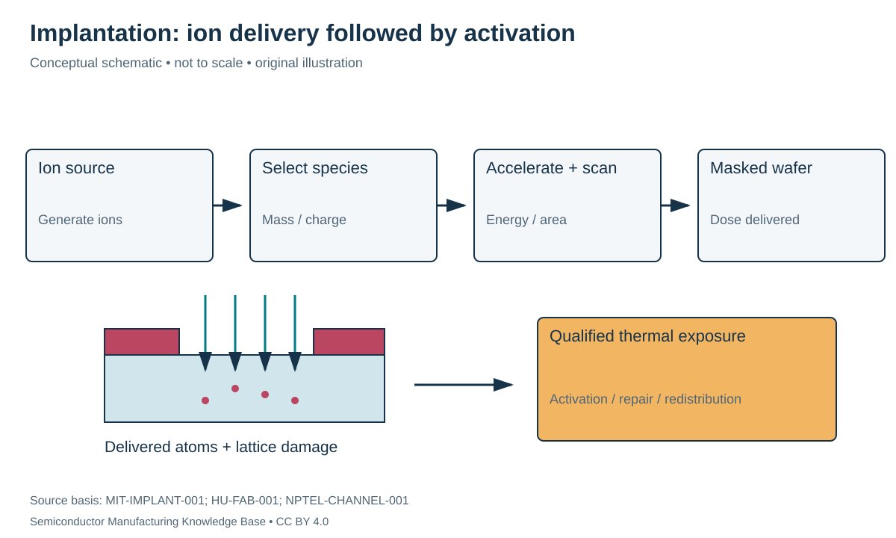

# Doping and activation: placing atoms is only half the task

Status: **Reviewed — author technical/source review; independent specialist review pending.**
Last technical review: 2026-09-17 · Article class: process explainer.

## Prerequisites

Read [semiconductor carriers](../05_semiconductor_physics/README.md) first. This chapter describes process functions, not a qualified manufacturing recipe.

## Why this matters

Doping changes semiconductor electrical behavior through electrically active impurities. The concentration of incorporated atoms, the concentration of active dopants and the free-carrier concentration are related but not identical. Compensation, activation and temperature matter. The [carrier chapter](../05_semiconductor_physics/README.md) supplies the electrical interpretation.

## Implantation versus diffusion

In ion implantation, a source generates ions; mass selection chooses a species/charge-to-mass range; acceleration and beam optics control delivery; scanning distributes exposure across the wafer. A masking structure blocks or attenuates the implant where required. **Energy**, usually stated in keV, influences the depth distribution. **Dose**, in ions/cm², is integrated arrival per area. It is not a volume concentration. [MIT-IMPLANT-001](../42_references/bibliography.md#mit-implant-001), implantation equipment slides.

Diffusion redistributes species through thermal motion and concentration-dependent transport. Source conditions matter: a sustained surface source and a finite deposited dose do not produce the same depth profile. A diffusion length scales with the square root of diffusivity times time in a simple constant-diffusivity model; a boundary condition is still needed to determine the actual profile. [MIT-IMPLANT-001](../42_references/bibliography.md#mit-implant-001), opening diffusion slides.

Implantation damages the lattice as ions lose energy. Subsequent annealing repairs damage and allows dopants to occupy electrically useful sites. **Rapid thermal processing (RTP)** controls a short thermal exposure; it does not eliminate diffusion or every defect. The challenge is to obtain sufficient activation while retaining the intended spatial profile. [HU-FAB-001](../42_references/bibliography.md#hu-fab-001), §3.5.1.

## Crystal direction and thermal budget

**Channeling** occurs when crystal directions permit a fraction of ions to penetrate differently from a random-direction picture. Tilting the wafer or modifying the entrance layer can reduce channeling, but masking topography and shadowing introduce additional constraints. No universal angle or screening-layer thickness is appropriate for every structure. [NPTEL-CHANNEL-001](../42_references/bibliography.md#nptel-channel-001).

The **thermal budget** is the accumulated temperature–time exposure relevant to a specified mechanism. It is not one universal scalar for all diffusion, activation and film reactions. Earlier doping must survive later hot processes. Conversely, reducing every thermal exposure may leave inadequate activation. Integration therefore evaluates the final profile, not only the as-implanted state.

| Variable | Units | Function and verification |
|---|---|---|
| Dose | ions/cm² | Integrated delivery; beam-current accounting and calibration |
| Ion energy | keV | Depth distribution; species/stack-dependent profile measurement |
| Tilt / rotation | degrees | Crystal and feature geometry; shadowing review |
| Anneal temperature/time | °C; s | Activation/damage repair versus redistribution |
| Active concentration | cm⁻³ | Electrical interpretation; not inferred from dose alone |
| Junction depth | nm | Location where relevant net doping changes sign |

## A charge-to-dose calculation

For constant collected current $I$, time $t$, uniformly exposed area $A$, elementary charge $q$ and ion charge state $z$, the ideal dose is

$$Q=\frac{It}{zqA}.$$

Using hypothetical $I=1$ µA, $t=10$ s, $A=10$ cm², $z=1$, and $q=1.602176634\times10^{-19}$ C gives $Q=6.24\times10^{12}$ ions/cm². The dimensional check is coulombs divided by coulombs per ion and area. This assumes the measured current represents the implanted ions and ignores collection, scanning and secondary-electron corrections.

Even perfect dose knowledge cannot determine a depth profile without energy, material and transport information. Nor does it determine activation. Spreading a dose uniformly over an assumed thickness is only an average-concentration thought experiment; a real implant profile is not a uniform box.

## Failure chains and alternatives

Channeling → unexpectedly deep tail → altered junction behavior calls for depth-profile and electrical checks. Mask shadowing → local underdose → electrical nonuniformity requires geometry-aware review. Residual damage → defect-assisted leakage requires suitable structural/electrical characterization. Excess later diffusion → broadened profile → changed device dimensions connects this chapter to thermal processing and device integration.

Chemical profiling measures where atoms are; electrical measurements test their effective behavior. A sheet-resistance result alone cannot reconstruct every depth-dependent concentration. Alternatives include diffusion from a controlled source and doping during epitaxial growth. Compare spatial control, damage, masking and subsequent thermal constraints rather than assuming interchangeable final structures.

## Position in the manufacturing map

`PROC-0104` identifies this process scope in the [persistent entity register](../manufacturing_map/process_nodes.md). The [Phase 2 map guide](../manufacturing_map/phase2_unit_processes.md) separates process-family membership from the illustrative physical route. Upstream and downstream interfaces are defined in the chapter, not inferred from learning order. Continue to [thermal oxidation](../13_oxidation/oxidation.md).

## Connections and boundaries

Use the [Phase 2 glossary](../40_glossary/phase2_glossary.md), [method comparisons](../41_reference_tables/phase2_comparisons.md), and [process cost drivers](../36_economics/phase2_cost_drivers.md). Equipment categories are linked in the map; the broader [equipment ecosystem](../33_equipment_ecosystem/README.md) and [investment analysis](../37_investment_analysis/README.md) remain later work. Product-specific recipes and customer adoption are **UNKNOWN / PROPRIETARY** here. No verified [Rubin implementation](../38_case_studies/nvidia_rubin/README.md) is inferred from general applicability.

## Sources and review

- [MIT-IMPLANT-001](../42_references/bibliography.md#mit-implant-001): Opening diffusion slides and implantation equipment slides
- [HU-FAB-001](../42_references/bibliography.md#hu-fab-001): Device fabrication chapter; only cited mechanism sections.
- [NPTEL-CHANNEL-001](../42_references/bibliography.md#nptel-channel-001): Channeling discussion

Source scope, equations, illustration rights and remaining limitations are recorded in the [Phase 2 audit](../AUDIT_PHASE2.md). Hypothetical numbers are teaching examples, not tool specifications or process targets.
