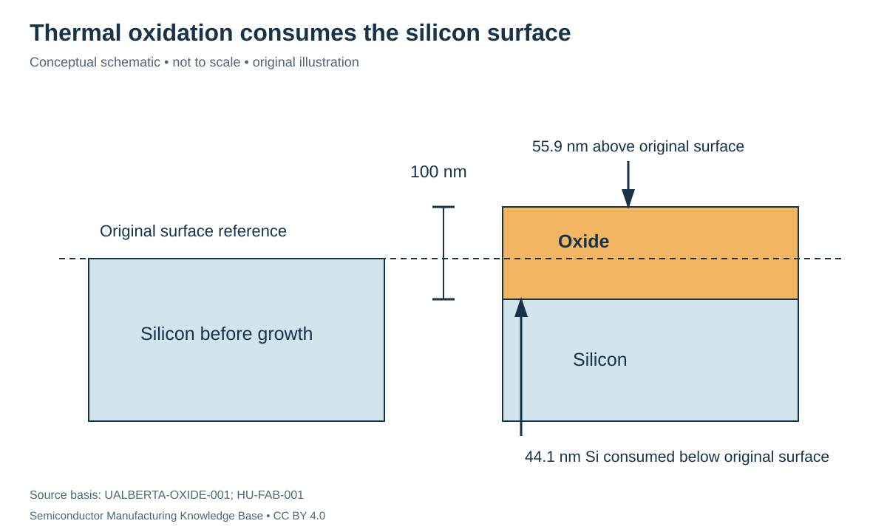

# Thermal oxidation: growing oxide by consuming silicon

Status: **Reviewed — author technical/source review; independent specialist review pending.**
Last technical review: 2026-09-17 · Article class: process explainer.

## Prerequisites

Read [deposition mechanisms](../10_deposition/deposition.md) first. This chapter describes process functions, not a qualified manufacturing recipe.

## Why this matters

Thermal oxidation forms silicon oxide by reacting oxidant with silicon. Some of the original silicon becomes part of the oxide. That makes it physically different from depositing an oxide onto an arbitrary surface. The moving silicon/oxide interface matters whenever geometry is tightly constrained.

## Mechanism and equipment

A thermal reactor controls wafer temperature, ambient delivery and time. In dry oxidation, the oxidant is oxygen; wet oxidation uses water vapor. Oxidant reaches the reacting interface through the existing oxide as growth proceeds. Film thickness therefore changes the transport problem during the run. [HU-FAB-001](../42_references/bibliography.md#hu-fab-001), §3.2.

Wet and dry processes differ in growth behavior; wet oxidation can grow oxide more rapidly under comparable conditions. Models depend on temperature, pressure, surface orientation and initial oxide assumptions. The University of Alberta calculator explicitly cautions about model validity for very thin oxide. Treat a calculator as a model implementation, not as qualification of a particular furnace or interface. [UALBERTA-OXIDE-001](../42_references/bibliography.md#ualberta-oxide-001).

**Interface quality** concerns the electrical and structural state where silicon meets oxide. Thickness alone cannot establish interface-trap density, leakage, breakdown behavior or long-term reliability. The intended use determines which measurements matter. A thick isolation-related oxide and a sensitive device dielectric therefore need different acceptance evidence even if both are called silicon dioxide.

## A moving-boundary mass balance

For a planar, dense, stoichiometric oxide with conserved silicon atoms, the consumed silicon thickness is

$$x_{Si}=x_{ox}\frac{\rho_{ox}}{\rho_{Si}}\frac{M_{Si}}{M_{SiO_2}}.$$

Here $x$ is thickness, $\rho$ is mass density and $M$ is molar mass. Ratios are dimensionless, so both sides have length units. Using the densities and molar masses documented by the Alberta tool gives $x_{Si}=0.4407x_{ox}$ approximately. A hypothetical 100 nm oxide consumes about 44.1 nm of silicon and extends about 55.9 nm above the original surface. The oxide/Si interface moves downward; the top surface moves upward.

This example does not predict oxide thickness versus time. It assumes a planar geometry and the cited material densities; curvature, stress, nonstoichiometry or a different film density require additional treatment. It also does not apply unchanged to deposited oxide.

## Variables and kinetics

| Variable | Units | Engineering interpretation |
|---|---|---|
| Temperature | °C or K, convention stated | Controls reaction and transport rates |
| Time | s or min | Growth exposure, including relevant transients |
| Oxidant ambient / pressure | Species; Pa | Boundary conditions for transport |
| Initial oxide thickness | nm | Growth begins through an existing layer |
| Final oxide thickness | nm | Geometry and electrical function |
| Interface quality | Measurement-specific | Requires electrical/structural evidence, not thickness alone |

At smaller thicknesses, interfacial reaction can strongly influence growth; with increasing thickness, transport through oxide becomes more important. A simple constant nm/min extrapolation is therefore not generally valid over a wide thickness range. Temperature ramp and cooldown history can also matter to the integrated result. Exact rate constants and recipes remain process-specific.

## Failures, alternatives and interfaces

Contamination at the incoming surface → impaired interface properties → leakage or reliability problems motivates qualified cleaning and electrical characterization. Thickness nonuniformity → variation in electrical or masking function calls for a thickness map rather than one center-point reading. Excess thermal exposure → dopant redistribution → altered junction geometry links oxidation to the [doping chapter](../12_doping/doping.md).

Thermally grown oxide is useful when consumption of silicon and the thermal exposure fit the integration plan. Deposited oxides extend options to different underlying materials and thermal constraints, but their deposition method and subsequent treatment determine properties. “Oxide” is a composition category, not a promise of interchangeable electrical quality. Downstream lithography/etch receive both the oxide thickness and the changed surface geometry.

## Position in the manufacturing map

`PROC-0105` identifies this process scope in the [persistent entity register](../manufacturing_map/process_nodes.md). The [Phase 2 map guide](../manufacturing_map/phase2_unit_processes.md) separates process-family membership from the illustrative physical route. Upstream and downstream interfaces are defined in the chapter, not inferred from learning order. Continue to [cleaning](../14_cleaning/cleaning.md).

## Connections and boundaries

Use the [Phase 2 glossary](../40_glossary/phase2_glossary.md), [method comparisons](../41_reference_tables/phase2_comparisons.md), and [process cost drivers](../36_economics/phase2_cost_drivers.md). Equipment categories are linked in the map; the broader [equipment ecosystem](../33_equipment_ecosystem/README.md) and [investment analysis](../37_investment_analysis/README.md) remain later work. Product-specific recipes and customer adoption are **UNKNOWN / PROPRIETARY** here. No verified [Rubin implementation](../38_case_studies/nvidia_rubin/README.md) is inferred from general applicability.

## Sources and review

- [HU-FAB-001](../42_references/bibliography.md#hu-fab-001): Device fabrication chapter; only cited mechanism sections.
- [UALBERTA-OXIDE-001](../42_references/bibliography.md#ualberta-oxide-001): Introduction and calculation details

Source scope, equations, illustration rights and remaining limitations are recorded in the [Phase 2 audit](../AUDIT_PHASE2.md). Hypothetical numbers are teaching examples, not tool specifications or process targets.
