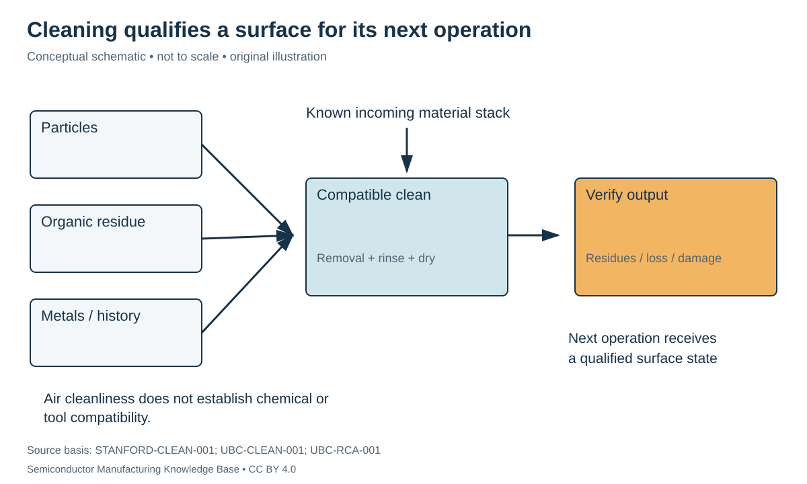

# Cleaning: controlling contamination without damaging the stack

Status: **Reviewed — author technical/source review; independent specialist review pending.**
Last technical review: 2026-09-17 · Article class: process explainer.

## Prerequisites

Read [etching interfaces](../11_etching/etching.md) first. This chapter describes process functions, not a qualified manufacturing recipe.

## Why this matters

A clean surface is defined relative to its next operation. Removing one contaminant while changing an essential film or spreading contamination to other wafers is not a successful clean. The incoming material stack and processing history must be known before choosing a method.

## Contamination classes and equipment boundaries

Particles create localized geometric obstructions. Organic residues can change adhesion or interfacial chemistry. Metallic contamination can change electrical behavior or contaminate shared equipment. Airborne cleanliness controls only one entry path; chemicals, handling surfaces, carriers and process tools also contribute.

Stanford's process-flow rules illustrate why material history and segregated equipment/labware matter: a shared liquid bath can redistribute contamination, and using a permissive tool does not reset the wafer's history. The local category names are facility-specific. [STANFORD-CLEAN-001](../42_references/bibliography.md#stanford-clean-001).

## What the methods do

Solvent cleaning targets compatible organic residues, but solvent residue and subsequent surface condition still matter. Removing native oxide is a different objective from removing an organic film. UBC's teaching procedures distinguish these functions; this chapter deliberately describes purpose rather than reproducing chemical operating instructions. [UBC-CLEAN-001](../42_references/bibliography.md#ubc-clean-001).

The RCA family includes alkaline peroxide cleaning, often called SC-1, and acidic peroxide cleaning, often called SC-2. Their contaminant-removal purposes differ; SC-2 targets metallic contamination. Such chemistry can leave or change a chemical oxide, so the resulting surface termination must be considered. Names alone do not specify a universally safe sequence for metals, dielectrics and fragile patterned features. [UBC-RCA-001](../42_references/bibliography.md#ubc-rca-001).

A wet bench supplies compatible chemical handling, controlled exposure and rinsing. NIST's RCA bench is an example of cleaning associated with subsequent high-temperature processing. [NIST-CLEAN-001](../42_references/bibliography.md#nist-clean-001). Rinsing transfers soluble residues away; drying must then avoid leaving contamination or unacceptable forces on fragile structures. Ultrapure water describes controlled water quality beyond the simple absence of ions: relevant acceptance categories can include particles, dissolved species and organics. No water-grade numerical limits are prescribed here.

Plasma cleaning/ashing uses reactive species to remove compatible residues, including selected organic films. Energetic or reactive exposure can also modify the desired surface. A strip process therefore needs its own compatibility review; complete removal of resist does not prove absence of every residue or absence of damage.

## Variables and checks

| Variable | Units / form | Question |
|---|---|---|
| Residue identity | Chemical/material class | Is the removal mechanism appropriate? |
| Chemical exposure | Concentration convention; temperature; time | What else in the stack can react? |
| Particle population | Count with size threshold and area | What was actually removed or added? |
| Rinse quality | Specified measurement and units | Were soluble residues displaced? |
| Surface termination | Chemical state | Is the next deposition/adhesion step compatible? |
| Queue time after clean | min or h | Can the prepared surface change before use? |

## An honest removal metric

Suppose a hypothetical inspection counts 1,000 particles before a clean and 10 afterward over the same inspected area, with the same detectable-size threshold. The count-based removal fraction is $(1000-10)/1000=99\%$. This says nothing by itself about particles below the detection threshold, metals, electrical yield or newly damaged structures. If inspection conditions differ, even that comparison is invalid.

A count-based metric should therefore retain area, size threshold, scan method and uncertainty. “Zero detected” is not equivalent to a chemically perfect surface.

## Failure chains and selection

Incompatible chemistry → unintended film loss → changed dimensions requires thickness/profile checks. Contaminated bath → redeposition → more defects requires input and tool-history investigation. Incomplete residue removal → poor adhesion/nucleation → pattern or film failure requires surface-sensitive analysis and downstream correlation. Aggressive removal/drying → damaged fragile features requires structural inspection, even if particle counts improve.

A pre-furnace clean, post-etch residue clean and post-CMP clean face different incoming materials. Prefer a method because its contaminant-removal function and damage budget match that interface. The output is a qualified surface state, not merely a wafer that has passed through a cleaning tool.

## Position in the manufacturing map

`PROC-0106` identifies this process scope in the [persistent entity register](../manufacturing_map/process_nodes.md). The [Phase 2 map guide](../manufacturing_map/phase2_unit_processes.md) separates process-family membership from the illustrative physical route. Upstream and downstream interfaces are defined in the chapter, not inferred from learning order. Continue to [metrology](../16_metrology_and_inspection/metrology.md).

## Connections and boundaries

Use the [Phase 2 glossary](../40_glossary/phase2_glossary.md), [method comparisons](../41_reference_tables/phase2_comparisons.md), and [process cost drivers](../36_economics/phase2_cost_drivers.md). Equipment categories are linked in the map; the broader [equipment ecosystem](../33_equipment_ecosystem/README.md) and [investment analysis](../37_investment_analysis/README.md) remain later work. Product-specific recipes and customer adoption are **UNKNOWN / PROPRIETARY** here. No verified [Rubin implementation](../38_case_studies/nvidia_rubin/README.md) is inferred from general applicability.

## Sources and review

- [STANFORD-CLEAN-001](../42_references/bibliography.md#stanford-clean-001): Material history, tool eligibility and labware discussion
- [UBC-CLEAN-001](../42_references/bibliography.md#ubc-clean-001): Overview, solvent clean and oxide-removal discussion
- [UBC-RCA-001](../42_references/bibliography.md#ubc-rca-001): Overview of RCA-1/RCA-2 purposes
- [NIST-CLEAN-001](../42_references/bibliography.md#nist-clean-001): Tool description

Source scope, equations, illustration rights and remaining limitations are recorded in the [Phase 2 audit](../AUDIT_PHASE2.md). Hypothetical numbers are teaching examples, not tool specifications or process targets.
