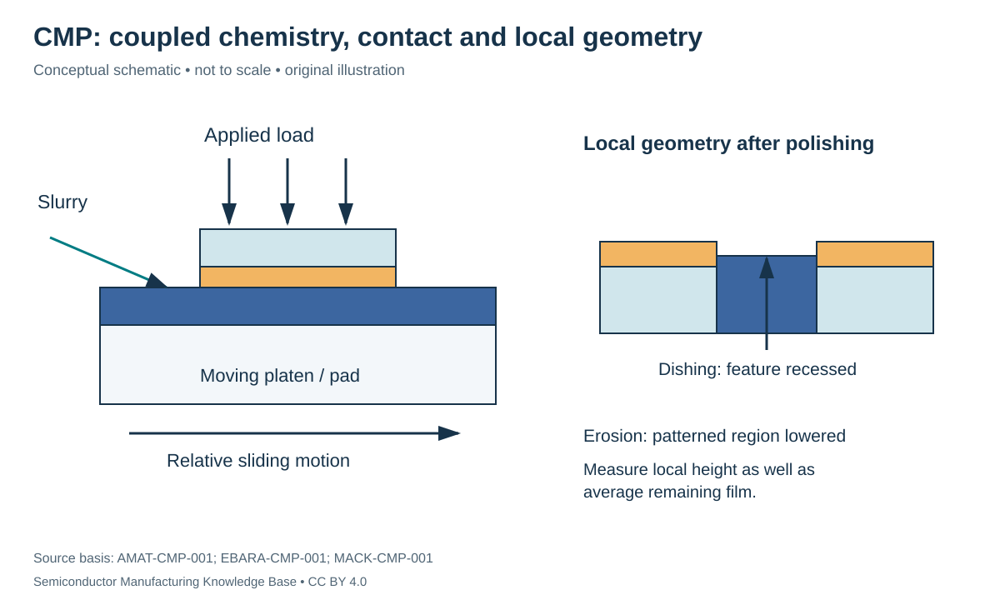

# CMP: removing overburden while preserving useful structures

Status: **Reviewed — author technical/source review; independent specialist review pending.**
Last technical review: 2026-09-17 · Article class: process explainer.

## Prerequisites

Read [deposition and film coverage](../10_deposition/deposition.md) first. This chapter describes process functions, not a qualified manufacturing recipe.

## Why this matters

Repeated film formation and patterning create height differences. Excess topography complicates coating and consumes lithography focus margin. Chemical mechanical planarization (CMP) reduces this topography while removing unwanted material. Removing material uniformly from a flat blanket wafer and planarizing a patterned wafer are related but different tasks. [MACK-CMP-001](../42_references/bibliography.md#mack-cmp-001), page 1.

## Pad, slurry, wafer and endpoint

A carrier presses the wafer against a moving polishing pad while slurry supplies chemical and abrasive functions. Material response, pressure and relative motion determine removal. The tool must manage slurry delivery, wafer loading and the evolving pad condition. Endpoint information helps stop near the intended material boundary; a correct average removal rate alone cannot determine the stopping point everywhere. [AMAT-CMP-001](../42_references/bibliography.md#amat-cmp-001).

**Pad conditioning** maintains the pad's working surface rather than allowing uncontrolled drift with use. **Overburden** is material above the intended retained features. **Selectivity** compares removal rates of named materials under the chosen process. Subsequent cleaning and drying remove residues and prepare the next interface; these functions can be integrated into a CMP tool system. [EBARA-CMP-001](../42_references/bibliography.md#ebara-cmp-001).

## Global planarity and local defects

**Dishing** is recess of a polished feature relative to its surrounding surface. **Erosion** is unwanted lowering of a patterned region or surrounding material during polishing. Pattern density and material removal differences make local behavior diverge from a blanket-film calibration. Overpolishing that clears one region can damage another. [MACK-CMP-001](../42_references/bibliography.md#mack-cmp-001), page 2.

These defects must be separated from scratches caused by local mechanical interactions and from residual particles after cleaning. A wafer can have acceptable average thickness but unacceptable local shape or contamination. The downstream reader is lithography or another integration operation needing both the remaining material and the surface geometry.

| Variable | Units | Tradeoff / check |
|---|---|---|
| Applied pressure | Pa or kPa | Removal versus mechanical stress and local response |
| Relative sliding speed | m/s | Removal rate; not identical to platen rpm |
| Slurry delivery and composition | Flow units; specified chemistry | Supply stability, reaction and particle behavior |
| Removal rate / uniformity | nm/min; defined percent or nm range | Blanket calibration versus patterned result |
| Remaining film / dishing | nm | Endpoint and local geometry |
| Pad condition | Tool-specific measurements | Drift and repeatability |

## A scoped rate example

A simple empirical pressure–velocity model writes removal rate $R=KPV$. With $R$ in m/s, pressure $P$ in Pa and sliding speed $V$ in m/s, the coefficient $K$ has units Pa⁻¹. The pressure/speed dependence is a local approximation, not a universal law for all films and slurries. [MACK-CMP-001](../42_references/bibliography.md#mack-cmp-001), pressure/speed slide.

For hypothetical $K=10^{-13}$ Pa⁻¹, $P=20{,}000$ Pa and $V=0.5$ m/s, $R=10^{-9}$ m/s, or 60 nm/min. Removing 180 nm would take 3 minutes if the rate stayed constant. This calculation excludes endpoint transients, pattern effects, tool nonuniformity and changes in the exposed material. It is not a polishing recipe.

## Failure chains and alternatives

Insufficient removal → residual overburden → unwanted connection or unprepared surface requires thickness and electrical/structural checks appropriate to the integration. Excess removal → dishing/erosion → changed resistance or later focus problems requires local topography measurement. Large abrasive agglomerates or debris → scratches → possible electrical damage requires defect inspection plus slurry/pad investigation. Residual slurry → contamination → downstream adhesion or film problems requires post-CMP cleaning verification.

Etchback and suitable material reflow are alternative ways to reduce some topography, but they do not automatically provide the same global planarization or material selectivity. The choice follows the structure, temperature constraints and acceptable material loss. Detailed isolation, contact and interconnect examples belong to Phase 3; this chapter establishes the physical tool functions and acceptance questions.

## Position in the manufacturing map

`PROC-0107` identifies this process scope in the [persistent entity register](../manufacturing_map/process_nodes.md). The [Phase 2 map guide](../manufacturing_map/phase2_unit_processes.md) separates process-family membership from the illustrative physical route. Upstream and downstream interfaces are defined in the chapter, not inferred from learning order. Continue to [measurement and control](../16_metrology_and_inspection/metrology.md).

## Connections and boundaries

Use the [Phase 2 glossary](../40_glossary/phase2_glossary.md), [method comparisons](../41_reference_tables/phase2_comparisons.md), and [process cost drivers](../36_economics/phase2_cost_drivers.md). Equipment categories are linked in the map; the broader [equipment ecosystem](../33_equipment_ecosystem/README.md) and [investment analysis](../37_investment_analysis/README.md) remain later work. Product-specific recipes and customer adoption are **UNKNOWN / PROPRIETARY** here. No verified [Rubin implementation](../38_case_studies/nvidia_rubin/README.md) is inferred from general applicability.

## Sources and review

- [MACK-CMP-001](../42_references/bibliography.md#mack-cmp-001): Pages 1–2: topography, pressure/speed and dishing/erosion
- [AMAT-CMP-001](../42_references/bibliography.md#amat-cmp-001): CMP mechanism and control description
- [EBARA-CMP-001](../42_references/bibliography.md#ebara-cmp-001): Polishing, cleaning and drying explanation

Source scope, equations, illustration rights and remaining limitations are recorded in the [Phase 2 audit](../AUDIT_PHASE2.md). Hypothetical numbers are teaching examples, not tool specifications or process targets.
