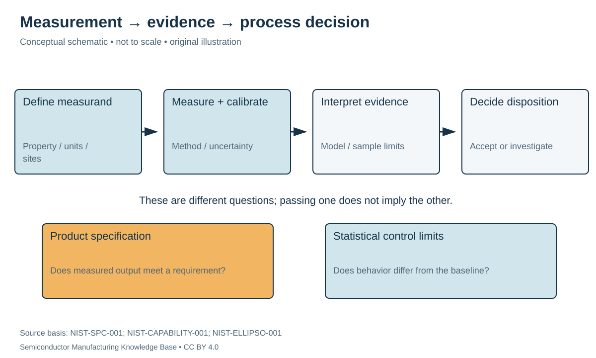

# Metrology and inspection: evidence for process decisions

Status: **Reviewed — author technical/source review; independent specialist review pending.**
Last technical review: 2026-09-17 · Article class: process explainer.

## Prerequisites

Read [fab process interfaces](../08_fab_overview/fab_flow.md) first. This chapter describes process functions, not a qualified manufacturing recipe.

## Why this matters

**Metrology** quantifies a property; **inspection** looks for defects or departures from an expected structure. Neither is useful without a defined measurand, sampling plan and decision rule. A highly precise measurement of the wrong quantity can still approve an unsuitable wafer.

## Match the method to the question

| Question | Method family | Main interpretation limit |
|---|---|---|
| Are patterns placed correctly? | Optical overlay metrology | Targets, sampling and model must represent the relevant placement |
| What is the feature width/profile? | CD-SEM or other electron imaging | Image contrast, charging and edge definition affect interpretation |
| How thick is a film? | Ellipsometry / optical reflectometry | Optical model and material properties matter |
| What is the surface height difference? | Profilometry | Probe/access geometry and lateral scale matter |
| What is on the surface? | Surface spectroscopy, including XPS | Surface-sensitive composition differs from bulk composition |
| Where are anomalies? | Optical/electron inspection | Detection threshold and reviewed area limit conclusions |

Optical diffraction and electron-beam tools provide complementary pattern information; one measurement technology does not universally replace the other. [ASML-METRO-001](../42_references/bibliography.md#asml-metro-001). **Ellipsometry** interprets changes in polarization through a film model. NIST's thin-film reference-material work illustrates how modeling and interpretation affect reported thickness; its 1998 abstract is not a specification for a current instrument. [NIST-ELLIPSO-001](../42_references/bibliography.md#nist-ellipso-001). **X-ray photoelectron spectroscopy (XPS)** uses photoelectron energies to investigate surface composition and chemical state. [NIST-XPS-001](../42_references/bibliography.md#nist-xps-001).

Stylus profilometry traces surface height mechanically; optical interference provides another height-measurement approach. Film thickness and surface height are distinct measurands, even when they share length units. [ASU-METRO-001](../42_references/bibliography.md#asu-metro-001).

Calibration links instrument response to reference information. Repeatability describes variation under stated repeated conditions; uncertainty includes additional relevant contributions. **Bias** is systematic offset relative to a reference. A reported value needs units, method, location, sampling context and an uncertainty appropriate to the decision.

## Sampling and process windows

A sampling plan specifies wafers, sites, features and times. Dense measurement consumes time; sparse measurement can miss localized or intermittent defects. Random sampling assumptions are particularly weak when defects cluster by wafer edge, chamber or pattern neighborhood. Inspecting a convenient test structure does not automatically prove all product geometries acceptable.

For an explicitly hypothetical independent model with defect probability 0.01 per inspected item, inspecting 100 items has probability $0.99^{100}\approx0.366$ of finding none. This is an original probability illustration, not a fab defect model. It explains why zero observations can be weak evidence; correlated populations require another model.

A **process window** is the set of conditions meeting specified acceptance criteria. A dose/focus window, for example, can require dimensions and defect performance simultaneously. Passing one nominal setting does not establish margin to drift or prove another pattern family will pass.

## Statistical control versus product acceptance

A control chart compares time-ordered observations with a baseline of process variation. Limits are selected under specified statistical assumptions; signals prompt investigation rather than automatically identifying the physical cause. [NIST-SPC-001](../42_references/bibliography.md#nist-spc-001). Specification limits describe requirements. A process can be stable yet unable to meet specifications, or show a statistical signal while a measured item still meets specification. Capability analysis therefore requires a suitable stable-process baseline. [NIST-CAPABILITY-001](../42_references/bibliography.md#nist-capability-001).

Suppose a hypothetical stable population has known mean 100 nm and standard deviation 2 nm. Three-sigma individual-observation limits are 94 and 106 nm. If the upper specification is 110 nm, a 107 nm observation is inside that specification but above the statistical upper limit. Recalculating limits to include every new excursion would erase the signal rather than explain it. Real charts must match subgrouping, distribution, autocorrelation and parameter-estimation assumptions.

## Excursion response and feedback

An **excursion** is a departure requiring evaluation. **Statistical process control (SPC)** uses measured process/product behavior to identify unusual variation. **Fault detection and classification (FDC)** uses tool traces or related signals to detect and help classify abnormal equipment behavior. A changed pressure trace is evidence about the tool; it is not automatically proof that every affected wafer failed electrically.

A useful response preserves records, checks measurement validity, identifies the potentially affected material, investigates the cause, and applies a documented disposition. Recipe corrections need a qualified relationship between the adjustment and the measured outcome. Otherwise feedback can chase measurement noise or move another property outside its window.

Wrong optical model → biased thickness → incorrect etch/CMP decision calls for reference/model validation. Sparse sampling → missed local defects → false acceptance calls for a revised sampling plan. Unrecognized instrument drift → apparent process shift → unnecessary adjustment calls for measurement-system checks. The output of this module is defensible evidence and a decision record; full electrical yield, wafer test and reliability qualification remain later phases.

## Position in the manufacturing map

`PROC-0108` identifies this process scope in the [persistent entity register](../manufacturing_map/process_nodes.md). The [Phase 2 map guide](../manufacturing_map/phase2_unit_processes.md) separates process-family membership from the illustrative physical route. Upstream and downstream interfaces are defined in the chapter, not inferred from learning order. Continue to [device integration in Phase 3](../17_transistor_fabrication/README.md).

## Connections and boundaries

Use the [Phase 2 glossary](../40_glossary/phase2_glossary.md), [method comparisons](../41_reference_tables/phase2_comparisons.md), and [process cost drivers](../36_economics/phase2_cost_drivers.md). Equipment categories are linked in the map; the broader [equipment ecosystem](../33_equipment_ecosystem/README.md) and [investment analysis](../37_investment_analysis/README.md) remain later work. Product-specific recipes and customer adoption are **UNKNOWN / PROPRIETARY** here. No verified [Rubin implementation](../38_case_studies/nvidia_rubin/README.md) is inferred from general applicability.

## Sources and review

- [ASU-METRO-001](../42_references/bibliography.md#asu-metro-001): optical and stylus measurement functions.

- [ASML-METRO-001](../42_references/bibliography.md#asml-metro-001): Optical and electron-beam metrology sections
- [NIST-ELLIPSO-001](../42_references/bibliography.md#nist-ellipso-001): Publication metadata and abstract only
- [NIST-XPS-001](../42_references/bibliography.md#nist-xps-001): Instrument technique description
- [NIST-SPC-001](../42_references/bibliography.md#nist-spc-001): Control-chart purpose and limits
- [NIST-CAPABILITY-001](../42_references/bibliography.md#nist-capability-001): Capability and process-stability discussion

Source scope, equations, illustration rights and remaining limitations are recorded in the [Phase 2 audit](../AUDIT_PHASE2.md). Hypothetical numbers are teaching examples, not tool specifications or process targets.
