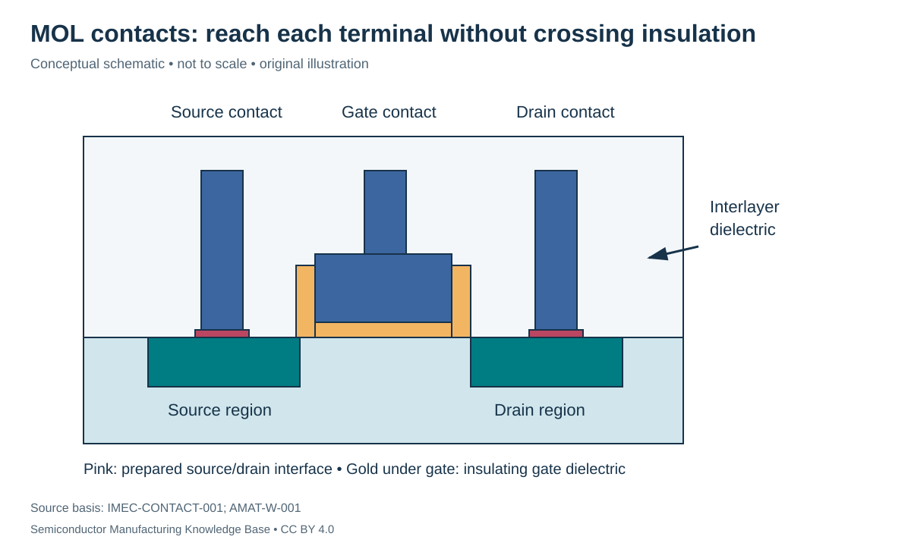

# Contacts and MOL: connecting the device without losing its advantage

Status: **Reviewed — author technical/source review; independent specialist review pending.**
Last technical review: 2026-09-17 · Article class: integration explainer.

## Prerequisites

Read [device integration](planar_and_finfet.md) and [metrology](../16_metrology_and_inspection/metrology.md). Distinguish chemical doping from electrically active carrier supply.

## The boundary between a transistor and its wires

A source/drain contact transfers carriers between semiconductor and conductor. A gate contact reaches the gate electrode, not the channel through the gate dielectric. A via in the wiring stack usually connects metal levels. Terminology varies by process, so this repository calls terminal access and its immediate local connections **middle of line (MOL)**; [BEOL](../19_back_end_of_line/beol_integration.md) owns the repeated wiring stack.

Contact resistance includes an interface contribution as well as spreading/access and plug contributions. Silicide formation can provide a suitable metal–semiconductor interface; a **silicide** is a compound of silicon and a metal, not simply any metal deposited on silicon. Interface quality and semiconductor-side doping affect carrier transfer. [IMEC-CONTACT-001](../42_references/bibliography.md#imec-contact-001), contact-resistance and test-vehicle sections.

## A representative contact module

Receive completed device regions embedded in a compatible interlayer dielectric. Pattern and etch openings to the selected terminals, remove relevant residues, prepare the interface, add qualified liner/nucleation layers where needed, fill with conductor and remove unwanted overburden. Contact etch must reach the intended surface while preserving nearby gate caps/spacers. A self-aligned scheme uses such protective structures to reduce sensitivity to a lithographic overlap error; it does not remove all alignment and etch constraints.

A conventional tungsten approach distinguishes liner/barrier, nucleation and bulk fill functions. These layers consume part of the available opening. [AMAT-W-001](../42_references/bibliography.md#amat-w-001), conventional-contact discussion. Cobalt approaches combine deposition, thermal treatment and planarization differently, illustrating why swapping metal names is not a complete process change. [AMAT-CO-001](../42_references/bibliography.md#amat-co-001). No universal W/Co resistance ranking or customer implementation is asserted.

## Contact area: a useful but limited calculation

For an ideal uniform interface, $R_c=\rho_c/A$, where specific contact resistivity $\rho_c$ is in Ω·cm² and area $A$ is in cm². Hypothetically, let $\rho_c=10^{-8}$ Ω·cm² and a square interface have side 40 nm, or $4\times10^{-6}$ cm. Then $A=1.6\times10^{-11}$ cm² and $R_c=625$ Ω. Halving the side reduces area fourfold and raises this ideal contribution to 2,500 Ω.

This calculation isolates the interface. It excludes plug resistance, current crowding, nonuniform interface properties and lateral semiconductor transport. A measured two-terminal resistance can include all of these. Extracting contact resistivity therefore requires a suitable test structure and model; a low metal-film resistivity is not a substitute for low interface resistance.

A related cylindrical plug example shows the geometry cost of liners. With outer radius 10 nm and a 2 nm radial non-core layer, the central conducting area fraction is $(8/10)^2=0.64$. If the outer layer's conduction is neglected, core resistance rises by $1/0.64=1.5625$ relative to a fully conducting opening of the same material and length. Conductive liners actually add parallel paths; their interface and reliability roles cannot be judged from area alone.

## Variables and failure consequences

| Variable | Units | Consequence and evidence |
|---|---|---|
| Contact opening / landing overlap | nm | Missed or reduced landing → resistance/open; cross-section and electrical chains |
| Interface state and contamination | Composition; method-specific metric | Poor carrier transfer → resistance variation; interface analysis plus extraction |
| Specific contact resistivity | Ω·cm² | Distinct from total Ω; qualified geometry/model required |
| Plug fill and remaining overburden | Void fraction/geometry; nm | Voids raise resistance; bridges can short neighboring terminals |
| Spacer/cap integrity | nm; continuity | Unintended gate contact → leakage/short; isolation checks |

A high-resistance contact is a parametric failure before it necessarily becomes an open circuit. Gate-to-source/drain shorts are a different mechanism. Review fill geometry, interface condition and electrical signatures together instead of assigning every failure to the metal. The delivered state is a wafer with accessible, isolated terminal connections, ready for wiring; it is not yet evidence of a functional logic die.

## Position in the manufacturing map

`PROC-0203` identifies this scope in the [entity register](../manufacturing_map/process_nodes.md#proc-0203). The [Phase 3 route guide](../manufacturing_map/phase3_integration.md) separates alternative device flows, contact formation and the wiring loop. These are representative teaching routes, not released foundry recipes. Fabrication output is not automatically a tested or known-good die.

## Connections and boundaries

[Phase 3 glossary](../40_glossary/phase3_glossary.md) · [Integration comparisons](../41_reference_tables/phase3_comparisons.md) · [Engineering cost drivers](../36_economics/phase3_cost_drivers.md). Equipment functions reuse the [Phase 2 process chapters](../LEARNING_PATHS.md#phase-2-reading-path); [ecosystem coverage](../33_equipment_ecosystem/README.md) remains later work. Full economics and [investment analysis](../37_investment_analysis/README.md) remain separate. Exact recipes, proprietary stack dimensions and customer adoption are **UNKNOWN / PROPRIETARY** in this treatment. No [Rubin process or supplier assignment](../38_case_studies/nvidia_rubin/README.md) is inferred.

## Sources and review

- [IMEC-CONTACT-001](../42_references/bibliography.md#imec-contact-001): Source/drain contact resistance; contact resistivity; test-vehicle discussion
- [AMAT-W-001](../42_references/bibliography.md#amat-w-001): Conventional tungsten contact and liner/nucleation discussion
- [AMAT-CO-001](../42_references/bibliography.md#amat-co-001): Deposition, anneal and CMP functional descriptions

The [Phase 3 audit](../AUDIT_PHASE3.md) records scope and limitations. Numerical examples are hypothetical unless explicitly identified as physical constants; no example is a qualified recipe or product specification.
