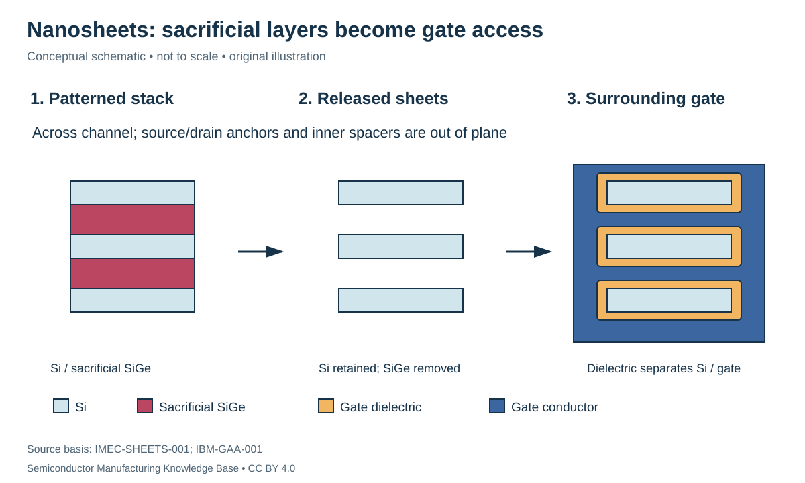
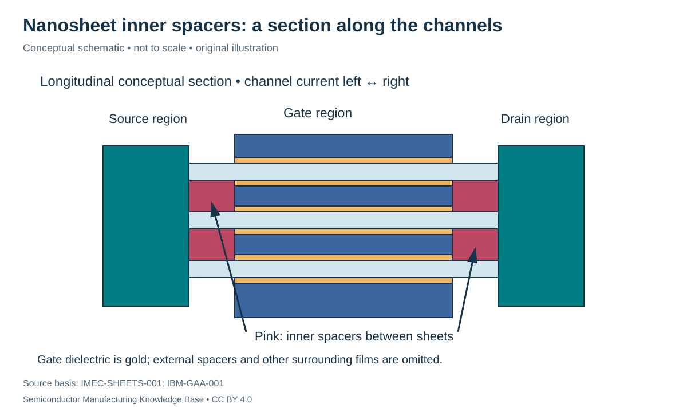

# Nanosheet integration: release the channels, then surround them

Status: **Reviewed — author technical/source review; independent specialist review pending.**
Last technical review: 2026-09-17 · Article class: integration explainer.

## Prerequisites

Read [planar and FinFET integration](planar_and_finfet.md), [epitaxial/ALD deposition](../10_deposition/deposition.md) and [selective etching](../11_etching/etching.md).

## Why the gate-all-around geometry changes manufacturing

A gate-all-around (GAA) nanosheet has an insulated gate surrounding the channel perimeter. Several horizontal channels can be stacked within one device footprint. Stacked sheets are channels of a device, not automatically separate vertically stacked nMOS and pMOS transistors. The latter is a different integration architecture.

A representative silicon-channel route begins with alternating Si and sacrificial SiGe layers. Patterning creates a multilayer body. Recessing sacrificial-layer ends and filling them with dielectric forms **inner spacers**. Selective SiGe removal later releases the channels, and replacement-gate processing puts dielectric and metal around them. Inner spacers separate the gate from source/drain regions at the sheet ends. These functions and the release/gate-space constraints are described in [IMEC-SHEETS-001](../42_references/bibliography.md#imec-sheets-001), “Critical nanosheet building blocks.”

## Representative sequence and state boundaries

The following is an author-composed learning sequence. Lithography, cleaning and inspection are implicit at qualified interfaces; it is not a complete mask list.

1. Grow and pattern a compatible alternating-layer stack; establish isolation and channel-body geometry.
2. Define a temporary gate and external spacers to locate the future channel region.
3. Prepare source/drain recesses and inner spacers at the sacrificial-layer ends; form suitable source/drain regions attached to the retained sheets.
4. Embed the structure in dielectric and expose/remove the temporary gate, preserving the intended access cavity.
5. Remove sacrificial material in the gate region while retaining the channels and their end attachments.
6. Form a conformal gate dielectric and work-function/fill metals, then define the final gate and contact interfaces.

The original nanosheet research paper documents an integrated structure with inner spacers, replacement work-function metals, bottom-isolation considerations and contact design. Its demonstration is a specific research vehicle, not proof of a particular product's recipe. [IBM-GAA-001](../42_references/bibliography.md#ibm-gaa-001), fabrication and device discussions.

## Why release and fill must be designed together

Selective removal needs access to sacrificial material without unacceptable channel loss or residue. Sheet roughness and thickness changes affect the channel that remains. **Stiction** means surfaces adhere when they should stay separated. After release, deposition must reach the sheet undersides and inter-sheet spaces. A film that looks uniform on top does not establish a complete surrounding gate. These are geometry and interface constraints, not independent tool optimizations.

The inner spacer has a different job from the external gate sidewall spacer: it occupies regions between channel sheets near the source/drain boundary. Its size affects separation, parasitic capacitance and the room left for other materials. Bottom isolation addresses unwanted conduction beneath the intended channel stack; STI beside the device alone does not establish that this path is suppressed.

## Hypothetical perimeter and clearance checks

For rectangular sheets of width $w$, thickness $t$ and count $N$, a geometric surrounded perimeter is $W_{geom}=2N(w+t)$. Three hypothetical sheets with $w=30$ nm and $t=5$ nm give 210 nm. This is a geometric bookkeeping proxy, not a prediction that current equals a planar device of that width: mobility, confinement, contact resistance and bias all matter.

Suppose the vertical free gap before gate deposition is 12 nm. If the combined dielectric/metal coating uses 3 nm on each facing surface, the remaining ideal clearance is $12-2(3)=6$ nm. Increasing the coating to 6 nm per side exhausts that clearance. Actual corners, nucleation and process access make this simple subtraction an incomplete fill model, but it exposes an integration constraint that a single-film thickness target hides.

| Variable | Units | Failure chain / check |
|---|---|---|
| Sheet thickness/width and spacing | nm | Variation → changed control or fill access; cross-section sampling |
| Inner spacer recess/fill | nm; continuity | Missing isolation or excess encroachment → leakage/capacitance/resistance changes |
| Sacrificial removal | Residual composition; channel loss in nm | Residue or over-removal → incomplete gate or damaged channel |
| Gate-stack coverage | nm around perimeter | Discontinuity → unstable electrical behavior; physical and electrical evidence |
| Source/drain attachment | Geometry; resistance | Poor connection → access resistance/open; contact and device tests |

Upstream deposition and etch receive a tighter coupled requirement here than in a blanket-film example. Downstream [MOL contacts](contacts_and_mol.md) must access the intended terminals without defeating the isolation just built. Wider or more numerous sheets cannot be assumed to improve circuit performance unless parasitic loading and terminal resistance are included.

## Position in the manufacturing map

`PROC-0202` identifies this scope in the [entity register](../manufacturing_map/process_nodes.md#proc-0202). The [Phase 3 route guide](../manufacturing_map/phase3_integration.md) separates alternative device flows, contact formation and the wiring loop. These are representative teaching routes, not released foundry recipes. Fabrication output is not automatically a tested or known-good die.

## Connections and boundaries

[Phase 3 glossary](../40_glossary/phase3_glossary.md) · [Integration comparisons](../41_reference_tables/phase3_comparisons.md) · [Engineering cost drivers](../36_economics/phase3_cost_drivers.md). Equipment functions reuse the [Phase 2 process chapters](../LEARNING_PATHS.md#phase-2-reading-path); [ecosystem coverage](../33_equipment_ecosystem/README.md) remains later work. Full economics and [investment analysis](../37_investment_analysis/README.md) remain separate. Exact recipes, proprietary stack dimensions and customer adoption are **UNKNOWN / PROPRIETARY** in this treatment. No [Rubin process or supplier assignment](../38_case_studies/nvidia_rubin/README.md) is inferred.

## Sources and review

- [IMEC-SHEETS-001](../42_references/bibliography.md#imec-sheets-001): Critical nanosheet building blocks
- [IBM-GAA-001](../42_references/bibliography.md#ibm-gaa-001): Two-page paper: device fabrication, isolation and gate/contact discussions

The [Phase 3 audit](../AUDIT_PHASE3.md) records scope and limitations. Numerical examples are hypothetical unless explicitly identified as physical constants; no example is a qualified recipe or product specification.
