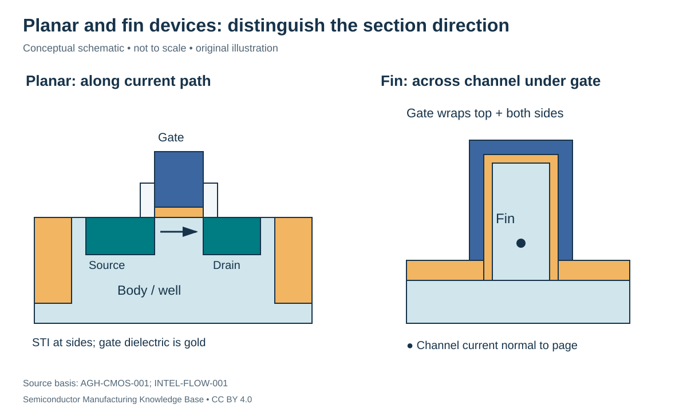

# Planar and FinFET integration: making a controllable channel

Status: **Reviewed — author technical/source review; independent specialist review pending.**
Last technical review: 2026-09-17 · Article class: integration explainer.

## Prerequisites

Read [MOSFET operation](../06_transistor_fundamentals/README.md) and the [fab unit-process path](../LEARNING_PATHS.md#phase-2-reading-path). Know the difference between deposition, etch, implant, activation and CMP.

## Why integration matters

A MOSFET requires a channel controlled by an insulated gate, source/drain regions that supply carriers, isolation from unwanted paths and accessible terminals. Integration turns these electrical requirements into a sequence in which each operation leaves a usable state for the next. Improving one transistor dimension can worsen resistance, capacitance or variability elsewhere.

## A representative planar route

In bulk CMOS, wells provide the body doping for complementary n-channel and p-channel devices. **Shallow trench isolation (STI)** separates neighboring active regions using dielectric-filled trenches. Wells do not replace field isolation, and STI does not provide complete dielectric isolation beneath every bulk device. A historical planar teaching sequence is isolation/wells → gate dielectric and patterned gate → source/drain extensions → sidewall spacers → deeper source/drain formation and activation → terminal preparation. Its ordering and materials are examples, not universal requirements. [AGH-CMOS-001](../42_references/bibliography.md#agh-cmos-001), slides 6–16 and 31–33.

A gate sidewall **spacer** establishes lateral separation and protects surfaces during subsequent operations. Depositing a dielectric and directionally etching horizontal portions is one way to leave material beside a gate. The output is a controlled offset, not another conducting electrode. A larger offset can reduce some overlap effects while increasing access resistance; the desirable value follows device and contact requirements.

In the figure, the planar longitudinal section shows source, gate-controlled channel and drain. The fin section cuts across the channel under the gate: current runs into or out of the page. Mixing these viewing directions would make a misleading comparison.

## FinFET integration changes the surface problem

A fin is a raised semiconductor body. In a tri-gate form, the gate couples through dielectric to the top and two sidewalls. Fin patterning, etching and isolation recess must establish the exposed body geometry before the gate can surround it. A historical FinFET teaching flow uses a temporary gate, later removed and replaced by a high-k dielectric and metal gate. This postpones sensitive final-gate processing relative to some high-temperature operations. [INTEL-FLOW-001](../42_references/bibliography.md#intel-flow-001), slides 8–11.

The replacement route is often called **gate-last** or **replacement metal gate (RMG)**. A gate-first route instead retains its functional gate through more of the subsequent process. Architecture and sequence are separate choices: “FinFET” does not uniquely specify every gate-stack ordering.

Source/drain engineering may use recess and selective epitaxy to shape a region and incorporate dopants or strain-producing material. Epitaxy requires a suitable crystal/surface; a nominal material name does not establish selectivity or defect quality. [ASM-EPI-001](../42_references/bibliography.md#asm-epi-001). Implant/activation and later heating must be evaluated against the final junction profile. Strain is a mechanical state that can alter carrier transport; its benefit depends on carrier type, orientation and actual structure.

## Gate-stack capacitance is not physical thickness alone

A **high-k** dielectric has higher relative permittivity than the reference oxide. A **work-function metal** helps set the gate's electrostatic boundary condition; it is not simply chosen for the lowest wire resistance. For ideal planar dielectric layers in series,

$$\frac{C}{A}=\frac{\epsilon_0}{\sum_i t_i/k_i},\qquad EOT=k_{ref}\sum_i\frac{t_i}{k_i}.$$

Here $t_i$ is each physical thickness, $k_i$ its dimensionless relative permittivity, $A$ area and $\epsilon_0$ vacuum permittivity. EOT is equivalent oxide thickness for reference $k_{ref}$, expressing equal ideal capacitance per area. This follows the [MOS capacitor model](../42_references/bibliography.md#hu-mos-001), extended by series-capacitor addition; it excludes quantum, depletion and interface-state effects.

Hypothetically, 0.5 nm of interfacial dielectric with $k=3.9$ plus 2.0 nm with $k=20$ gives $EOT=0.5+2(3.9/20)=0.89$ nm, despite a physical total of 2.5 nm. Ignoring the interfacial layer would predict 0.39 nm and overestimate ideal capacitance by a factor of 2.28. This is a capacitance calculation, not a leakage or reliability prediction.

## Controls, failures and the next interface

| Controlled quantity | Units | Integration failure and evidence |
|---|---|---|
| Fin width/height or planar active width | nm | Geometry variation → changed electrostatics/current; cross-section and CD sampling |
| Gate length and spacer extent | nm | Offset/profile error → altered access resistance or capacitance; profile plus electrical tests |
| Activated doping and junction profile | cm⁻³; nm | Redistribution/damage → leakage or resistance; chemical and electrical evidence differ |
| Gate-stack thickness/composition | nm; composition | Interface or film change → threshold/leakage variation; capacitance and current tests |
| Thermal history | Temperature–time record | Later steps can change earlier structures; trace recipe genealogy |

Isolation fill defects may create unwanted leakage paths; damaged gate interfaces may degrade behavior without a visible open. A measured structural dimension therefore does not substitute for electrical characterization. The completed device regions feed [contact/MOL integration](contacts_and_mol.md). The alternative [nanosheet route](nanosheet_integration.md) adds suspended channels and internal spacer/gate-fill constraints rather than merely rotating a fin.

## Position in the manufacturing map

`PROC-0201` identifies this scope in the [entity register](../manufacturing_map/process_nodes.md#proc-0201). The [Phase 3 route guide](../manufacturing_map/phase3_integration.md) separates alternative device flows, contact formation and the wiring loop. These are representative teaching routes, not released foundry recipes. Fabrication output is not automatically a tested or known-good die.

## Connections and boundaries

[Phase 3 glossary](../40_glossary/phase3_glossary.md) · [Integration comparisons](../41_reference_tables/phase3_comparisons.md) · [Engineering cost drivers](../36_economics/phase3_cost_drivers.md). Equipment functions reuse the [Phase 2 process chapters](../LEARNING_PATHS.md#phase-2-reading-path); [ecosystem coverage](../33_equipment_ecosystem/README.md) remains later work. Full economics and [investment analysis](../37_investment_analysis/README.md) remain separate. Exact recipes, proprietary stack dimensions and customer adoption are **UNKNOWN / PROPRIETARY** in this treatment. No [Rubin process or supplier assignment](../38_case_studies/nvidia_rubin/README.md) is inferred.

## Sources and review

- [AGH-CMOS-001](../42_references/bibliography.md#agh-cmos-001): Slides 6–16 and 31–33: planar flow, isolation, wells, spacers and activation
- [INTEL-FLOW-001](../42_references/bibliography.md#intel-flow-001): Slides 8–11: fin formation, temporary gate and replacement gate
- [HU-MOS-001](../42_references/bibliography.md#hu-mos-001): Previously registered teaching source; scope identified inline.
- [ASM-EPI-001](../42_references/bibliography.md#asm-epi-001): Previously registered teaching source; scope identified inline.

The [Phase 3 audit](../AUDIT_PHASE3.md) records scope and limitations. Numerical examples are hypothetical unless explicitly identified as physical constants; no example is a qualified recipe or product specification.
