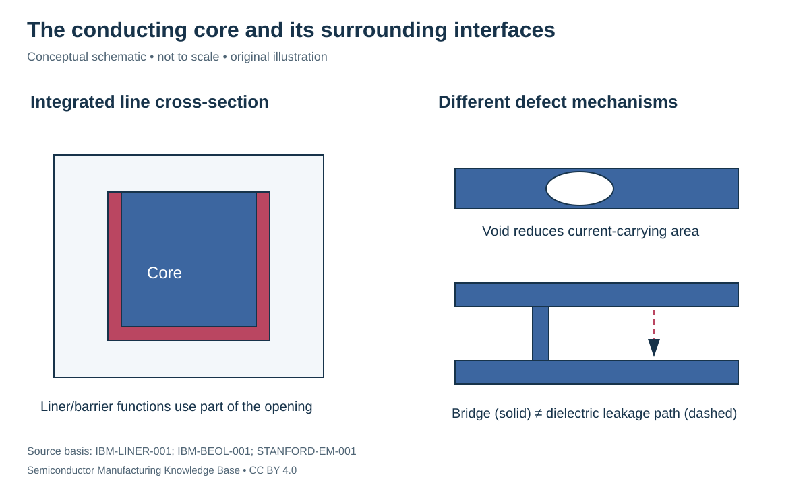

# Wiring materials and reliability: qualify the whole stack

Status: **Reviewed — author technical/source review; independent specialist review pending.**
Last technical review: 2026-09-17 · Article class: integration explainer.

## Prerequisites

Read [wire resistance and capacitance](wire_rc.md) and [deposition](../10_deposition/deposition.md). Reliability concerns change over time under stress, distinct from immediate fabrication defects.

## Compare integrated conductors, not a bulk-resistivity ranking

At narrow dimensions, interfaces, microstructure and the volume reserved for surrounding layers influence usable line resistance. Thinning a copper barrier/liner can recover conducting volume but compromise diffusion blocking or fill reliability. [IBM-BEOL-001](../42_references/bibliography.md#ibm-beol-001), opening tradeoff discussion. A fair material comparison therefore fixes geometry, integration scheme, temperature and acceptance criteria.

| Material / role | Why it appears in an integration discussion | Qualification question |
|---|---|---|
| Copper wiring | Damascene fill within patterned dielectric | Barrier/liner/seed continuity, fill and reliability |
| Tungsten plugs | Deposition into contact openings | Nucleation/liner volume, seam control and interface resistance |
| Cobalt contact/local conductor | Alternative deposition/anneal/CMP combinations | Complete integrated resistance and reliability, not bulk ranking |
| Ruthenium patterned wiring | Supports investigated subtractive/semi-damascene routes | Etch, gap fill, morphology and stack-specific reliability |

The W and Co entries are grounded in [AMAT-W-001](../42_references/bibliography.md#amat-w-001) and [AMAT-CO-001](../42_references/bibliography.md#amat-co-001); they are process-role examples, not product adoption claims. The Ru route is described in [IMEC-SEMI-001](../42_references/bibliography.md#imec-semi-001). None establishes that one conductor replaces every wiring level.

## Barriers, liners and low-k dielectrics

A diffusion **barrier** limits undesired material transport. A **liner** can support adhesion or subsequent growth. A **seed** provides a surface suitable for the chosen fill process. A historical Cu stack describes TaN/Ta followed by Cu seed and electroplating, illustrating distinct functions even when terminology overlaps. [IBM-LINER-001](../42_references/bibliography.md#ibm-liner-001), abstract. Do not assign every function to every layer solely from its name.

A **low-k** dielectric reduces electric-field coupling compared with a reference dielectric. Porosity can lower permittivity while introducing process vulnerabilities. A primary study of porous SiOCH describes plasma-induced chemical changes, increased moisture affinity and changes in the final dielectric response. [AVS-LOWK-001](../42_references/bibliography.md#avs-lowk-001), abstract. The deposited film's initial k-value is therefore insufficient evidence for the patterned, cleaned and polished stack.

## Different failures require different stress evidence

**Electromigration** is current-associated atomic transport. Nonuniform atomic flux can create depletion and accumulation, producing voids or raised material; microstructure and mechanical back stress affect evolution. [STANFORD-EM-001](../42_references/bibliography.md#stanford-em-001), flux-divergence discussion. An electron-flow arrow is not a universal prediction of where every void must appear.

**Thermomechanical fatigue** instead concerns damage from repeated deformation, including thermal cycling driven by Joule heating. NIST's research distinguishes controlled AC thermal stressing from electromigration and reports that narrow integrated structures require their own reliability characterization. [NIST-INTERCONNECT-001](../42_references/bibliography.md#nist-interconnect-001). Current stress alone does not identify which mechanism caused a resistance shift.

**Time-dependent dielectric breakdown (TDDB)** concerns progressive loss of insulating function under electrical stress. Metal diffusion and damaged dielectric interfaces can matter; it is different from an as-fabricated metal bridge. A barrier change that improves resistance can therefore harm a different reliability budget. [IBM-BEOL-001](../42_references/bibliography.md#ibm-beol-001).

| Observation | Possible mechanism | Evidence needed |
|---|---|---|
| Resistance rises during stress | Void growth, interface change or heating | Temperature control, time trace and failure analysis |
| Adjacent-line leakage grows | Dielectric degradation or contamination | Electrical stress conditions and structural/chemical analysis |
| Delamination/cracking | Stress/adhesion incompatibility | Mechanical/thermal history and interface examination |
| Immediate short | Bridge, residue or misplaced connection | Geometry inspection and electrical localization |

## A current-density example with no lifetime claim

For a hypothetical 1 mA through a 40 nm by 80 nm conducting core, $J=I/A=3.125\times10^{11}$ A/m², or $3.125\times10^7$ A/cm². Two equal parallel paths would halve each path's current density only if current shares equally. Different via/interface resistances can invalidate that assumption.

This number is not a safe-current limit or a lifetime estimate. Lifetime extrapolation requires a validated failure mechanism, temperature, geometry, duty cycle, statistical distribution and calibrated acceleration model. A wire that conducts today can still fail later. Reliability data must therefore travel with its stress conditions and population rather than appearing as a single universal material score.

## Position in the manufacturing map

`CHAR-0202` identifies this scope in the [entity register](../manufacturing_map/process_nodes.md#char-0202). The [Phase 3 route guide](../manufacturing_map/phase3_integration.md) separates alternative device flows, contact formation and the wiring loop. These are representative teaching routes, not released foundry recipes. Fabrication output is not automatically a tested or known-good die.

## Connections and boundaries

[Phase 3 glossary](../40_glossary/phase3_glossary.md) · [Integration comparisons](../41_reference_tables/phase3_comparisons.md) · [Engineering cost drivers](../36_economics/phase3_cost_drivers.md). Equipment functions reuse the [Phase 2 process chapters](../LEARNING_PATHS.md#phase-2-reading-path); [ecosystem coverage](../33_equipment_ecosystem/README.md) remains later work. Full economics and [investment analysis](../37_investment_analysis/README.md) remain separate. Exact recipes, proprietary stack dimensions and customer adoption are **UNKNOWN / PROPRIETARY** in this treatment. No [Rubin process or supplier assignment](../38_case_studies/nvidia_rubin/README.md) is inferred.

## Sources and review

- [IBM-BEOL-001](../42_references/bibliography.md#ibm-beol-001): Opening damascene discussion and barrier/liner tradeoffs
- [IBM-LINER-001](../42_references/bibliography.md#ibm-liner-001): Abstract only: TaN/Ta, Cu seed and plated fill
- [AMAT-W-001](../42_references/bibliography.md#amat-w-001): Conventional tungsten contact and liner/nucleation discussion
- [AMAT-CO-001](../42_references/bibliography.md#amat-co-001): Deposition, anneal and CMP functional descriptions
- [IMEC-SEMI-001](../42_references/bibliography.md#imec-semi-001): Semi-damascene definition and direct-etch process description
- [AVS-LOWK-001](../42_references/bibliography.md#avs-lowk-001): Conference abstract: porosity, carbon-group removal, moisture and k-value
- [STANFORD-EM-001](../42_references/bibliography.md#stanford-em-001): Electromigration and flux-divergence sections, especially pages 11–13
- [NIST-INTERCONNECT-001](../42_references/bibliography.md#nist-interconnect-001): Summary, Description and AC-Induced Thin Film Fatigue

The [Phase 3 audit](../AUDIT_PHASE3.md) records scope and limitations. Numerical examples are hypothetical unless explicitly identified as physical constants; no example is a qualified recipe or product specification.
