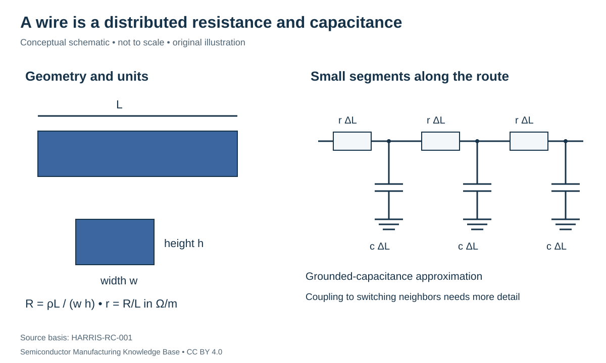

# Interconnect physics: geometry, resistance, capacitance and delay

Status: **Reviewed — author technical/source review; independent specialist review pending.**
Last technical review: 2026-09-17 · Article class: integration explainer.

## Prerequisites

Read [MOSFET/CMOS fundamentals](../06_transistor_fundamentals/README.md) and [MOL contacts](../17_transistor_fabrication/contacts_and_mol.md). Basic resistor and capacitor circuit models are assumed.

## Why wires are part of the circuit

An interconnect transfers voltage, charge or power between circuit nodes. A physical wire has resistance and electric-field coupling to its surroundings. Local wiring connects nearby terminals; longer/global routes serve broader connections. Different levels can use different widths, thicknesses and pitches. Vias connect levels through intervening dielectric. A physical crossing without a via need not be an electrical connection. [HU-FAB-001](../42_references/bibliography.md#hu-fab-001), §3.8.

## Resistance and available conductor area

For a uniform conductor, $R=\rho L/A$, with resistivity $\rho$ in Ω·m, length $L$ in m and conducting area $A$ in m². For a rectangular core, $A=wh$. The per-length resistance is $r=\rho/(wh)$ in Ω/m. Resistivity and resistance are different quantities: a short thick wire made from a higher-resistivity material can have lower resistance than a long thin wire made from a lower-resistivity material.

Assume hypothetically $\rho=3.0\times10^{-8}$ Ω·m, $L=10$ µm, $w=40$ nm and $h=80$ nm. Area is $3.2\times10^{-15}$ m² and $R=93.75$ Ω. With that same assumed resistivity, reducing width to 20 nm doubles resistance. Real narrow-line resistivity can also change; the calculation is not a nanoscale bulk-material prediction. See [materials and reliability](materials_and_reliability.md).

## Capacitance, delay and units

A parallel-plate estimate is $C=\epsilon_0 kA_{face}/d$ for facing area $A_{face}$, spacing $d$ and relative permittivity $k$. Actual wires also have sidewall/fringing fields and neighboring conductors, so extraction must use the relevant geometry. Reducing $k$ reduces this ideal capacitance at fixed geometry, while narrowing the spacing increases it.

For a uniform, resistance-dominated wire of length $L$, per-length resistance $r$ and capacitance $c$, the wire's Elmore first-moment contribution with an ideal driver and no end load is $\tau_E=rcL^2/2=RC/2$. This is not the exact 50% crossing delay. Adding a driver resistance $R_d$ and end load $C_L$ gives the simple model

$$\tau_E=R_d(C+C_L)+R(C/2+C_L).$$

It excludes driver-internal capacitance and assumes fixed capacitances and a linear RC approximation. [HARRIS-RC-001](../42_references/bibliography.md#harris-rc-001), §4. Resistance per length must be Ω/m (or Ω/µm), despite an inconsistent unit statement in the historical notes. Ω·F gives seconds.

With the hypothetical 93.75 Ω wire and $c=0.20$ fF/µm, $C=2$ fF and intrinsic $RC/2=93.75$ fs. Doubling length with unchanged cross-section and per-length properties quadruples this term. With $R_d=500$ Ω and $C_L=3$ fF, the modeled total is $500(5\,\mathrm{fF})+93.75(4\,\mathrm{fF})=2.875$ ps. The driver/load context is larger than the wire-only term here.

## Coupling, voltage drop and tradeoffs

Coupling capacitance responds to voltage differences between neighbors. Simultaneous same-direction and opposite-direction transitions can therefore produce different loading and delay; a quiet neighboring wire can also receive a transient disturbance. Treating every capacitance as permanently grounded hides this signal dependence. [HARRIS-RC-001](../42_references/bibliography.md#harris-rc-001), §5.

For steady current, voltage drop is $IR$ and resistive heating is $I^2R$. A hypothetical 100 µA through 93.75 Ω drops 9.375 mV and dissipates 0.9375 µW. This arithmetic does not determine temperature: thermal paths and duty cycle are missing. Current density uses the actual conducting area, not the drawn trench area.

| Design/process change | Potential benefit | Constraint to include |
|---|---|---|
| Wider or thicker conductor | Lower resistance at fixed resistivity | Area, coupling, pattern/fill requirements |
| Larger spacing / lower-k dielectric | Lower coupling | Routing density and material robustness |
| Parallel vias | Lower ideal connection resistance | Unequal current sharing, landing and area |
| Repeaters on long routes | Break long RC loading into shorter sections | Added gates, power, area and timing constraints |

Manufacturing variation in linewidth, thickness, liner volume or via landing changes the extracted circuit. Continuity testing detects an open; it does not prove acceptable timing, voltage drop or reliability. [BEOL integration](../19_back_end_of_line/beol_integration.md) explains how the geometry is formed, while later design/signoff chapters will explain how circuit constraints become layout requirements.

## Position in the manufacturing map

`CHAR-0201` identifies this scope in the [entity register](../manufacturing_map/process_nodes.md#char-0201). The [Phase 3 route guide](../manufacturing_map/phase3_integration.md) separates alternative device flows, contact formation and the wiring loop. These are representative teaching routes, not released foundry recipes. Fabrication output is not automatically a tested or known-good die.

## Connections and boundaries

[Phase 3 glossary](../40_glossary/phase3_glossary.md) · [Integration comparisons](../41_reference_tables/phase3_comparisons.md) · [Engineering cost drivers](../36_economics/phase3_cost_drivers.md). Equipment functions reuse the [Phase 2 process chapters](../LEARNING_PATHS.md#phase-2-reading-path); [ecosystem coverage](../33_equipment_ecosystem/README.md) remains later work. Full economics and [investment analysis](../37_investment_analysis/README.md) remain separate. Exact recipes, proprietary stack dimensions and customer adoption are **UNKNOWN / PROPRIETARY** in this treatment. No [Rubin process or supplier assignment](../38_case_studies/nvidia_rubin/README.md) is inferred.

## Sources and review

- [HARRIS-RC-001](../42_references/bibliography.md#harris-rc-001): Sections 2–6: resistance, capacitance, distributed RC, coupling and IR drop
- [HU-FAB-001](../42_references/bibliography.md#hu-fab-001): Previously registered teaching source; scope identified inline.

The [Phase 3 audit](../AUDIT_PHASE3.md) records scope and limitations. Numerical examples are hypothetical unless explicitly identified as physical constants; no example is a qualified recipe or product specification.
