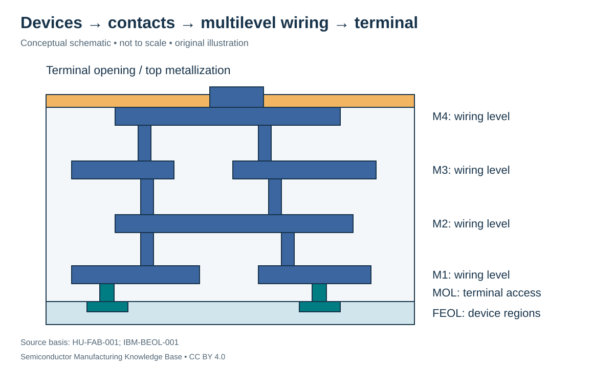
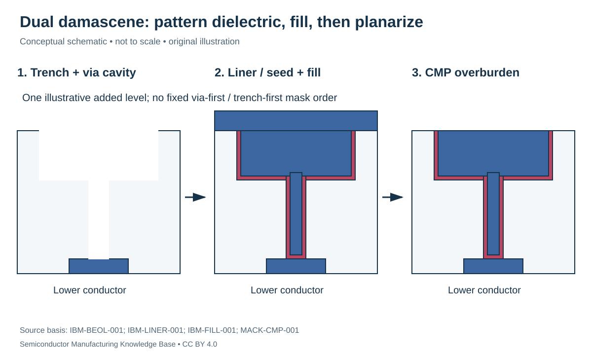

# BEOL integration: building and protecting the multilevel wiring stack

Status: **Reviewed — author technical/source review; independent specialist review pending.**
Last technical review: 2026-09-17 · Article class: integration explainer.

## Prerequisites

Read [MOL contacts](../17_transistor_fabrication/contacts_and_mol.md), [wire RC](../18_interconnects/wire_rc.md), [materials/reliability](../18_interconnects/materials_and_reliability.md) and [CMP](../15_cmp/cmp.md).

## Input and output boundaries

BEOL receives device-terminal connections and builds insulated routing above them. Lines run within levels; vias connect selected levels. The upper structure includes protection and accessible terminal metallization appropriate to later test/assembly. FEOL forms the devices, MOL accesses their terminals and BEOL forms this repeated wiring stack; exact naming boundaries differ. None of these labels means a wafer has passed electrical test. [HU-FAB-001](../42_references/bibliography.md#hu-fab-001), §3.8.

The drawing shows four illustrative routing levels and selected vias. It does not prescribe the layer count, orientations, materials or terminal style of a commercial chip. A layer crossing in projection is not a connection unless the required via is present.

## Representative copper dual-damascene module

**Damascene** places conductor into a patterned recess and removes overburden. In **single damascene**, one feature level is filled/planarized at a time. **Dual damascene** forms a connected trench/via cavity before a shared metal-fill sequence. Via-first and trench-first patterning variants exist; the teaching map aggregates them rather than asserting one universal mask order.

1. Receive a compatible lower conductor/contact level and deposit the qualified dielectric/cap or etch-stop stack.
2. Pattern and etch trench/via cavities, with landing onto the selected lower conductor; remove residues while preserving dielectric properties.
3. Form the required barrier, liner and seed functions on the cavity surfaces.
4. Fill the cavity with conductor, leaving controlled overburden.
5. CMP the overburden, then clean and verify the remaining geometry and electrical isolation.
6. Add the next qualified cap/dielectric interface and repeat using a distinct level instance.

The dielectric-first Cu sequence is described in [IBM-BEOL-001](../42_references/bibliography.md#ibm-beol-001). The barrier/liner/seed example is supported by [IBM-LINER-001](../42_references/bibliography.md#ibm-liner-001). These sources do not disclose a universal recipe for all devices.

## Fill is more than conformal coating

If a narrow opening closes near its top before its interior fills, a void or seam can remain. Engineered electrodeposition can fill features more effectively than simple conformal thickening; the primary electroplating paper describes this **superfilling** behavior and its relationship to additives. [IBM-FILL-001](../42_references/bibliography.md#ibm-fill-001), abstract. This teaching statement is not a plating-bath specification.

CMP must clear unwanted conducting paths while preserving the intended line/via. Overpolishing can alter local topography through dishing or erosion, so clearing one region does not establish acceptable geometry everywhere. [MACK-CMP-001](../42_references/bibliography.md#mack-cmp-001). Post-CMP cleaning is part of preparing the next interface, not proof that the prior dielectric survived every process intact.

## A landing-margin calculation

Consider a hypothetical centered square via landing on a straight lower wire. Let lower-wire width be 40 nm and via width 20 nm. Nominal lateral enclosure on each side is $(40-20)/2=10$ nm. An 8 nm placement error leaves 2 nm on one side and 18 nm on the other in this ideal one-dimensional view. If the process requires at least 4 nm enclosure, the geometry fails that hypothetical rule despite still overlapping.

This calculation excludes linewidth variation, edge roughness, etch bias and two-dimensional corners. Those contributions also consume margin. It is a reason to distinguish overlay, CD and enclosure budgets, not an actual design rule. Full rule decks and signoff belong to Phase 4.

## Alternatives and finishing interfaces

A subtractive approach patterns a deposited conductor, then forms insulation around it. Ru semi-damascene research provides an alternative integration route involving direct metal etch; it cannot be represented simply by changing “Cu” to “Ru” in the dual-damascene recipe. [IMEC-SEMI-001](../42_references/bibliography.md#imec-semi-001). Different fill, etch, gap and reliability constraints travel with the choice.

Upper-level **passivation** protects the stack while selected terminal openings remain accessible. Terminal metallization must fit the intended probing and subsequent connection process. This chapter stops at fabricated wiring and terminal readiness. Bumps, package redistribution and assembly qualification remain in [packaging](../25_advanced_packaging/README.md); [wafer test](../20_wafer_test/README.md) determines electrical disposition later.

| Process quantity | Units | Failure chain / acceptance evidence |
|---|---|---|
| Trench/via dimensions and landing | nm | Mislanding or incomplete etch → high resistance/open; geometry plus electrical chains |
| Barrier/liner continuity | nm; coverage | Discontinuity → diffusion or fill problems; interface-sensitive analysis |
| Fill geometry | Void/seam dimensions | Reduced conductor area → resistance or reliability loss |
| CMP endpoint / local topography | nm | Residual bridge or excess loss → short/resistance/focus problem |
| Integrated dielectric response | Permittivity; leakage | Plasma/clean damage → coupling or insulation degradation |
| Thermal/mechanical history | Temperature–time; stress | Changes to earlier films, contacts or interfaces |

Porous low-k damage can change the electrical dielectric after patterning, so pre-pattern blanket-film measurements alone are insufficient. [AVS-LOWK-001](../42_references/bibliography.md#avs-lowk-001). Likewise, later thermal treatment must respect the already fabricated device/contact stack. BEOL success means compatible geometry, electrical function and reliability evidence across repeated levels, not merely a visually complete stack.

## Position in the manufacturing map

`PROC-0210` identifies this scope in the [entity register](../manufacturing_map/process_nodes.md#proc-0210). The [Phase 3 route guide](../manufacturing_map/phase3_integration.md) separates alternative device flows, contact formation and the wiring loop. These are representative teaching routes, not released foundry recipes. Fabrication output is not automatically a tested or known-good die.

## Connections and boundaries

[Phase 3 glossary](../40_glossary/phase3_glossary.md) · [Integration comparisons](../41_reference_tables/phase3_comparisons.md) · [Engineering cost drivers](../36_economics/phase3_cost_drivers.md). Equipment functions reuse the [Phase 2 process chapters](../LEARNING_PATHS.md#phase-2-reading-path); [ecosystem coverage](../33_equipment_ecosystem/README.md) remains later work. Full economics and [investment analysis](../37_investment_analysis/README.md) remain separate. Exact recipes, proprietary stack dimensions and customer adoption are **UNKNOWN / PROPRIETARY** in this treatment. No [Rubin process or supplier assignment](../38_case_studies/nvidia_rubin/README.md) is inferred.

## Sources and review

- [HU-FAB-001](../42_references/bibliography.md#hu-fab-001): Previously registered teaching source; scope identified inline.
- [IBM-BEOL-001](../42_references/bibliography.md#ibm-beol-001): Opening damascene discussion and barrier/liner tradeoffs
- [IBM-LINER-001](../42_references/bibliography.md#ibm-liner-001): Abstract only: TaN/Ta, Cu seed and plated fill
- [IBM-FILL-001](../42_references/bibliography.md#ibm-fill-001): Abstract only: voids, seams and superconformal fill
- [IMEC-SEMI-001](../42_references/bibliography.md#imec-semi-001): Semi-damascene definition and direct-etch process description
- [AVS-LOWK-001](../42_references/bibliography.md#avs-lowk-001): Conference abstract: porosity, carbon-group removal, moisture and k-value
- [MACK-CMP-001](../42_references/bibliography.md#mack-cmp-001): Previously registered teaching source; scope identified inline.

The [Phase 3 audit](../AUDIT_PHASE3.md) records scope and limitations. Numerical examples are hypothetical unless explicitly identified as physical constants; no example is a qualified recipe or product specification.
