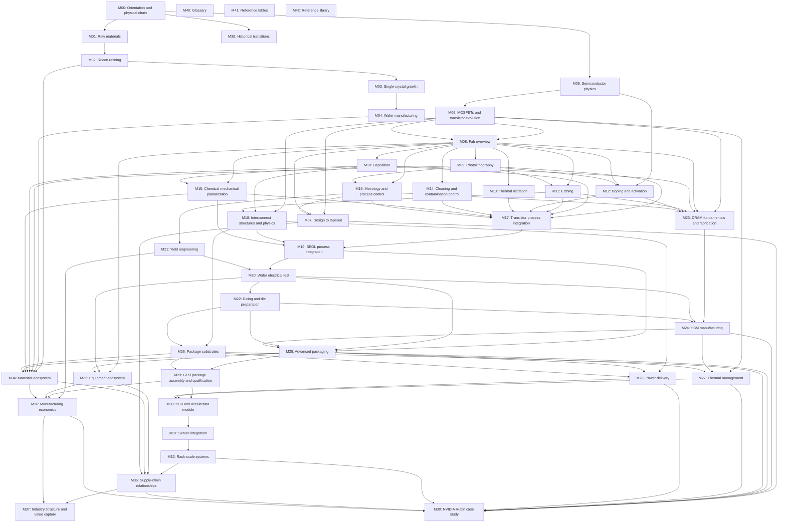
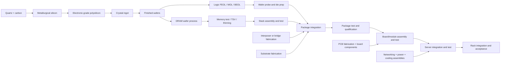
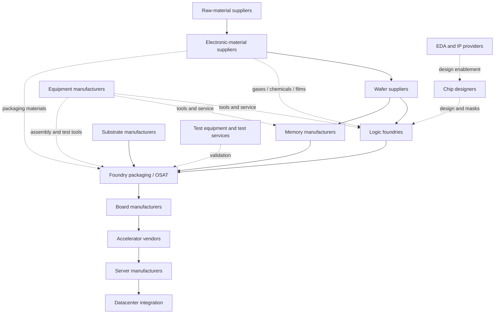

# Knowledge and manufacturing dependency graphs

## Edge semantics

- `A → B` in the prerequisite graph means understand A before studying B. It does not mean A ships a physical material to B.
- Solid arrows in the physical graph mean material or assembly flow. They compress repeated process loops.
- Dashed arrows in the ecosystem graph mean enabling services or tooling. They are not a literal sequence of material conversion.
- Related links and design/manufacturing feedback may be cyclic; mandatory prerequisites must stay acyclic.

## Complete module prerequisite graph

This graph includes all 43 architectural modules. The glossary, tables and references are entry resources with no mandatory prerequisites; they link across the whole collection. Scope inside each node is enumerated in the [topic inventory](catalog/topic_inventory.md). This is complete at architecture/module granularity; article-level edges must be registered during scoping, not fabricated before research.

*Figure P0-02 — Planned learning dependencies. Original graph, source: project scope and architecture decisions; CC BY 4.0. Editable source: [prerequisites.mmd](assets/diagrams/prerequisites.mmd).*

## Physical chain and convergence

*Figure P0-03 — Material-to-system chain. Original scope schematic; not a qualified process recipe. TSV/test/thinning order is architecture-dependent and will be researched in the memory track. Source: project specification; CC BY 4.0. [Editable source](assets/process_flows/physical_chain.mmd).*

## Enabling ecosystem

*Figure P0-04 — Roles and enabling relationships. Original architecture schematic; no company or market-share assertions. Source: project specification; CC BY 4.0. [Editable source](assets/supply_chain_maps/enabling_inputs.mmd).*

## Required cross-links beyond the prerequisite graph

| From | To | Relationship and reader question |
|---|---|---|
| Lithography | Resist → etch → metrology → yield | How does a printed pattern become a controlled physical feature? |
| Design | PDK → process rules → fabrication | How does a manufacturable layout constrain architecture? |
| Cleaning | Deposition, etch, bonding, yield | Where can contamination enter and where is it detected? |
| Doping | Physics → transistor fabrication → parametric test | How do process settings change electrical behavior? |
| Interconnect | CMP → BEOL → RC → power → reliability | How does wiring constrain switching and lifetime? |
| DRAM | TSV → thinning → bonding → HBM test | How does a memory wafer become a usable stack? |
| Wafer test | Known-good-die → packaging → compound yield | What evidence justifies assembling expensive components? |
| Package | Substrate → PCB → signal/power integrity | How do connections cross physical scales? |
| Die power | Package thermal path → board cooling → rack heat rejection | Where does heat go, and what limits performance? |
| Metrology | Yield → throughput → cost per good unit | How do detection and process control change economics? |
| Equipment and materials | Every relevant process → supply chain → economics | Which enabling inputs are necessary and substitutable? |
| Rubin claim register | Every case-study page → general concept | Which actual implementation details are supported? |

## Feedback loops to show in articles

Metrology can trigger process adjustment; electrical test can reveal design or process weaknesses; thermal and power limits constrain floorplanning and packaging; yield learning can change process windows. These are related/design-control edges, not added prerequisite cycles. Each article must identify its upstream input, output, downstream consumer and control feedback where meaningful.
