# Semiconductor Manufacturing Knowledge Base

**From quartz to a powered, cooled, rack-scale AI system.**

A GitHub-ready knowledge repository for a second-year electrical engineering student. General semiconductor manufacturing is the foundation; NVIDIA Vera Rubin will be a source-labeled case study. Engineering, manufacturing economics and investment research have separate homes. No buy/sell recommendations.

**Current build: Phases 0A, 1, 2 and 3 complete.** Twenty-five author-reviewed chapters cover quartz through wafers, device physics, fab unit processes, transistor integration and multilevel wiring. Twenty-six original teaching illustrations accompany the generated manufacturing maps. Independent specialist review remains pending. Later-phase indexes describe planned scope. See the [Phase 3 audit](AUDIT_PHASE3.md) and [Phase 3 reading path](LEARNING_PATHS.md#phase-3-reading-path).

## Start here

1. Start the [Phase 1 reading path](LEARNING_PATHS.md#phase-1-reading-path), or explore the [manufacturing map](manufacturing_map/README.md).
2. Inspect the [architecture and full directory tree](ARCHITECTURE.md) and [topic inventory](catalog/topic_inventory.md).
3. Follow the [dependency graph](DEPENDENCIES.md), which distinguishes learning order from physical flow.
4. Use the [roadmap](ROADMAP.md) for staged research, authoring and review.

```mermaid
flowchart LR
  MAT_0001["Quartz-bearing feedstock"]
  MAT_0003["Metallurgical-grade silicon"]
  MAT_0006["Electronic-grade polysilicon"]
  MAT_0007["Single-crystal silicon ingot"]
  MAT_0010["Accepted starting wafer"]
  ART_0030["Tested logic die [planned]"]
  ART_0033["Tested HBM stack [planned]"]
  ART_0036["Tested accelerator package [planned]"]
  ART_0038["Tested accelerator module [planned]"]
  ART_0040["Integrated rack system [planned]"]
  ART_0030 -->|"collapsed path"| ART_0036
  ART_0033 -->|"collapsed path"| ART_0036
  ART_0036 -->|"collapsed path"| ART_0038
  ART_0038 -->|"collapsed path"| ART_0040
  MAT_0001 -->|"collapsed path"| MAT_0003
  MAT_0003 -->|"collapsed path"| MAT_0006
  MAT_0006 -->|"collapsed path"| MAT_0007
  MAT_0007 -->|"collapsed path"| MAT_0010
  MAT_0010 -->|"collapsed path"| ART_0030
  MAT_0010 -->|"collapsed path"| ART_0033
```

<!-- BEGIN OVERVIEW -->

<!-- END OVERVIEW -->

*Figure P0-01 — Learning overview with physical assembly branches. Original schematic, not to scale; arrows simplify process variations. Source: canonical manufacturing-map records (planned scope until researched); CC BY 4.0. Technical process details await research. See the separate physical-flow and prerequisite graphs for precise edge meanings.*

## Navigate the repository

- [All 43 module indexes](catalog/topic_inventory.md)
- [Research strategy](RESEARCH_STRATEGY.md), [source policy](SOURCE_POLICY.md), [confidence labels](CONFIDENCE_LEVELS.md)
- [Article and diagram taxonomy](TAXONOMY.md), [article template](ARTICLE_TEMPLATE.md), [contributing](CONTRIBUTING.md)
- [Equipment](33_equipment_ecosystem/README.md), [materials](34_materials_ecosystem/README.md), [supply chain](35_supply_chain/README.md)
- [Economics](36_economics/README.md), [investment research](37_investment_analysis/README.md)
- [Rubin case-study plan](38_case_studies/nvidia_rubin/README.md)
- [Glossary conventions](40_glossary/SCHEMA.md), [bibliography](42_references/bibliography.md), [claim register](42_references/claims.csv)

## Reproduce the architecture checks

Run `python3 scripts/validate.py` from the repository root. The same structural checks run on GitHub pushes and pull requests. Human source and technical review remains necessary.

GitHub home: [samuelianrich/semiconductor-manufacturing-kb](https://github.com/samuelianrich/semiconductor-manufacturing-kb) (private). The repository includes no scheduled external actions; use the [maintenance protocol](MAINTENANCE.md) as content is developed.
