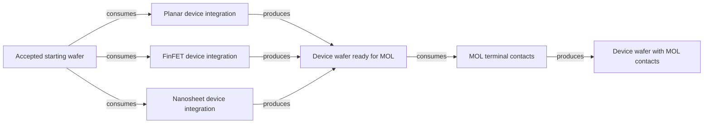

# Alternative device integration and MOL

[Map home](README.md) · [Schema](SCHEMA.md) · [Full entity register](process_nodes.md)

<!-- BEGIN GENERATED MAP -->
**Generated from the canonical CSV graph.** Planned scope is not technical evidence.

*MAP-DEVICE-INTEGRATION — Alternative device routes converge at a compatible terminal boundary; arrows from alternatives do not mean all three are required. Aggregate operations, not full recipes. Original schematic; CC BY 4.0. Source: graph records and their evidence links; no physical scale.*

| ID | Entity | Status | Canonical article |
|---|---|---|---|
| ART-0200 | Device wafer ready for MOL | reviewed | [Device wafer ready for MOL](../17_transistor_fabrication/planar_and_finfet.md) |
| ART-0201 | Device wafer with MOL contacts | reviewed | [Device wafer with MOL contacts](../17_transistor_fabrication/contacts_and_mol.md) |
| MAT-0010 | Accepted starting wafer | reviewed | [Accepted starting wafer](../04_wafer_manufacturing/wafer_finishing_and_acceptance.md) |
| PROC-0200 | Planar device integration | reviewed | [Planar device integration](../17_transistor_fabrication/planar_and_finfet.md) |
| PROC-0201 | FinFET device integration | reviewed | [FinFET device integration](../17_transistor_fabrication/planar_and_finfet.md) |
| PROC-0202 | Nanosheet device integration | reviewed | [Nanosheet device integration](../17_transistor_fabrication/nanosheet_integration.md) |
| PROC-0203 | MOL terminal contacts | reviewed | [MOL terminal contacts](../17_transistor_fabrication/contacts_and_mol.md) |

| Edge | Relationship | Conditions | Evidence |
|---|---|---|---|
| EDGE-0137 | PROC-0200 → CONSUMES → MAT-0010 | Alternative aggregate device route; one compatible option supplies the common MOL interface. Source/drain and isolation details remain variant-specific. | [AGH-CMOS-001](../42_references/bibliography.md#agh-cmos-001) (Slides 6–16 and 31–33: planar flow, isolation, wells, spacers and activation) |
| EDGE-0138 | PROC-0200 → PRODUCES → ART-0200 | Alternative aggregate device route; one compatible option supplies the common MOL interface. Source/drain and isolation details remain variant-specific. | [AGH-CMOS-001](../42_references/bibliography.md#agh-cmos-001) (Slides 6–16 and 31–33: planar flow, isolation, wells, spacers and activation) |
| EDGE-0139 | PROC-0201 → CONSUMES → MAT-0010 | Alternative aggregate device route; one compatible option supplies the common MOL interface. Source/drain and isolation details remain variant-specific. | [INTEL-FLOW-001](../42_references/bibliography.md#intel-flow-001) (Slides 8–11: fin formation, temporary gate and replacement gate) |
| EDGE-0140 | PROC-0201 → PRODUCES → ART-0200 | Alternative aggregate device route; one compatible option supplies the common MOL interface. Source/drain and isolation details remain variant-specific. | [INTEL-FLOW-001](../42_references/bibliography.md#intel-flow-001) (Slides 8–11: fin formation, temporary gate and replacement gate) |
| EDGE-0141 | PROC-0202 → CONSUMES → MAT-0010 | Alternative aggregate device route; one compatible option supplies the common MOL interface. Source/drain and isolation details remain variant-specific. | [IMEC-SHEETS-001](../42_references/bibliography.md#imec-sheets-001) (Critical nanosheet building blocks) |
| EDGE-0142 | PROC-0202 → PRODUCES → ART-0200 | Alternative aggregate device route; one compatible option supplies the common MOL interface. Source/drain and isolation details remain variant-specific. | [IMEC-SHEETS-001](../42_references/bibliography.md#imec-sheets-001) (Critical nanosheet building blocks) |
| EDGE-0145 | PROC-0203 → CONSUMES → ART-0200 | Representative integration relationship; acceptance requires geometry, material and electrical qualification. | [IMEC-CONTACT-001](../42_references/bibliography.md#imec-contact-001) (Source/drain contact resistance; contact resistivity; test-vehicle discussion) |
| EDGE-0146 | PROC-0203 → PRODUCES → ART-0201 | Representative integration relationship; acceptance requires geometry, material and electrical qualification. | [IMEC-CONTACT-001](../42_references/bibliography.md#imec-contact-001) (Source/drain contact resistance; contact resistivity; test-vehicle discussion) |
<!-- END GENERATED MAP -->
