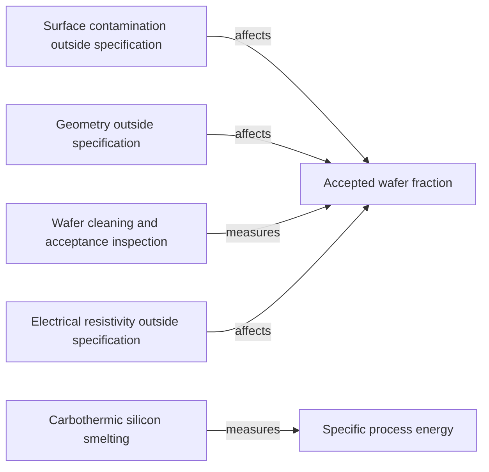

# Manufacturing economics relationships

[Map home](README.md) · [Schema](SCHEMA.md) · [Full entity register](process_nodes.md)

<!-- BEGIN GENERATED MAP -->
**Generated from the canonical CSV graph.** Planned scope is not technical evidence.

*MAP-ECONOMICS-MAP — Only evidenced drivers are populated before Phase 10. Quantitative models and industry interpretation remain separate. Original schematic; CC BY 4.0. Source: graph records and their evidence links; no physical scale.*

| ID | Entity | Status | Canonical article |
|---|---|---|---|
| FAIL-0001 | Surface contamination outside specification | reviewed | [Surface contamination outside specification](../04_wafer_manufacturing/wafer_finishing_and_acceptance.md) |
| FAIL-0002 | Geometry outside specification | reviewed | [Geometry outside specification](../04_wafer_manufacturing/wafer_finishing_and_acceptance.md) |
| FAIL-0003 | Electrical resistivity outside specification | reviewed | [Electrical resistivity outside specification](../05_semiconductor_physics/doping_and_transport.md) |
| METRIC-0001 | Accepted wafer fraction | reviewed | [Accepted wafer fraction](../04_wafer_manufacturing/wafer_finishing_and_acceptance.md) |
| METRIC-0002 | Specific process energy | reviewed | [Specific process energy](../02_silicon_refining/metallurgical_silicon.md) |
| PROC-0002 | Carbothermic silicon smelting | reviewed | [Carbothermic silicon smelting](../02_silicon_refining/metallurgical_silicon.md) |
| PROC-0009 | Wafer cleaning and acceptance inspection | reviewed | [Wafer cleaning and acceptance inspection](../04_wafer_manufacturing/wafer_finishing_and_acceptance.md) |

| Edge | Relationship | Conditions | Evidence |
|---|---|---|---|
| EDGE-0080 | FAIL-0001 → AFFECTS → METRIC-0001 | A detected out-of-spec event excludes a wafer from accepted count under the chosen disposition policy. | [SUMCO-WAFER-001](../42_references/bibliography.md#sumco-wafer-001) (Cleaning and inspection; acceptance boundary) |
| EDGE-0081 | FAIL-0002 → AFFECTS → METRIC-0001 | Only failures of the applicable specification reduce this boundary-specific accepted count. | [SEMI-WAFER-001](../42_references/bibliography.md#semi-wafer-001) (Specification scope; accounting implication) |
| EDGE-0082 | PROC-0009 → MEASURES → METRIC-0001 | Aggregate count after stated inspection coverage; no lot data supplied. | [SUMCO-WAFER-001](../42_references/bibliography.md#sumco-wafer-001) (Final inspection; original count definition) |
| EDGE-0083 | PROC-0002 → MEASURES → METRIC-0002 | Aggregated energy and accepted-mass accounting at the furnace boundary; original metric definition, no actual operating data supplied. | [NTNU-SMELTING-001](../42_references/bibliography.md#ntnu-smelting-001) (Electrical energy input; accounting definition) |
| EDGE-0086 | FAIL-0003 → AFFECTS → METRIC-0001 | A detected failure of the applicable electrical specification changes accepted-wafer count under the chosen policy. | [SEMI-WAFER-001](../42_references/bibliography.md#semi-wafer-001) (Specified wafer characteristics; author accounting implication) |
<!-- END GENERATED MAP -->
