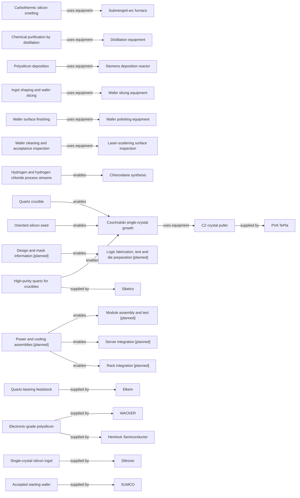

# Enabling inputs and services

[Map home](README.md) · [Schema](SCHEMA.md) · [Full entity register](process_nodes.md)

<!-- BEGIN GENERATED MAP -->
**Generated from the canonical CSV graph.** Planned scope is not technical evidence.

*MAP-ENABLING-INPUTS — Enabling inputs and evidenced supplier roles are distinct from physical conversion. Later-phase scopes remain planned. Original schematic; CC BY 4.0. Source: graph records and their evidence links; no physical scale.*

| ID | Entity | Status | Canonical article |
|---|---|---|---|
| ART-0041 | Power and cooling assemblies | planned | [Power and cooling assemblies](../28_power_delivery/README.md) |
| ART-0042 | Design and mask information | planned | [Design and mask information](../07_ic_design_and_tapeout/README.md) |
| EQ-0001 | Submerged-arc furnace | reviewed | [Submerged-arc furnace](../02_silicon_refining/metallurgical_silicon.md) |
| EQ-0002 | Distillation equipment | reviewed | [Distillation equipment](../02_silicon_refining/electronic_grade_polysilicon.md) |
| EQ-0003 | Siemens deposition reactor | reviewed | [Siemens deposition reactor](../02_silicon_refining/electronic_grade_polysilicon.md) |
| EQ-0004 | CZ crystal puller | reviewed | [CZ crystal puller](../03_crystal_growth/crystal_growth.md) |
| EQ-0005 | Wafer slicing equipment | reviewed | [Wafer slicing equipment](../04_wafer_manufacturing/wafer_finishing_and_acceptance.md) |
| EQ-0006 | Wafer polishing equipment | reviewed | [Wafer polishing equipment](../04_wafer_manufacturing/wafer_finishing_and_acceptance.md) |
| EQ-0007 | Laser-scattering surface inspection | reviewed | [Laser-scattering surface inspection](../04_wafer_manufacturing/wafer_finishing_and_acceptance.md) |
| MAT-0001 | Quartz-bearing feedstock | reviewed | [Quartz-bearing feedstock](../01_raw_materials/quartz_and_feedstocks.md) |
| MAT-0006 | Electronic-grade polysilicon | reviewed | [Electronic-grade polysilicon](../02_silicon_refining/electronic_grade_polysilicon.md) |
| MAT-0007 | Single-crystal silicon ingot | reviewed | [Single-crystal silicon ingot](../03_crystal_growth/crystal_growth.md) |
| MAT-0010 | Accepted starting wafer | reviewed | [Accepted starting wafer](../04_wafer_manufacturing/wafer_finishing_and_acceptance.md) |
| MAT-0012 | High-purity quartz for crucibles | reviewed | [High-purity quartz for crucibles](../01_raw_materials/quartz_and_feedstocks.md) |
| MAT-0013 | Quartz crucible | reviewed | [Quartz crucible](../03_crystal_growth/crystal_growth.md) |
| MAT-0014 | Hydrogen and hydrogen chloride process streams | reviewed | [Hydrogen and hydrogen chloride process streams](../02_silicon_refining/electronic_grade_polysilicon.md) |
| MAT-0015 | Oriented silicon seed | reviewed | [Oriented silicon seed](../03_crystal_growth/crystal_growth.md) |
| PROC-0002 | Carbothermic silicon smelting | reviewed | [Carbothermic silicon smelting](../02_silicon_refining/metallurgical_silicon.md) |
| PROC-0003 | Chlorosilane synthesis | reviewed | [Chlorosilane synthesis](../02_silicon_refining/electronic_grade_polysilicon.md) |
| PROC-0004 | Chemical purification by distillation | reviewed | [Chemical purification by distillation](../02_silicon_refining/electronic_grade_polysilicon.md) |
| PROC-0005 | Polysilicon deposition | reviewed | [Polysilicon deposition](../02_silicon_refining/electronic_grade_polysilicon.md) |
| PROC-0006 | Czochralski single-crystal growth | reviewed | [Czochralski single-crystal growth](../03_crystal_growth/crystal_growth.md) |
| PROC-0007 | Ingot shaping and wafer slicing | reviewed | [Ingot shaping and wafer slicing](../04_wafer_manufacturing/wafer_finishing_and_acceptance.md) |
| PROC-0008 | Wafer surface finishing | reviewed | [Wafer surface finishing](../04_wafer_manufacturing/wafer_finishing_and_acceptance.md) |
| PROC-0009 | Wafer cleaning and acceptance inspection | reviewed | [Wafer cleaning and acceptance inspection](../04_wafer_manufacturing/wafer_finishing_and_acceptance.md) |
| PROC-0030 | Logic fabrication, test and die preparation | planned | [Logic fabrication, test and die preparation](../17_transistor_fabrication/README.md) |
| PROC-0038 | Module assembly and test | planned | [Module assembly and test](../30_pcb_and_module/README.md) |
| PROC-0039 | Server integration | planned | [Server integration](../31_system_integration/README.md) |
| PROC-0040 | Rack integration | planned | [Rack integration](../32_rack_scale_system/README.md) |
| SUP-0001 | Elkem | reviewed | [Elkem](../01_raw_materials/quartz_and_feedstocks.md) |
| SUP-0002 | Sibelco | reviewed | [Sibelco](../01_raw_materials/quartz_and_feedstocks.md) |
| SUP-0003 | WACKER | reviewed | [WACKER](../02_silicon_refining/electronic_grade_polysilicon.md) |
| SUP-0004 | Hemlock Semiconductor | reviewed | [Hemlock Semiconductor](../02_silicon_refining/electronic_grade_polysilicon.md) |
| SUP-0005 | PVA TePla | reviewed | [PVA TePla](../03_crystal_growth/crystal_growth.md) |
| SUP-0006 | Siltronic | reviewed | [Siltronic](../03_crystal_growth/crystal_growth.md) |
| SUP-0007 | SUMCO | reviewed | [SUMCO](../04_wafer_manufacturing/wafer_finishing_and_acceptance.md) |

| Edge | Relationship | Conditions | Evidence |
|---|---|---|---|
| EDGE-0029 | ART-0042 → ENABLES → PROC-0030 | Information input, not material consumed. | Planned; not evidence-backed |
| EDGE-0051 | ART-0041 → ENABLES → PROC-0038 | Boundary-specific assemblies and interfaces; not a serial conversion of power into hardware. | Planned; not evidence-backed |
| EDGE-0052 | ART-0041 → ENABLES → PROC-0039 | Boundary-specific assemblies and interfaces; not a serial conversion of power into hardware. | Planned; not evidence-backed |
| EDGE-0053 | ART-0041 → ENABLES → PROC-0040 | Boundary-specific assemblies and interfaces; not a serial conversion of power into hardware. | Planned; not evidence-backed |
| EDGE-0054 | PROC-0002 → USES_EQUIPMENT → EQ-0001 |  | [NTNU-SMELTING-001](../42_references/bibliography.md#ntnu-smelting-001) (Furnace description) |
| EDGE-0055 | PROC-0004 → USES_EQUIPMENT → EQ-0002 |  | [WACKER-POLY-001](../42_references/bibliography.md#wacker-poly-001) (Distillation discussion) |
| EDGE-0056 | PROC-0005 → USES_EQUIPMENT → EQ-0003 |  | [WACKER-POLY-001](../42_references/bibliography.md#wacker-poly-001) (Deposition hall) |
| EDGE-0057 | PROC-0006 → USES_EQUIPMENT → EQ-0004 |  | [PVA-CZ-001](../42_references/bibliography.md#pva-cz-001) (The Process and system description) |
| EDGE-0058 | PROC-0007 → USES_EQUIPMENT → EQ-0005 |  | [SUMCO-WAFER-001](../42_references/bibliography.md#sumco-wafer-001) (Slicing) |
| EDGE-0059 | PROC-0008 → USES_EQUIPMENT → EQ-0006 |  | [SUMCO-WAFER-001](../42_references/bibliography.md#sumco-wafer-001) (Polishing) |
| EDGE-0060 | PROC-0009 → USES_EQUIPMENT → EQ-0007 |  | [UCSB-INSPECT-001](../42_references/bibliography.md#ucsb-inspect-001) (Surface analysis operating principle) |
| EDGE-0062 | MAT-0012 → ENABLES → PROC-0006 | Indirect enabling input: quartz is first made into a crucible; quartz ore is not placed into the CZ silicon melt. | [SIBELCO-QUARTZ-001](../42_references/bibliography.md#sibelco-quartz-001) (Semiconductor application bullet) |
| EDGE-0063 | MAT-0013 → ENABLES → PROC-0006 | CZ variant; container contacts the melt. FZ has a different boundary. | [KIEL-SEGREGATION-001](../42_references/bibliography.md#kiel-segregation-001) (Quartz crucible and oxygen) |
| EDGE-0064 | MAT-0014 → ENABLES → PROC-0003 | Grouped utility chemistry; actual H2/HCl delivery and recovery are distinct streams. | [WACKER-POLY-001](../42_references/bibliography.md#wacker-poly-001) (Chlorosilane route) |
| EDGE-0065 | MAT-0015 → ENABLES → PROC-0006 | Seeded growth; orientation depends on selected seed. | [SUMCO-WAFER-001](../42_references/bibliography.md#sumco-wafer-001) (Monocrystalline pulling) |
| EDGE-0069 | MAT-0001 → SUPPLIED_BY → SUP-0001 | Elkem describes Tana quartzite extraction and industrial uses. Role example only; see claim boundary. | [ELKEM-QUARTZ-001](../42_references/bibliography.md#elkem-quartz-001) (Plant description and industrial uses) · CLM-000001 |
| EDGE-0070 | MAT-0012 → SUPPLIED_BY → SUP-0002 | Sibelco describes IOTA high-purity quartz for making fused-quartz crucibles and quartzware. Role example only; see claim boundary. | [SIBELCO-QUARTZ-001](../42_references/bibliography.md#sibelco-quartz-001) (Semiconductor application bullet) · CLM-000002 |
| EDGE-0071 | MAT-0006 → SUPPLIED_BY → SUP-0003 | WACKER describes a chlorosilane/distillation and Siemens deposition route for polysilicon. Role example only; see claim boundary. | [WACKER-POLY-001](../42_references/bibliography.md#wacker-poly-001) (Chlorosilane/distillation and deposition hall sections) · CLM-000003 |
| EDGE-0072 | MAT-0006 → SUPPLIED_BY → SUP-0004 | Hemlock describes TCS-based CVD and controlled polysilicon sizing, cleaning and packaging. Role example only; see claim boundary. | [HSC-POLY-001](../42_references/bibliography.md#hsc-poly-001) (What We Do: The Science of Polysilicon) · CLM-000004 |
| EDGE-0073 | EQ-0004 → SUPPLIED_BY → SUP-0005 | PVA TePla describes CZ puller equipment and thermal and motion control functions. Role example only; see claim boundary. | [PVA-CZ-001](../42_references/bibliography.md#pva-cz-001) (The Process; Czochralski systems) · CLM-000006 |
| EDGE-0074 | MAT-0007 → SUPPLIED_BY → SUP-0006 | Siltronic describes float-zone silicon products and their lower-oxygen and high-resistivity application context. Role example only; see claim boundary. | [SILTRONIC-FZ-001](../42_references/bibliography.md#siltronic-fz-001) (Float zone/FZ subsection) · CLM-000007 |
| EDGE-0075 | MAT-0010 → SUPPLIED_BY → SUP-0007 | SUMCO describes wafer forming through slicing, lapping, etching, polishing, cleaning and inspection. Role example only; see claim boundary. | [SUMCO-WAFER-001](../42_references/bibliography.md#sumco-wafer-001) (Wafer forming sequence) · CLM-000008 |
<!-- END GENERATED MAP -->
