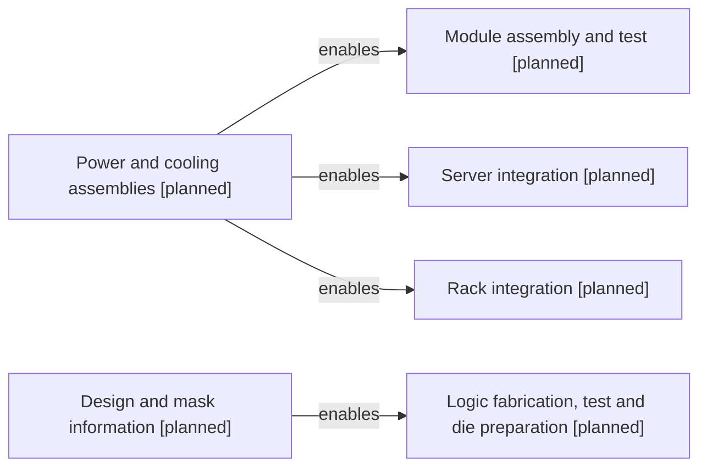

# Enabling inputs and services

[Map home](README.md) · [Schema](SCHEMA.md) · [Full entity register](process_nodes.md)

<!-- BEGIN GENERATED MAP -->
**Generated from the canonical CSV graph.** Planned scope is not technical evidence.

*MAP-ENABLING-INPUTS — Enabling inputs and evidenced supplier roles are distinct from physical conversion. Later-phase scopes remain planned. Original schematic; CC BY 4.0. Source: graph records and their evidence links; no physical scale.*

| ID | Entity | Status | Canonical article |
|---|---|---|---|
| ART-0041 | Power and cooling assemblies | planned | [Power and cooling assemblies](../28_power_delivery/README.md) |
| ART-0042 | Design and mask information | planned | [Design and mask information](../07_ic_design_and_tapeout/README.md) |
| PROC-0030 | Logic fabrication, test and die preparation | planned | [Logic fabrication, test and die preparation](../17_transistor_fabrication/README.md) |
| PROC-0038 | Module assembly and test | planned | [Module assembly and test](../30_pcb_and_module/README.md) |
| PROC-0039 | Server integration | planned | [Server integration](../31_system_integration/README.md) |
| PROC-0040 | Rack integration | planned | [Rack integration](../32_rack_scale_system/README.md) |

| Edge | Relationship | Conditions | Evidence |
|---|---|---|---|
| EDGE-0029 | ART-0042 → ENABLES → PROC-0030 | Information input, not material consumed. | Planned; not evidence-backed |
| EDGE-0051 | ART-0041 → ENABLES → PROC-0038 | Boundary-specific assemblies and interfaces; not a serial conversion of power into hardware. | Planned; not evidence-backed |
| EDGE-0052 | ART-0041 → ENABLES → PROC-0039 | Boundary-specific assemblies and interfaces; not a serial conversion of power into hardware. | Planned; not evidence-backed |
| EDGE-0053 | ART-0041 → ENABLES → PROC-0040 | Boundary-specific assemblies and interfaces; not a serial conversion of power into hardware. | Planned; not evidence-backed |
<!-- END GENERATED MAP -->
