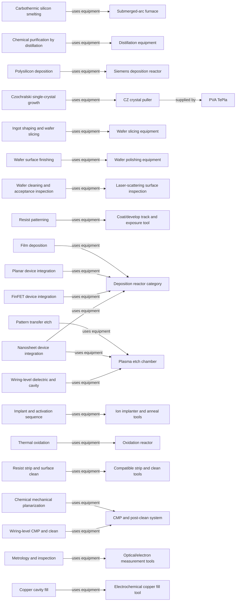

# Equipment and process roles

[Map home](README.md) · [Schema](SCHEMA.md) · [Full entity register](process_nodes.md)

<!-- BEGIN GENERATED MAP -->
**Generated from the canonical CSV graph.** Planned scope is not technical evidence.

*MAP-EQUIPMENT-MAP — Machines connect to the operations they perform. Supplier lists are representative only where evidence is recorded. Original schematic; CC BY 4.0. Source: graph records and their evidence links; no physical scale.*

| ID | Entity | Status | Canonical article |
|---|---|---|---|
| EQ-0001 | Submerged-arc furnace | reviewed | [Submerged-arc furnace](../02_silicon_refining/metallurgical_silicon.md) |
| EQ-0002 | Distillation equipment | reviewed | [Distillation equipment](../02_silicon_refining/electronic_grade_polysilicon.md) |
| EQ-0003 | Siemens deposition reactor | reviewed | [Siemens deposition reactor](../02_silicon_refining/electronic_grade_polysilicon.md) |
| EQ-0004 | CZ crystal puller | reviewed | [CZ crystal puller](../03_crystal_growth/crystal_growth.md) |
| EQ-0005 | Wafer slicing equipment | reviewed | [Wafer slicing equipment](../04_wafer_manufacturing/wafer_finishing_and_acceptance.md) |
| EQ-0006 | Wafer polishing equipment | reviewed | [Wafer polishing equipment](../04_wafer_manufacturing/wafer_finishing_and_acceptance.md) |
| EQ-0007 | Laser-scattering surface inspection | reviewed | [Laser-scattering surface inspection](../04_wafer_manufacturing/wafer_finishing_and_acceptance.md) |
| EQ-0101 | Coat/develop track and exposure tool | reviewed | [Coat/develop track and exposure tool](../09_photolithography/lithography.md) |
| EQ-0102 | Deposition reactor category | reviewed | [Deposition reactor category](../10_deposition/deposition.md) |
| EQ-0103 | Plasma etch chamber | reviewed | [Plasma etch chamber](../11_etching/etching.md) |
| EQ-0104 | Ion implanter and anneal tools | reviewed | [Ion implanter and anneal tools](../12_doping/doping.md) |
| EQ-0105 | Oxidation reactor | reviewed | [Oxidation reactor](../13_oxidation/oxidation.md) |
| EQ-0106 | Compatible strip and clean tools | reviewed | [Compatible strip and clean tools](../14_cleaning/cleaning.md) |
| EQ-0107 | CMP and post-clean system | reviewed | [CMP and post-clean system](../15_cmp/cmp.md) |
| EQ-0108 | Optical/electron measurement tools | reviewed | [Optical/electron measurement tools](../16_metrology_and_inspection/metrology.md) |
| EQ-0201 | Electrochemical copper fill tool | reviewed | [Electrochemical copper fill tool](../19_back_end_of_line/beol_integration.md) |
| PROC-0002 | Carbothermic silicon smelting | reviewed | [Carbothermic silicon smelting](../02_silicon_refining/metallurgical_silicon.md) |
| PROC-0004 | Chemical purification by distillation | reviewed | [Chemical purification by distillation](../02_silicon_refining/electronic_grade_polysilicon.md) |
| PROC-0005 | Polysilicon deposition | reviewed | [Polysilicon deposition](../02_silicon_refining/electronic_grade_polysilicon.md) |
| PROC-0006 | Czochralski single-crystal growth | reviewed | [Czochralski single-crystal growth](../03_crystal_growth/crystal_growth.md) |
| PROC-0007 | Ingot shaping and wafer slicing | reviewed | [Ingot shaping and wafer slicing](../04_wafer_manufacturing/wafer_finishing_and_acceptance.md) |
| PROC-0008 | Wafer surface finishing | reviewed | [Wafer surface finishing](../04_wafer_manufacturing/wafer_finishing_and_acceptance.md) |
| PROC-0009 | Wafer cleaning and acceptance inspection | reviewed | [Wafer cleaning and acceptance inspection](../04_wafer_manufacturing/wafer_finishing_and_acceptance.md) |
| PROC-0101 | Resist patterning | reviewed | [Resist patterning](../09_photolithography/lithography.md) |
| PROC-0102 | Film deposition | reviewed | [Film deposition](../10_deposition/deposition.md) |
| PROC-0103 | Pattern transfer etch | reviewed | [Pattern transfer etch](../11_etching/etching.md) |
| PROC-0104 | Implant and activation sequence | reviewed | [Implant and activation sequence](../12_doping/doping.md) |
| PROC-0105 | Thermal oxidation | reviewed | [Thermal oxidation](../13_oxidation/oxidation.md) |
| PROC-0106 | Resist strip and surface clean | reviewed | [Resist strip and surface clean](../14_cleaning/cleaning.md) |
| PROC-0107 | Chemical mechanical planarization | reviewed | [Chemical mechanical planarization](../15_cmp/cmp.md) |
| PROC-0108 | Metrology and inspection | reviewed | [Metrology and inspection](../16_metrology_and_inspection/metrology.md) |
| PROC-0200 | Planar device integration | reviewed | [Planar device integration](../17_transistor_fabrication/planar_and_finfet.md) |
| PROC-0201 | FinFET device integration | reviewed | [FinFET device integration](../17_transistor_fabrication/planar_and_finfet.md) |
| PROC-0202 | Nanosheet device integration | reviewed | [Nanosheet device integration](../17_transistor_fabrication/nanosheet_integration.md) |
| PROC-0210 | Wiring-level dielectric and cavity | reviewed | [Wiring-level dielectric and cavity](../19_back_end_of_line/beol_integration.md) |
| PROC-0212 | Copper cavity fill | reviewed | [Copper cavity fill](../19_back_end_of_line/beol_integration.md) |
| PROC-0213 | Wiring-level CMP and clean | reviewed | [Wiring-level CMP and clean](../19_back_end_of_line/beol_integration.md) |
| SUP-0005 | PVA TePla | reviewed | [PVA TePla](../03_crystal_growth/crystal_growth.md) |

| Edge | Relationship | Conditions | Evidence |
|---|---|---|---|
| EDGE-0054 | PROC-0002 → USES_EQUIPMENT → EQ-0001 |  | [NTNU-SMELTING-001](../42_references/bibliography.md#ntnu-smelting-001) (Furnace description) |
| EDGE-0055 | PROC-0004 → USES_EQUIPMENT → EQ-0002 |  | [WACKER-POLY-001](../42_references/bibliography.md#wacker-poly-001) (Distillation discussion) |
| EDGE-0056 | PROC-0005 → USES_EQUIPMENT → EQ-0003 |  | [WACKER-POLY-001](../42_references/bibliography.md#wacker-poly-001) (Deposition hall) |
| EDGE-0057 | PROC-0006 → USES_EQUIPMENT → EQ-0004 |  | [PVA-CZ-001](../42_references/bibliography.md#pva-cz-001) (The Process and system description) |
| EDGE-0058 | PROC-0007 → USES_EQUIPMENT → EQ-0005 |  | [SUMCO-WAFER-001](../42_references/bibliography.md#sumco-wafer-001) (Slicing) |
| EDGE-0059 | PROC-0008 → USES_EQUIPMENT → EQ-0006 |  | [SUMCO-WAFER-001](../42_references/bibliography.md#sumco-wafer-001) (Polishing) |
| EDGE-0060 | PROC-0009 → USES_EQUIPMENT → EQ-0007 |  | [UCSB-INSPECT-001](../42_references/bibliography.md#ucsb-inspect-001) (Surface analysis operating principle) |
| EDGE-0073 | EQ-0004 → SUPPLIED_BY → SUP-0005 | PVA TePla describes CZ puller equipment and thermal and motion control functions. Role example only; see claim boundary. | [PVA-CZ-001](../42_references/bibliography.md#pva-cz-001) (The Process; Czochralski systems) · CLM-000006 |
| EDGE-0088 | PROC-0101 → USES_EQUIPMENT → EQ-0101 | General functional relationship; application requires material and integration qualification. | [MACK-QUALITY-001](../42_references/bibliography.md#mack-quality-001) (Pattern-transfer and resist-property slides) |
| EDGE-0090 | PROC-0102 → USES_EQUIPMENT → EQ-0102 | General functional relationship; application requires material and integration qualification. | [ASM-ALD-001](../42_references/bibliography.md#asm-ald-001) (ALD process and thermal/plasma discussion) |
| EDGE-0092 | PROC-0103 → USES_EQUIPMENT → EQ-0103 | General functional relationship; application requires material and integration qualification. | [LAM-ETCH-001](../42_references/bibliography.md#lam-etch-001) (Etch process overview and process categories) |
| EDGE-0094 | PROC-0104 → USES_EQUIPMENT → EQ-0104 | General functional relationship; application requires material and integration qualification. | [MIT-IMPLANT-001](../42_references/bibliography.md#mit-implant-001) (Opening diffusion slides and implantation equipment slides) |
| EDGE-0096 | PROC-0105 → USES_EQUIPMENT → EQ-0105 | General functional relationship; application requires material and integration qualification. | [UALBERTA-OXIDE-001](../42_references/bibliography.md#ualberta-oxide-001) (Introduction and calculation details) |
| EDGE-0098 | PROC-0106 → USES_EQUIPMENT → EQ-0106 | General functional relationship; application requires material and integration qualification. | [UBC-CLEAN-001](../42_references/bibliography.md#ubc-clean-001) (Overview, solvent clean and oxide-removal discussion) |
| EDGE-0100 | PROC-0107 → USES_EQUIPMENT → EQ-0107 | General functional relationship; application requires material and integration qualification. | [AMAT-CMP-001](../42_references/bibliography.md#amat-cmp-001) (CMP mechanism and control description) |
| EDGE-0102 | PROC-0108 → USES_EQUIPMENT → EQ-0108 | General functional relationship; application requires material and integration qualification. | [ASML-METRO-001](../42_references/bibliography.md#asml-metro-001) (Optical and electron-beam metrology sections) |
| EDGE-0130 | PROC-0200 → USES_EQUIPMENT → EQ-0102 | Uses qualified film-formation equipment as part of a multi-tool integration route, not a single generic reactor recipe. | [AGH-CMOS-001](../42_references/bibliography.md#agh-cmos-001) (Slides 6–16 and 31–33: planar flow, isolation, wells, spacers and activation) |
| EDGE-0131 | PROC-0201 → USES_EQUIPMENT → EQ-0102 | Uses qualified film-formation equipment as part of a multi-tool integration route, not a single generic reactor recipe. | [INTEL-FLOW-001](../42_references/bibliography.md#intel-flow-001) (Slides 8–11: fin formation, temporary gate and replacement gate) |
| EDGE-0132 | PROC-0202 → USES_EQUIPMENT → EQ-0102 | Uses qualified film-formation equipment as part of a multi-tool integration route, not a single generic reactor recipe. | [IMEC-SHEETS-001](../42_references/bibliography.md#imec-sheets-001) (Critical nanosheet building blocks) |
| EDGE-0133 | PROC-0202 → USES_EQUIPMENT → EQ-0103 | Selective removal is required; exact wet/dry route and hardware are variant-specific, and the equipment category here represents a dry option. | [IMEC-SHEETS-001](../42_references/bibliography.md#imec-sheets-001) (Critical nanosheet building blocks) |
| EDGE-0134 | PROC-0210 → USES_EQUIPMENT → EQ-0103 | Representative integration relationship; acceptance requires geometry, material and electrical qualification. | [IBM-BEOL-001](../42_references/bibliography.md#ibm-beol-001) (Opening damascene discussion and barrier/liner tradeoffs) |
| EDGE-0135 | PROC-0213 → USES_EQUIPMENT → EQ-0107 | Representative integration relationship; acceptance requires geometry, material and electrical qualification. | [MACK-CMP-001](../42_references/bibliography.md#mack-cmp-001) (CMP roles and overpolishing defects) |
| EDGE-0136 | PROC-0212 → USES_EQUIPMENT → EQ-0201 | Representative integration relationship; acceptance requires geometry, material and electrical qualification. | [IBM-FILL-001](../42_references/bibliography.md#ibm-fill-001) (Abstract only: voids, seams and superconformal fill) |
<!-- END GENERATED MAP -->
