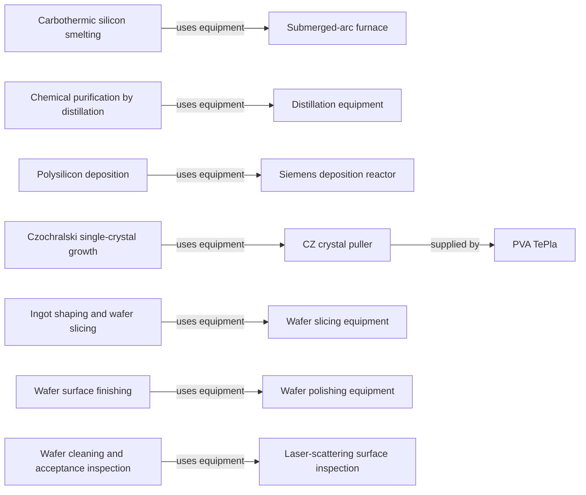

# Equipment and process roles

[Map home](README.md) · [Schema](SCHEMA.md) · [Full entity register](process_nodes.md)

<!-- BEGIN GENERATED MAP -->
**Generated from the canonical CSV graph.** Planned scope is not technical evidence.

*MAP-EQUIPMENT-MAP — Machines connect to the operations they perform. Supplier lists are representative only where evidence is recorded. Original schematic; CC BY 4.0. Source: graph records and their evidence links; no physical scale.*

| ID | Entity | Status | Canonical article |
|---|---|---|---|
| EQ-0001 | Submerged-arc furnace | reviewed | [Submerged-arc furnace](../02_silicon_refining/metallurgical_silicon.md) |
| EQ-0002 | Distillation equipment | reviewed | [Distillation equipment](../02_silicon_refining/electronic_grade_polysilicon.md) |
| EQ-0003 | Siemens deposition reactor | reviewed | [Siemens deposition reactor](../02_silicon_refining/electronic_grade_polysilicon.md) |
| EQ-0004 | CZ crystal puller | reviewed | [CZ crystal puller](../03_crystal_growth/crystal_growth.md) |
| EQ-0005 | Wafer slicing equipment | reviewed | [Wafer slicing equipment](../04_wafer_manufacturing/wafer_finishing_and_acceptance.md) |
| EQ-0006 | Wafer polishing equipment | reviewed | [Wafer polishing equipment](../04_wafer_manufacturing/wafer_finishing_and_acceptance.md) |
| EQ-0007 | Laser-scattering surface inspection | reviewed | [Laser-scattering surface inspection](../04_wafer_manufacturing/wafer_finishing_and_acceptance.md) |
| PROC-0002 | Carbothermic silicon smelting | reviewed | [Carbothermic silicon smelting](../02_silicon_refining/metallurgical_silicon.md) |
| PROC-0004 | Chemical purification by distillation | reviewed | [Chemical purification by distillation](../02_silicon_refining/electronic_grade_polysilicon.md) |
| PROC-0005 | Polysilicon deposition | reviewed | [Polysilicon deposition](../02_silicon_refining/electronic_grade_polysilicon.md) |
| PROC-0006 | Czochralski single-crystal growth | reviewed | [Czochralski single-crystal growth](../03_crystal_growth/crystal_growth.md) |
| PROC-0007 | Ingot shaping and wafer slicing | reviewed | [Ingot shaping and wafer slicing](../04_wafer_manufacturing/wafer_finishing_and_acceptance.md) |
| PROC-0008 | Wafer surface finishing | reviewed | [Wafer surface finishing](../04_wafer_manufacturing/wafer_finishing_and_acceptance.md) |
| PROC-0009 | Wafer cleaning and acceptance inspection | reviewed | [Wafer cleaning and acceptance inspection](../04_wafer_manufacturing/wafer_finishing_and_acceptance.md) |
| SUP-0005 | PVA TePla | reviewed | [PVA TePla](../03_crystal_growth/crystal_growth.md) |

| Edge | Relationship | Conditions | Evidence |
|---|---|---|---|
| EDGE-0054 | PROC-0002 → USES_EQUIPMENT → EQ-0001 |  | [NTNU-SMELTING-001](../42_references/bibliography.md#ntnu-smelting-001) (Furnace description) |
| EDGE-0055 | PROC-0004 → USES_EQUIPMENT → EQ-0002 |  | [WACKER-POLY-001](../42_references/bibliography.md#wacker-poly-001) (Distillation discussion) |
| EDGE-0056 | PROC-0005 → USES_EQUIPMENT → EQ-0003 |  | [WACKER-POLY-001](../42_references/bibliography.md#wacker-poly-001) (Deposition hall) |
| EDGE-0057 | PROC-0006 → USES_EQUIPMENT → EQ-0004 |  | [PVA-CZ-001](../42_references/bibliography.md#pva-cz-001) (The Process and system description) |
| EDGE-0058 | PROC-0007 → USES_EQUIPMENT → EQ-0005 |  | [SUMCO-WAFER-001](../42_references/bibliography.md#sumco-wafer-001) (Slicing) |
| EDGE-0059 | PROC-0008 → USES_EQUIPMENT → EQ-0006 |  | [SUMCO-WAFER-001](../42_references/bibliography.md#sumco-wafer-001) (Polishing) |
| EDGE-0060 | PROC-0009 → USES_EQUIPMENT → EQ-0007 |  | [UCSB-INSPECT-001](../42_references/bibliography.md#ucsb-inspect-001) (Surface analysis operating principle) |
| EDGE-0073 | EQ-0004 → SUPPLIED_BY → SUP-0005 | PVA TePla describes CZ puller equipment and thermal and motion control functions. Role example only; see claim boundary. | [PVA-CZ-001](../42_references/bibliography.md#pva-cz-001) (The Process; Czochralski systems) · CLM-000006 |
<!-- END GENERATED MAP -->
