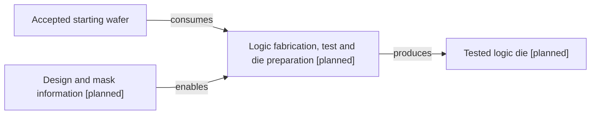

# Logic manufacturing path

[Map home](README.md) · [Schema](SCHEMA.md) · [Full entity register](process_nodes.md)

<!-- BEGIN GENERATED MAP -->
**Generated from the canonical CSV graph.** Planned scope is not technical evidence.

*MAP-LOGIC-PATH — Later-phase scope only. Design is an enabling input; detailed FEOL/MOL/BEOL and test steps remain to be researched. Original schematic; CC BY 4.0. Source: graph records and their evidence links; no physical scale.*

| ID | Entity | Status | Canonical article |
|---|---|---|---|
| ART-0030 | Tested logic die | planned | [Tested logic die](../20_wafer_test/README.md) |
| ART-0042 | Design and mask information | planned | [Design and mask information](../07_ic_design_and_tapeout/README.md) |
| MAT-0010 | Accepted starting wafer | reviewed | [Accepted starting wafer](../04_wafer_manufacturing/wafer_finishing_and_acceptance.md) |
| PROC-0030 | Logic fabrication, test and die preparation | planned | [Logic fabrication, test and die preparation](../17_transistor_fabrication/README.md) |

| Edge | Relationship | Conditions | Evidence |
|---|---|---|---|
| EDGE-0027 | PROC-0030 → CONSUMES → MAT-0010 |  | Planned; not evidence-backed |
| EDGE-0028 | PROC-0030 → PRODUCES → ART-0030 |  | Planned; not evidence-backed |
| EDGE-0029 | ART-0042 → ENABLES → PROC-0030 | Information input, not material consumed. | Planned; not evidence-backed |
<!-- END GENERATED MAP -->
