# Master manufacturing process map

[Map home](README.md) · [Schema](SCHEMA.md) · [Full entity register](process_nodes.md)

<!-- BEGIN GENERATED MAP -->
**Generated from the canonical CSV graph.** Planned scope is not technical evidence.

```mermaid
flowchart LR
  MAT_0001["Quartz-bearing feedstock"]
  MAT_0003["Metallurgical-grade silicon"]
  MAT_0006["Electronic-grade polysilicon"]
  MAT_0007["Single-crystal silicon ingot"]
  MAT_0010["Accepted starting wafer"]
  ART_0030["Tested logic die [planned]"]
  ART_0033["Tested HBM stack [planned]"]
  ART_0036["Tested accelerator package [planned]"]
  ART_0038["Tested accelerator module [planned]"]
  ART_0040["Integrated rack system [planned]"]
  ART_0030 -->|"collapsed path"| ART_0036
  ART_0033 -->|"collapsed path"| ART_0036
  ART_0036 -->|"collapsed path"| ART_0038
  ART_0038 -->|"collapsed path"| ART_0040
  MAT_0001 -->|"collapsed path"| MAT_0003
  MAT_0003 -->|"collapsed path"| MAT_0006
  MAT_0006 -->|"collapsed path"| MAT_0007
  MAT_0007 -->|"collapsed path"| MAT_0010
  MAT_0010 -->|"collapsed path"| ART_0030
  MAT_0010 -->|"collapsed path"| ART_0033
```

*MAP-MASTER-PROCESS-MAP — Projected material/assembly paths; intermediate operations are collapsed. Logic and memory are parallel branches. Detailed suppliers, recipes and Rubin applicability are not implied. Original schematic; CC BY 4.0. Source: graph records and their evidence links; no physical scale.*

| ID | Entity | Status | Canonical article |
|---|---|---|---|
| MAT-0001 | Quartz-bearing feedstock | reviewed | [Quartz-bearing feedstock](../01_raw_materials/quartz_and_feedstocks.md) |
| MAT-0003 | Metallurgical-grade silicon | reviewed | [Metallurgical-grade silicon](../02_silicon_refining/metallurgical_silicon.md) |
| MAT-0006 | Electronic-grade polysilicon | reviewed | [Electronic-grade polysilicon](../02_silicon_refining/electronic_grade_polysilicon.md) |
| MAT-0007 | Single-crystal silicon ingot | reviewed | [Single-crystal silicon ingot](../03_crystal_growth/crystal_growth.md) |
| MAT-0010 | Accepted starting wafer | reviewed | [Accepted starting wafer](../04_wafer_manufacturing/wafer_finishing_and_acceptance.md) |
| ART-0030 | Tested logic die | planned | [Tested logic die](../20_wafer_test/README.md) |
| ART-0033 | Tested HBM stack | planned | [Tested HBM stack](../24_hbm_manufacturing/README.md) |
| ART-0036 | Tested accelerator package | planned | [Tested accelerator package](../29_gpu_package/README.md) |
| ART-0038 | Tested accelerator module | planned | [Tested accelerator module](../30_pcb_and_module/README.md) |
| ART-0040 | Integrated rack system | planned | [Integrated rack system](../32_rack_scale_system/README.md) |
<!-- END GENERATED MAP -->
