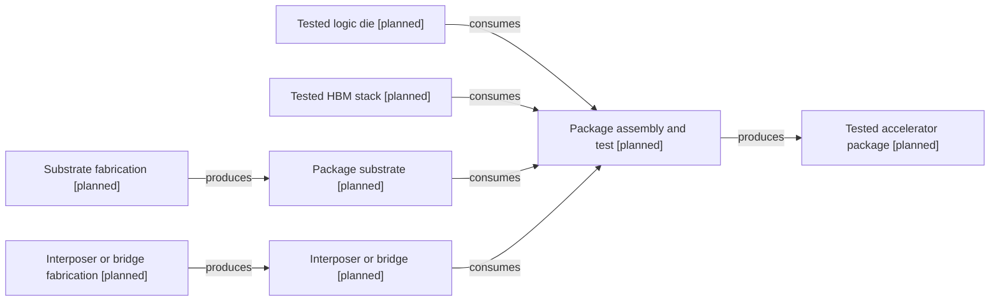

# Packaging convergence

[Map home](README.md) · [Schema](SCHEMA.md) · [Full entity register](process_nodes.md)

<!-- BEGIN GENERATED MAP -->
**Generated from the canonical CSV graph.** Planned scope is not technical evidence.

*MAP-PACKAGING-PATH — Representative interposer-based assembly scope; tested logic, memory, substrate and interconnect structures converge. Other packaging architectures will have separate routes. Original schematic; CC BY 4.0. Source: graph records and their evidence links; no physical scale.*

| ID | Entity | Status | Canonical article |
|---|---|---|---|
| ART-0030 | Tested logic die | planned | [Tested logic die](../20_wafer_test/README.md) |
| ART-0033 | Tested HBM stack | planned | [Tested HBM stack](../24_hbm_manufacturing/README.md) |
| ART-0034 | Package substrate | planned | [Package substrate](../26_substrates/README.md) |
| ART-0035 | Interposer or bridge | planned | [Interposer or bridge](../25_advanced_packaging/README.md) |
| ART-0036 | Tested accelerator package | planned | [Tested accelerator package](../29_gpu_package/README.md) |
| PROC-0034 | Substrate fabrication | planned | [Substrate fabrication](../26_substrates/README.md) |
| PROC-0035 | Interposer or bridge fabrication | planned | [Interposer or bridge fabrication](../25_advanced_packaging/README.md) |
| PROC-0036 | Package assembly and test | planned | [Package assembly and test](../29_gpu_package/README.md) |

| Edge | Relationship | Conditions | Evidence |
|---|---|---|---|
| EDGE-0036 | PROC-0034 → PRODUCES → ART-0034 |  | Planned; not evidence-backed |
| EDGE-0037 | PROC-0035 → PRODUCES → ART-0035 |  | Planned; not evidence-backed |
| EDGE-0039 | PROC-0036 → CONSUMES → ART-0030 |  | Planned; not evidence-backed |
| EDGE-0040 | PROC-0036 → CONSUMES → ART-0033 |  | Planned; not evidence-backed |
| EDGE-0041 | PROC-0036 → CONSUMES → ART-0034 |  | Planned; not evidence-backed |
| EDGE-0042 | PROC-0036 → CONSUMES → ART-0035 |  | Planned; not evidence-backed |
| EDGE-0043 | PROC-0036 → PRODUCES → ART-0036 |  | Planned; not evidence-backed |
<!-- END GENERATED MAP -->
