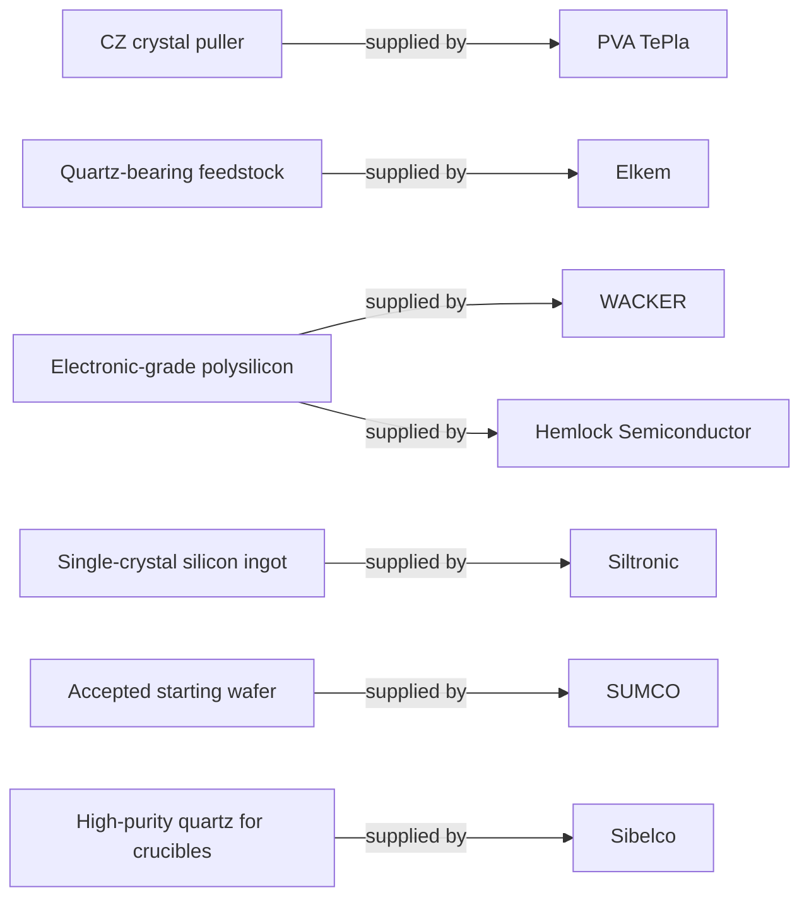

# Supplier relationships

[Map home](README.md) · [Schema](SCHEMA.md) · [Full entity register](process_nodes.md)

<!-- BEGIN GENERATED MAP -->
**Generated from the canonical CSV graph.** Planned scope is not technical evidence.

*MAP-SUPPLIER-MAP — Company roles require evidence and claim IDs; they do not establish market share, exclusivity or Rubin design wins. Original schematic; CC BY 4.0. Source: graph records and their evidence links; no physical scale.*

| ID | Entity | Status | Canonical article |
|---|---|---|---|
| EQ-0004 | CZ crystal puller | reviewed | [CZ crystal puller](../03_crystal_growth/crystal_growth.md) |
| MAT-0001 | Quartz-bearing feedstock | reviewed | [Quartz-bearing feedstock](../01_raw_materials/quartz_and_feedstocks.md) |
| MAT-0006 | Electronic-grade polysilicon | reviewed | [Electronic-grade polysilicon](../02_silicon_refining/electronic_grade_polysilicon.md) |
| MAT-0007 | Single-crystal silicon ingot | reviewed | [Single-crystal silicon ingot](../03_crystal_growth/crystal_growth.md) |
| MAT-0010 | Accepted starting wafer | reviewed | [Accepted starting wafer](../04_wafer_manufacturing/wafer_finishing_and_acceptance.md) |
| MAT-0012 | High-purity quartz for crucibles | reviewed | [High-purity quartz for crucibles](../01_raw_materials/quartz_and_feedstocks.md) |
| SUP-0001 | Elkem | reviewed | [Elkem](../01_raw_materials/quartz_and_feedstocks.md) |
| SUP-0002 | Sibelco | reviewed | [Sibelco](../01_raw_materials/quartz_and_feedstocks.md) |
| SUP-0003 | WACKER | reviewed | [WACKER](../02_silicon_refining/electronic_grade_polysilicon.md) |
| SUP-0004 | Hemlock Semiconductor | reviewed | [Hemlock Semiconductor](../02_silicon_refining/electronic_grade_polysilicon.md) |
| SUP-0005 | PVA TePla | reviewed | [PVA TePla](../03_crystal_growth/crystal_growth.md) |
| SUP-0006 | Siltronic | reviewed | [Siltronic](../03_crystal_growth/crystal_growth.md) |
| SUP-0007 | SUMCO | reviewed | [SUMCO](../04_wafer_manufacturing/wafer_finishing_and_acceptance.md) |

| Edge | Relationship | Conditions | Evidence |
|---|---|---|---|
| EDGE-0069 | MAT-0001 → SUPPLIED_BY → SUP-0001 | Elkem describes Tana quartzite extraction and industrial uses. Role example only; see claim boundary. | [ELKEM-QUARTZ-001](../42_references/bibliography.md#elkem-quartz-001) (Plant description and industrial uses) · CLM-000001 |
| EDGE-0070 | MAT-0012 → SUPPLIED_BY → SUP-0002 | Sibelco describes IOTA high-purity quartz for making fused-quartz crucibles and quartzware. Role example only; see claim boundary. | [SIBELCO-QUARTZ-001](../42_references/bibliography.md#sibelco-quartz-001) (Semiconductor application bullet) · CLM-000002 |
| EDGE-0071 | MAT-0006 → SUPPLIED_BY → SUP-0003 | WACKER describes a chlorosilane/distillation and Siemens deposition route for polysilicon. Role example only; see claim boundary. | [WACKER-POLY-001](../42_references/bibliography.md#wacker-poly-001) (Chlorosilane/distillation and deposition hall sections) · CLM-000003 |
| EDGE-0072 | MAT-0006 → SUPPLIED_BY → SUP-0004 | Hemlock describes TCS-based CVD and controlled polysilicon sizing, cleaning and packaging. Role example only; see claim boundary. | [HSC-POLY-001](../42_references/bibliography.md#hsc-poly-001) (What We Do: The Science of Polysilicon) · CLM-000004 |
| EDGE-0073 | EQ-0004 → SUPPLIED_BY → SUP-0005 | PVA TePla describes CZ puller equipment and thermal and motion control functions. Role example only; see claim boundary. | [PVA-CZ-001](../42_references/bibliography.md#pva-cz-001) (The Process; Czochralski systems) · CLM-000006 |
| EDGE-0074 | MAT-0007 → SUPPLIED_BY → SUP-0006 | Siltronic describes float-zone silicon products and their lower-oxygen and high-resistivity application context. Role example only; see claim boundary. | [SILTRONIC-FZ-001](../42_references/bibliography.md#siltronic-fz-001) (Float zone/FZ subsection) · CLM-000007 |
| EDGE-0075 | MAT-0010 → SUPPLIED_BY → SUP-0007 | SUMCO describes wafer forming through slicing, lapping, etching, polishing, cleaning and inspection. Role example only; see claim boundary. | [SUMCO-WAFER-001](../42_references/bibliography.md#sumco-wafer-001) (Wafer forming sequence) · CLM-000008 |
<!-- END GENERATED MAP -->
