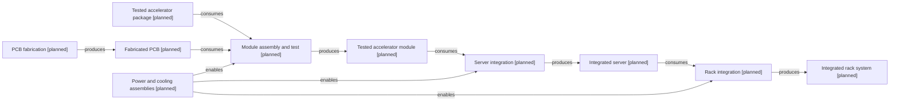

# Package to rack integration

[Map home](README.md) · [Schema](SCHEMA.md) · [Full entity register](process_nodes.md)

<!-- BEGIN GENERATED MAP -->
**Generated from the canonical CSV graph.** Planned scope is not technical evidence.

*MAP-SYSTEM-PATH — Later-phase scope only. Board fabrication supplies module assembly; power and cooling are enabling integration inputs. Original schematic; CC BY 4.0. Source: graph records and their evidence links; no physical scale.*

| ID | Entity | Status | Canonical article |
|---|---|---|---|
| ART-0036 | Tested accelerator package | planned | [Tested accelerator package](../29_gpu_package/README.md) |
| ART-0037 | Fabricated PCB | planned | [Fabricated PCB](../30_pcb_and_module/README.md) |
| ART-0038 | Tested accelerator module | planned | [Tested accelerator module](../30_pcb_and_module/README.md) |
| ART-0039 | Integrated server | planned | [Integrated server](../31_system_integration/README.md) |
| ART-0040 | Integrated rack system | planned | [Integrated rack system](../32_rack_scale_system/README.md) |
| ART-0041 | Power and cooling assemblies | planned | [Power and cooling assemblies](../28_power_delivery/README.md) |
| PROC-0037 | PCB fabrication | planned | [PCB fabrication](../30_pcb_and_module/README.md) |
| PROC-0038 | Module assembly and test | planned | [Module assembly and test](../30_pcb_and_module/README.md) |
| PROC-0039 | Server integration | planned | [Server integration](../31_system_integration/README.md) |
| PROC-0040 | Rack integration | planned | [Rack integration](../32_rack_scale_system/README.md) |

| Edge | Relationship | Conditions | Evidence |
|---|---|---|---|
| EDGE-0038 | PROC-0037 → PRODUCES → ART-0037 |  | Planned; not evidence-backed |
| EDGE-0044 | PROC-0038 → CONSUMES → ART-0036 |  | Planned; not evidence-backed |
| EDGE-0045 | PROC-0038 → CONSUMES → ART-0037 |  | Planned; not evidence-backed |
| EDGE-0046 | PROC-0038 → PRODUCES → ART-0038 |  | Planned; not evidence-backed |
| EDGE-0047 | PROC-0039 → CONSUMES → ART-0038 |  | Planned; not evidence-backed |
| EDGE-0048 | PROC-0039 → PRODUCES → ART-0039 |  | Planned; not evidence-backed |
| EDGE-0049 | PROC-0040 → CONSUMES → ART-0039 |  | Planned; not evidence-backed |
| EDGE-0050 | PROC-0040 → PRODUCES → ART-0040 |  | Planned; not evidence-backed |
| EDGE-0051 | ART-0041 → ENABLES → PROC-0038 | Boundary-specific assemblies and interfaces; not a serial conversion of power into hardware. | Planned; not evidence-backed |
| EDGE-0052 | ART-0041 → ENABLES → PROC-0039 | Boundary-specific assemblies and interfaces; not a serial conversion of power into hardware. | Planned; not evidence-backed |
| EDGE-0053 | ART-0041 → ENABLES → PROC-0040 | Boundary-specific assemblies and interfaces; not a serial conversion of power into hardware. | Planned; not evidence-backed |
<!-- END GENERATED MAP -->
