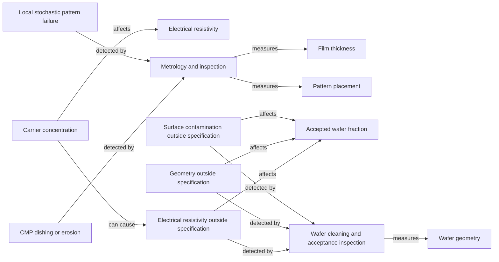

# Failure, detection and yield relationships

[Map home](README.md) · [Schema](SCHEMA.md) · [Full entity register](process_nodes.md)

<!-- BEGIN GENERATED MAP -->
**Generated from the canonical CSV graph.** Planned scope is not technical evidence.

*MAP-YIELD-MAP — Failure modes, detection operations and measured characteristics; arrows do not represent an inevitable cascade. Original schematic; CC BY 4.0. Source: graph records and their evidence links; no physical scale.*

| ID | Entity | Status | Canonical article |
|---|---|---|---|
| CHAR-0001 | Carrier concentration | reviewed | [Carrier concentration](../05_semiconductor_physics/doping_and_transport.md) |
| CHAR-0002 | Electrical resistivity | reviewed | [Electrical resistivity](../05_semiconductor_physics/doping_and_transport.md) |
| CHAR-0003 | Wafer geometry | reviewed | [Wafer geometry](../04_wafer_manufacturing/wafer_finishing_and_acceptance.md) |
| CHAR-0101 | Film thickness | reviewed | [Film thickness](../16_metrology_and_inspection/metrology.md) |
| CHAR-0102 | Pattern placement | reviewed | [Pattern placement](../16_metrology_and_inspection/metrology.md) |
| FAIL-0001 | Surface contamination outside specification | reviewed | [Surface contamination outside specification](../04_wafer_manufacturing/wafer_finishing_and_acceptance.md) |
| FAIL-0002 | Geometry outside specification | reviewed | [Geometry outside specification](../04_wafer_manufacturing/wafer_finishing_and_acceptance.md) |
| FAIL-0003 | Electrical resistivity outside specification | reviewed | [Electrical resistivity outside specification](../05_semiconductor_physics/doping_and_transport.md) |
| FAIL-0101 | Local stochastic pattern failure | reviewed | [Local stochastic pattern failure](../09_photolithography/lithography.md) |
| FAIL-0102 | CMP dishing or erosion | reviewed | [CMP dishing or erosion](../15_cmp/cmp.md) |
| METRIC-0001 | Accepted wafer fraction | reviewed | [Accepted wafer fraction](../04_wafer_manufacturing/wafer_finishing_and_acceptance.md) |
| PROC-0009 | Wafer cleaning and acceptance inspection | reviewed | [Wafer cleaning and acceptance inspection](../04_wafer_manufacturing/wafer_finishing_and_acceptance.md) |
| PROC-0108 | Metrology and inspection | reviewed | [Metrology and inspection](../16_metrology_and_inspection/metrology.md) |

| Edge | Relationship | Conditions | Evidence |
|---|---|---|---|
| EDGE-0076 | CHAR-0001 → AFFECTS → CHAR-0002 | At stated mobility and low-field conditions; changing impurity scattering can also change mobility. | [HU-TRANSPORT-001](../42_references/bibliography.md#hu-transport-001) (Conductivity relation) |
| EDGE-0077 | PROC-0009 → MEASURES → CHAR-0003 | Acceptance operation aggregates multiple metrology methods; laser scattering alone does not measure all geometry. | [SEMI-WAFER-001](../42_references/bibliography.md#semi-wafer-001) (Public scope of wafer measurements) |
| EDGE-0078 | FAIL-0001 → DETECTED_BY → PROC-0009 | Only detectable events within method sensitivity and inspection coverage. | [UCSB-INSPECT-001](../42_references/bibliography.md#ucsb-inspect-001) (Surface scattering detection) |
| EDGE-0079 | FAIL-0002 → DETECTED_BY → PROC-0009 | Appropriate geometry metrology and agreed specification required. | [SEMI-WAFER-001](../42_references/bibliography.md#semi-wafer-001) (Geometry measurement categories) |
| EDGE-0080 | FAIL-0001 → AFFECTS → METRIC-0001 | A detected out-of-spec event excludes a wafer from accepted count under the chosen disposition policy. | [SUMCO-WAFER-001](../42_references/bibliography.md#sumco-wafer-001) (Cleaning and inspection; acceptance boundary) |
| EDGE-0081 | FAIL-0002 → AFFECTS → METRIC-0001 | Only failures of the applicable specification reduce this boundary-specific accepted count. | [SEMI-WAFER-001](../42_references/bibliography.md#semi-wafer-001) (Specification scope; accounting implication) |
| EDGE-0084 | CHAR-0001 → CAN_CAUSE → FAIL-0003 | Only if the resulting resistivity crosses the specified bound; mobility and temperature must be accounted for. | [HU-TRANSPORT-001](../42_references/bibliography.md#hu-transport-001) (Conductivity dependence on carriers) |
| EDGE-0085 | FAIL-0003 → DETECTED_BY → PROC-0009 | Appropriate electrical metrology under specified conditions; not detection by surface laser scattering. | [SEMI-WAFER-001](../42_references/bibliography.md#semi-wafer-001) (Public scope; resistivity measurement categories) |
| EDGE-0086 | FAIL-0003 → AFFECTS → METRIC-0001 | A detected failure of the applicable electrical specification changes accepted-wafer count under the chosen policy. | [SEMI-WAFER-001](../42_references/bibliography.md#semi-wafer-001) (Specified wafer characteristics; author accounting implication) |
| EDGE-0116 | PROC-0108 → MEASURES → CHAR-0101 | General functional relationship; application requires material and integration qualification. | [NIST-ELLIPSO-001](../42_references/bibliography.md#nist-ellipso-001) (Publication metadata and abstract only) |
| EDGE-0117 | PROC-0108 → MEASURES → CHAR-0102 | General functional relationship; application requires material and integration qualification. | [ASML-METRO-001](../42_references/bibliography.md#asml-metro-001) (Optical and electron-beam metrology sections) |
| EDGE-0118 | FAIL-0101 → DETECTED_BY → PROC-0108 | Requires a method and sampling plan sensitive to the relevant local geometry; detection is not guaranteed. | [IMEC-STOCH-001](../42_references/bibliography.md#imec-stoch-001) (Stochastic failures and inspection discussion) |
| EDGE-0119 | FAIL-0102 → DETECTED_BY → PROC-0108 | Requires a method and sampling plan sensitive to the relevant local geometry; detection is not guaranteed. | [MACK-CMP-001](../42_references/bibliography.md#mack-cmp-001) (Pages 1–2: topography, pressure/speed and dishing/erosion) |
<!-- END GENERATED MAP -->
